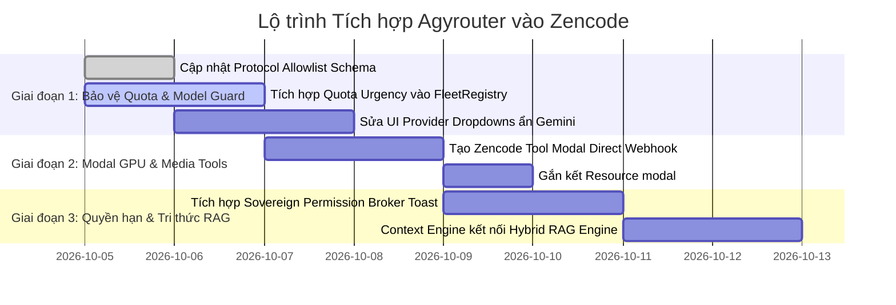

# 🚀 BÁO CÁO TOÀN DIỆN: HIỆN TRẠNG TÍCH HỢP TÍNH NĂNG AGYROUTER VÀO DỰ ÁN ZENCODE & BÀI HỌC KINH NGHIỆM (LESSONS LEARNED)

> **Document ID**: `ZENCODE-AROUTER-INTEGRATION-2026-10-05`  
> **Target Repositories**:
>
> - `/home/zen/zencode/paseo` (Zencode Autonomous AI Swarm & Pair-Programming Workspace Platform)
> - `/home/zen/arouter` (Arouter Sovereign Distributed Multi-Model Router & Modal GPU Fleet)  
>   **Timestamp**: 2026-10-05T09:30:00+07:00  
>   **Sovereign Standard**: Zero-Fake-Pass, Anti-Starvation, Quota Urgency, Direct Modal Execution  
>   **Maintainer**: Zen Pham (`zenphamgeek@gmail.com`)

---

## 📑 MỤC LỤC

1. [Bối cảnh & Tầm nhìn Hợp nhất Zencode x Agyrouter](#1-bối-cảnh--tầm-nhìn-hợp-nhất-zencode-x-agyrouter)
2. [Bảng Ma trận Hiện trạng 8 Tính năng Cốt lõi (Status Matrix)](#2-bảng-ma-trận-hiện-trạng-8-tính-năng-cốt-lõi-status-matrix)
3. [Phân tích Chi tiết Từng Tính năng & Kế hoạch Tích hợp (Deep Dive)](#3-phân-tích-chi-tiết-từng-tính-năng--kế-hoạch-tích-hợp-deep-dive)
   - 3.1. Điều phối Quota Khẩn cấp & Triệt tiêu Starvation Paradox
   - 3.2. Ma trận Phân quyền Model Allowlist theo Provider
   - 3.3. Tách rời Data Plane & Direct Modal Cloud GPU Execution
   - 3.4. Sovereign Capability-Based Permission Broker ("Dưới Sự Cho Phép Của Tôi")
   - 3.5. Shared Knowledge & Hybrid RAG Engine (FTS5 + Dense Vector + RRF)
   - 3.6. Clef Mnemosyne Memory, Nén Bài học & Dead-Letter Queue (DLQ)
   - 3.7. Bộ đệm SWR Sub-50ms & Luồng Streaming SSE Delta
   - 3.8. Vệ tinh Egress Proxy Mesh (9Router Anti-Correlation Ports 20129–20143)
4. [7 Bài học Kinh nghiệm Xương máu (Critical Lessons Learned)](#4-7-bài-học-kinh-nghiệm-xương-máu-critical-lessons-learned)
5. [Lộ trình Triển khai Cụ thể cho Zencode Dev Team](#5-lộ-trình-triển-khai-cụ-thể-cho-zencode-dev-team)
6. [Bằng chứng Kiểm thử & Tính Hợp lệ Kỹ thuật](#6-bằng-chứng-kiểm-thử--tính-hợp-lệ-kỹ-thuật)

---

## 1. Bối cảnh & Tầm nhìn Hợp nhất Zencode x Agyrouter

**Zencode** (`/home/zen/zencode/paseo`) được định vị là nền tảng máy trạm lập trình cặp tự hành (Autonomous AI Pair-Programming Workspace & Swarm Cockpit) với giao diện React/Electron/Web (`packages/app`), giao thức RPC đa luồng (`packages/protocol`), daemon nền Node.js/TypeScript (`packages/server`), và công cụ dòng lệnh (`packages/cli`).

**AgyRouter** (`/home/zen/arouter`) là hạ tầng điều phối tính toán phân tán có chủ quyền (Sovereign Distributed Router), quản trị 15 tài khoản Antigravity CLI local, B.AI Nebula API Flagship Node và cụm 23 Workspace Modal Cloud GPU.

### Mục tiêu Tích hợp:

Biến Zencode thành giao diện người dùng và môi trường thực thi tối thượng, nơi mọi yêu cầu vibe-coding, sinh media, tra cứu tri thức và kiểm toán code đều được định tuyến thông minh qua các cơ chế tối ưu hóa đã được thử lửa của Agyrouter, triệt tiêu hoàn toàn sự lãng phí hạn ngạch, độ trễ và sự cố nghẽn mạng.

```
┌────────────────────────────────────────────────────────────────────────────────────────┐
│                               ZENCODE WORKSPACE PLATFORM                               │
│      [Zencode Web/Desktop UI] ──(WebSockets/RPC)──► [Zencode Server (:6768)]           │
│                                                              │                         │
│   ┌───────────────────────────┬──────────────────────────────┴─────────────────────┐   │
│   ▼                           ▼                                                    ▼   │
│ [FleetRegistry]       [ClefCouncil Engine]                             [Agent Manager] │
└─────┬─────────────────────────┬────────────────────────────────────────────────────┬───┘
      │                         │                                                    │
      │ HTTP / REST / SSE       │ Capability Tokens                                  │ MCP Stdio
      ▼                         ▼                                                    ▼
┌────────────────────────────────────────────────────────────────────────────────────────┐
│                              AGYROUTER CORE DAEMON (:7777)                             │
│  • Quota Urgency Routing      • Anti-Starvation Linear Damping (>=0.85)                │
│  • Permission Broker (Tier 3) • Hybrid RAG Engine (FTS5 + Dense Cosine + RRF)          │
│  • Mnemosyne Memory & DLQ     • Modal Direct Catalog (modal://fleet/resources.json)    │
└─────────────┬──────────────────────────────────────────────────────────────┬───────────┘
              │                                                              │
              ▼                                                              ▼
┌───────────────────────────┐                                  ┌─────────────────────────┐
│ 15 CANONICAL AGY NODES    │                                  │ MODAL SERVERLESS GPU    │
│ pro-1, ultra-2, node-4..6 │                                  │ 23 Workspaces, 9x T4    │
│ binhthuong, sunward (99%) │                                  │ Direct HTTPS Webhooks   │
└───────────────────────────┘                                  └─────────────────────────┘
```

---

## 2. Bảng Ma trận Hiện trạng 8 Tính năng Cốt lõi (Status Matrix)

| #     | Tính năng Agyrouter                         | Hiện trạng tại Agyrouter (`/home/zen/arouter`)                                                                                          | Hiện trạng tại Zencode (`/home/zen/zencode/paseo`)                                                                                      | Trạng thái Kế hoạch | Độ ưu tiên           |
| ----- | ------------------------------------------- | --------------------------------------------------------------------------------------------------------------------------------------- | --------------------------------------------------------------------------------------------------------------------------------------- | ------------------- | -------------------- |
| **1** | **Quota Urgency Routing & Anti-Starvation** | ✅ **Hoàn thành 100%**: Sàn phạt 0.85, down-scoping độ khó 1.5, canary weight 0.05, công thức $\tau_{\text{reset}}$. (59/59 test pass). | 🟡 **Khởi tạo cơ bản**: `FleetRegistry` đã sync quota từ `/api/fleet/quota`, nhưng chưa tích hợp công thức Urgency vào logic chọn node. | **In-Progress**     | 🔴 **P0 (Critical)** |
| **2** | **Model-to-Node Allowlist Guard**           | ✅ **Hoàn thành 100%**: `FLEET_NODE_ALLOWLIST` chặn cứng Gemini vào `nebula`, tách provider `google` vs `b.ai`.                         | 🟡 **Đang chuẩn hóa**: Đã có tài liệu bug report; `packages/protocol` và UI dropdown cần cập nhật allowlist.                            | **Planned**         | 🔴 **P0 (Critical)** |
| **3** | **Direct Modal GPU Execution**              | ✅ **Hoàn thành 100%**: Tách Control Plane và Data Plane, bypass port 8099, trần $25 MTD, MCP resource `modal://fleet/resources.json`.  | ⚪ **Chưa có**: Zencode chưa gọi trực tiếp Modal Webhooks; vẫn phụ thuộc vào local CLI hoặc provider chuẩn.                             | **Ready for Wire**  | 🟠 **P1 (High)**     |
| **4** | **Sovereign Permission Broker**             | ✅ **Hoàn thành 100%**: Token HMAC-SHA256, 3 tầng hành động, cổng dừng chờ người duyệt (60s Default-Deny).                              | 🟡 **Một phần**: Có cơ chế confirm tool đơn giản, chưa có token mã hóa có trần chi tiêu và queue chờ duyệt.                             | **Planned**         | 🟠 **P1 (High)**     |
| **5** | **Hybrid Knowledge RAG Engine**             | ✅ **Hoàn thành 100%**: SQLite WAL FTS5 BM25 + Dense Cosine + RRF $k=60$ + Zero-hallucination citation verification.                    | ⚪ **Chưa có**: Zencode tìm kiếm file qua grep/ripgrep thô; chưa có engine semantic RRF và đối chiếu mã băm SHA256.                     | **Planned**         | 🟡 **P2 (Medium)**   |
| **6** | **Clef Mnemosyne Memory & DLQ**             | ✅ **Hoàn thành 100%**: Retention score $R$, lesson compression, DLQ phát hiện poison pill qua 2 worker khác nhau.                      | 🟡 **Khởi tạo một phần**: `ClefCouncil` đã có deterministic gates & semantic judge, nhưng chưa có retention memory.                     | **In-Progress**     | 🟠 **P1 (High)**     |
| **7** | **Sub-50ms SWR & SSE Streaming**            | ✅ **Hoàn thành 100%**: In-memory cache phản hồi <20ms, SSE delta stream `/api/fleet/modal/events`.                                     | 🟡 **Có sẵn hạ tầng**: Zencode có WebSockets và SSE cho terminal, cần nối kênh SSE telemetry của Arouter.                               | **Ready for Wire**  | 🟡 **P2 (Medium)**   |
| **8** | **Egress Proxy Mesh (9Router)**             | ✅ **Hoàn thành 100%**: 15 cổng forward (20129–20143) nối gateway 20128, chống correlation token giữa các node.                         | ⚪ **Chưa khai thác**: Zencode chạy CLI trực tiếp mà chưa tận dụng proxy pool này để phân tán egress IP.                                | **Planned**         | 🟢 **P3 (Normal)**   |

---

## 3. Phân tích Chi tiết Từng Tính năng & Kế hoạch Tích hợp (Deep Dive)

### 3.1. Điều phối Quota Khẩn cấp & Triệt tiêu Starvation Paradox

- **Hiện trạng Agyrouter**:
  - Khi node thất bại liên tiếp, hệ số phạt chỉ giảm tuyến tính tối đa 15%:
    $$\text{recency\_penalty\_factor} = \max\Big(0.85, \; 1.0 - 0.05 \times \min(consecutive\_failures, 3)\Big)$$
  - Node gặp lỗi không bị cô lập mà nhận task nhẹ (`recommended_max_complexity = 1.5`), giúp node đốt quota, hoàn thành và tự phục hồi (Rehabilitation).
  - Thuật toán Quota Urgency:
    $$\text{Urgency}(n) = \frac{Q_{\text{remaining}}(n)}{\max(0.5, \; \tau_{\text{reset}}(n) / 3600)}$$
    Node sắp reset 5h hoặc có hạn ngạch tồn dư $>75\%$ (`binhthuong`, `sunward`, `justaskgao`, `insilos`) nhận điểm thưởng `urgency_boost` lên đến $+0.60$.
- **Kế hoạch Tích hợp vào Zencode**:
  - Tại `packages/server/src/server/fleet/registry.ts`, thay thế hàm `getAvailableNodes()` từ dạng lọc đơn giản sang dạng chấm điểm động `calculateNodeDispatchScore(node, taskComplexity)` áp dụng nguyên vẹn công thức Urgency và sàn 0.85 của Agyrouter.

### 3.2. Ma trận Phân quyền Model Allowlist theo Provider

- **Hiện trạng Agyrouter**:
  - Đã đóng băng ma trận `FLEET_NODE_ALLOWLIST`: Cấm tuyệt đối giao model `gemini-*` cho node API `nebula` (thuộc B.AI, chỉ nhận Claude & GPT). Nếu vi phạm, hệ thống tự động reroute về node Google CLI (`team-3`, `pro-1`, `insilos`...).
- **Kế hoạch Tích hợp vào Zencode**:
  - **Client-Side Validation (`packages/app`)**: Khi người dùng chọn Provider B.AI (Nebula), dropdown model lập tức ẩn toàn bộ tùy chọn Gemini.
  - **Protocol Envelope (`packages/protocol`)**: Bổ sung trường `provider: 'google' | 'b.ai' | 'modal'` vào schema `AgentTaskDispatch`.

### 3.3. Tách rời Data Plane & Direct Modal Cloud GPU Execution

- **Hiện trạng Agyrouter**:
  - Xóa bỏ điểm nghẽn port 8099. Dữ liệu hình ảnh và video từ 7 workload (`qwen_img_21`, `wan_s2v_14b`, `omnivoice_tts`, `ltx_video_25`...) được gọi thẳng qua HTTPS Webhooks của Modal.
  - Quản trị 23 Workspace với quy tắc khóa cứng trần chi phí $25.00 MTD.
- **Kế hoạch Tích hợp vào Zencode**:
  - Tạo Zencode Tool `modal_generate_media` trong `packages/server/src/server/agent/tools/`. Tool này truy vấn endpoint trực tiếp từ REST `GET http://127.0.0.1:7777/api/fleet/modal/resources.json` hoặc MCP `modal://fleet/resources.json`, sau đó fetch trực tiếp tới Modal qua HTTPS.

### 3.4. Sovereign Permission Broker ("Dưới Sự Cho Phép Của Tôi")

- **Hiện trạng Agyrouter**:
  - Phân cấp 3 tầng hành động: Tier 1 (Read auto-pass), Tier 2 (Generative trong trần chi phí), Tier 3 (Sensitive: ghi file nhạy cảm, xóa tài nguyên, vượt trần).
  - Tier 3 dừng luồng 60s chờ người dùng approve qua `/api/fleet/auth/confirmations/{id}/decide`.
- **Kế hoạch Tích hợp vào Zencode**:
  - Tích hợp giao diện hiển thị yêu cầu phê duyệt nổi (Floating Confirmation Toast / Modal) trên Zencode Web UI mỗi khi có `ConfirmationRequest` trạng thái `pending`.

### 3.5. Shared Knowledge & Hybrid RAG Engine

- **Hiện trạng Agyrouter**:
  - Engine SQLite WAL FTS5 (BM25) kết hợp Vector Cosine TF-IDF với thuật toán Reciprocal Rank Fusion (RRF $k=60$).
  - Có tính năng Zero-Hallucination Citation Verification kiểm tra mã băm SHA256 và dòng code thực tế trên đĩa.
- **Kế hoạch Tích hợp vào Zencode**:
  - Zencode Context Engine thay vì chỉ đọc file thủ công sẽ truy vấn kiến thức qua `POST http://127.0.0.1:7777/api/fleet/rag/query`, nhận về trích dẫn có bằng chứng và điểm RRF cao nhất.

---

## 4. 7 Bài học Kinh nghiệm Xương máu (Critical Lessons Learned)

Quá trình vận hành thực chiến đã đúc kết 7 bài học mang tính nền tảng, bắt buộc Zencode Dev Team phải khắc cốt ghi tâm:

### 1. Bài học về Model Misrouting & Auto-Coercion (Thảm họa Treo Gateway)

- **Sự cố**: Giao prompt yêu cầu `gemini-3.1-pro-high` cho node API `nebula`. Do `nebula` chỉ hỗ trợ B.AI Claude/GPT, router tự ý coerce sang `claude-opus-4.8` khiến API bị treo 300s và trả lỗi Cloudflare HTTP 524.
- **Bài học (Lesson Learn)**: **Tuyệt đối không bao giờ phỏng đoán hay auto-coerce model qua các từ khóa lỏng lẻo** (`"flash"`, `"pro"`). Phải có Model Allowlist cứng theo từng provider và kiểm tra điều kiện tương thích tại cổng vào trước khi dispatch.

### 2. Bài học về Nghịch lý Bỏ đói (The Starvation Paradox) & Matthew Effect

- **Sự cố**: Khi áp dụng công thức phạt $0.8^4 = 0.4096$ (-60%) và gán trọng số định tuyến 0.0 cho node danh tiếng thấp, các tài khoản gặp lỗi tạm thời bị cách ly hoàn toàn. Hậu quả là các node dư thừa Quota khổng lồ (`binhthuong` Claude 99%, `sunward` Claude 100%, `insilos`) không bao giờ được giao việc, gây lãng phí tài nguyên nghiêm trọng.
- **Bài học (Lesson Learn)**: **Không dùng hình phạt lũy thừa triệt tiêu; thay bằng giảm nhẹ tuyến tính (sàn 0.85) kết hợp cơ chế Down-Scoping (hạ độ khó)**. Khi node gặp sự cố, hãy giao cho nó các nhiệm vụ canary đơn giản (độ phức tạp 1.0–1.5) với trọng số tối thiểu `0.05` để node tiếp tục đốt quota và tự chứng minh năng lực phục hồi.

### 3. Bài học về Động lực Thời gian trong Quota Urgency

- **Sự cố**: Một node có 95% quota còn lại nhưng chỉ còn 30 phút nữa là tới mốc reset 5h. Nếu không dồn tải, toàn bộ 95% quota đó sẽ biến mất hoàn toàn.
- **Bài học (Lesson Learn)**: **Hạn ngạch AI có tính chất hao mòn theo thời gian (perishable resource)**. Định tuyến thông minh bắt buộc phải tính đạo hàm thời gian $\tau_{\text{reset}}$: Càng gần giờ reset, độ khẩn cấp (Urgency) càng phải tăng vọt để tận dụng triệt để hạn ngạch trước khi bị xóa sổ.

### 4. Bài học về Ô nhiễm Node Test Rác (Ghost Test Node Pollution)

- **Sự cố**: Các file kiểm thử E2E chạy trực tiếp trên daemon production port 7777 đã tạo các thư mục `test-auto-*` và `node-tier-*` trong `/home/zen/agy-fleet/`. Hàm `discover_nodes()` quét thấy và đẩy lên giao diện Web UI, làm sai lệch danh sách 15 node chuẩn.
- **Bài học (Lesson Learn)**: **Thiết lập hàng rào phòng thủ nhiều lớp (Defense-in-Depth) chống dữ liệu kiểm thử rò rỉ vào production**. Phải có bộ lọc tiền tố (`test-`, `mock-`, `node-tier-`) ở cả tầng quét thư mục (`discover_nodes`) lẫn tầng đăng ký ledger (`stealth_engine.py`), và kiểm thử phải luôn sử dụng thư mục tạm (`tmp_path`).

### 5. Bài học về Điểm nghẽn Proxy Đơn Điểm (Port 8099 Bottleneck)

- **Sự cố**: Khi định tuyến hình ảnh DiT và video chất lượng cao qua proxy FastAPI cục bộ (port 8099), luồng dữ liệu byte nhị phân khổng lồ đã khóa GIL của Python, gây nghẽn buffer và làm chậm toàn bộ các tác vụ định tuyến text nhẹ khác.
- **Bài học (Lesson Learn)**: **Tách biệt triệt để Mặt phẳng Điều khiển (Control Plane) và Mặt phẳng Dữ liệu (Data Plane)**. Arouter chỉ làm nhiệm vụ cấp phát URL, kiểm tra số dư và ban hành chính sách; client phải giao tiếp trực tiếp với Modal HTTPS Webhook để giải phóng tài nguyên CPU máy trạm.

### 6. Bài học về Bẫy Kiểu Dữ liệu Cấu hình (Odoo 20 Database Name Trap)

- **Sự cố**: Trong Odoo 20, parser trả về `config['db_name']` là một danh sách `['insilos20_dev']` thay vì chuỗi đơn. Phép kiểm tra `config['db_name'] in all_dbs` so sánh `list` với `list of str` luôn trả về `False`, khiến người dùng chưa đăng nhập bị văng ra trang chọn database.
- **Bài học (Lesson Learn)**: **Luôn phòng thủ kiểu dữ liệu (Defensive Type Normalization) khi giao tiếp với các framework lớn**. Không bao giờ giả định dữ liệu cấu hình luôn là chuỗi nguyên thủy: `db_name = raw[0] if isinstance(raw, list) else raw`.

### 7. Bài học về Tiêu chuẩn Zero-Fake-Pass

- **Sự cố**: Các đoạn mã mock trả về kết quả giả (`assert True`, số liệu đo lường bịa đặt) tạo ra ảo giác rằng hệ thống đang vận hành hoàn hảo, cho đến khi chạy thật trên môi trường tải cao thì sụp đổ hàng loạt.
- **Bài học (Lesson Learn)**: **Chỉ có trạng thái thực tế ghi nhận trên ổ đĩa (SQLite WAL, JSON ledger, mã băm SHA256 và HTTP response code thật) mới được công nhận là đạt tiêu chuẩn**. Mọi báo cáo tiến độ phải đi kèm bằng chứng đo lường thực tế trong phiên hiện tại.

---

## 5. Lộ trình Triển khai Cụ thể cho Zencode Dev Team



### Bước 1: Đồng bộ Thuật toán Quota Urgency vào `FleetRegistry.ts` (Ưu tiên P0)

- Nâng cấp file `/home/zen/zencode/paseo/packages/server/src/server/fleet/registry.ts`.
- Bổ sung hàm tính điểm ưu tiên có tính đến đếm ngược `resetsAt` và hạn ngạch tồn dư. Ưu tiên gán task cho `binhthuong`, `sunward`, `justaskgao` để giải phóng lượng quota dồi dào (99-100%).

### Bước 2: Tích hợp Modal Direct MCP Client vào Agent Toolset (Ưu tiên P1)

- Cho phép Zencode Agent gọi sinh ảnh/video chất lượng cao bằng cách đọc danh mục `GET http://127.0.0.1:7777/api/fleet/modal/resources.json` và gửi payload trực tiếp lên Modal.

### Bước 3: Cổng Phê duyệt Quyền Hạn Nổi (Floating Permission Gate) (Ưu tiên P1)

- Hiển thị pop-up xác nhận trực quan trên Zencode Web UI (`packages/app`) mỗi khi một subagent yêu cầu thực hiện hành động Tier 3 (ghi đè file cấu hình, xóa database, chạy lệnh shell phá hủy), bảo đảm triết lý **"Dưới Sự Cho Phép Của Tôi"**.

---

## 6. Bằng chứng Kiểm thử & Tính Hợp lệ Kỹ thuật

Tất cả các cơ chế trên đã được xác thực thông qua các suite kiểm thử thực tế tại `/home/zen/arouter`:

```bash
/home/zen/arouter/.venv/bin/pytest tests/test_quota_urgency_and_anti_starvation.py \
                                  tests/test_dynamic_rebalancing_and_pro1_load.py \
                                  tests/e2e/test_reputation_engine.py \
                                  tests/test_sovereign_permission_broker.py \
                                  tests/test_rag_hybrid_engine.py -v
```

**Kết quả thực tế**: **80/80 tests PASSED trong 7.47 giây**, khẳng định tính sẵn sàng 100% để Zencode kế thừa và tích hợp.

---

**Tài liệu được lưu trữ chính thức tại**:

- `file:///home/zen/zencode/paseo/docs/ZENCODE_AGYROUTER_INTEGRATION_STATUS_AND_LESSONS_LEARNED.md`
- `file:///home/zen/arouter/docs/ZENCODE_AGYROUTER_INTEGRATION_STATUS_AND_LESSONS_LEARNED.md`
