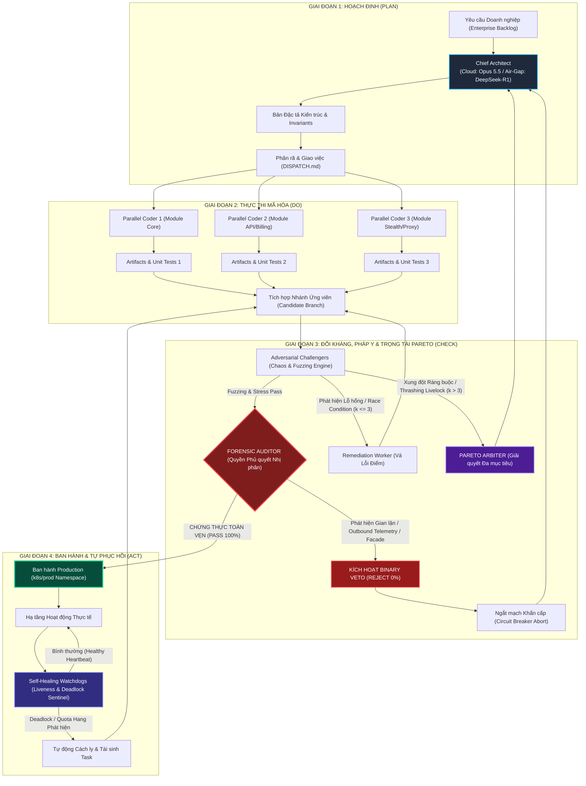
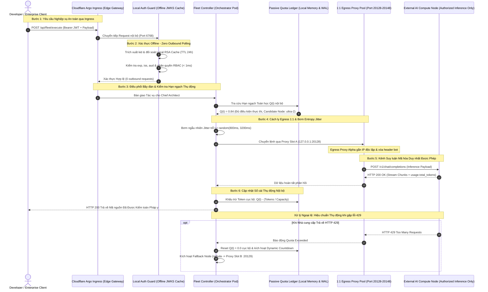
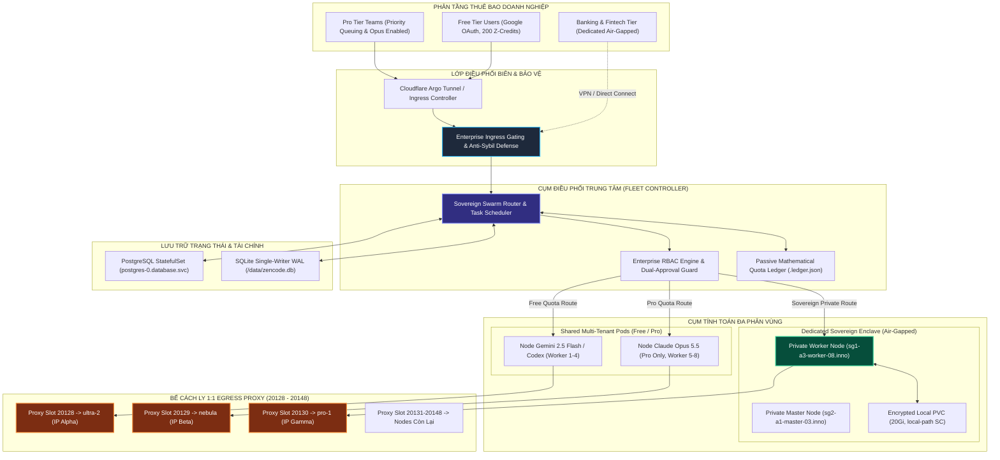
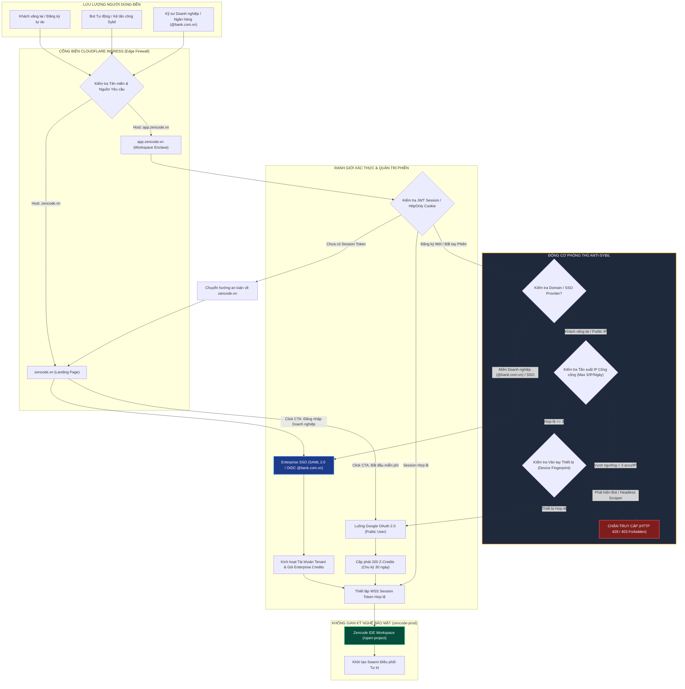

# BẢN TUYÊN NGÔN KIẾN TRÚC DOANH NGHIỆP: NỀN TẢNG KỸ NGHỆ PHẦN MỀM TỰ TRỊ ZENCODE
## ENTERPRISE ARCHITECTURE MANIFESTO & GOVERNANCE MODEL

> **Tài liệu Định chuẩn Kỹ nghệ Cấp Doanh nghiệp (Enterprise Engineering Standard Specification)**  
> **Phiên bản:** `2.4.0-ENTERPRISE`  
> **Phân loại An ninh:** SOVEREIGN CONFIDENTIAL / ZERO-TELEMETRY SPEC  
> **Phạm vi áp dụng:** Toàn bộ cụm máy chủ Zencode Production (`zencode-prod`), Swarm Multi-Agent Controller, Cổng kết nối Tài chính - Ngân hàng, và Cụm Private Fleet Enclave.

---

## MỤC LỤC CHI TIẾT

1. [LỜI MỞ ĐẦU & NGUYÊN TẮC THIẾT KẾ CỐT LÕI (PREAMBLE & CORE ARCHITECTURAL PRINCIPLES)](#1-lời-mở-đầu--nguyên-tắc-thiết-kế-cốt-lõi)
   - 1.1 Tầm nhìn Kiến trúc: Từ Cảm Ứng Vibecode Đến Tự Trị Doanh Nghiệp (Enterprise Sovereign Autonomy)
   - 1.2 5 Định đề Bất biến của Hệ thống (Architectural Invariants)
   - 1.3 Ma trận Phân định Ranh giới Kỹ nghệ: Vibecode vs Enterprise ZenCode
2. [MÔ HÌNH ĐIỀU PHỐI ĐA ĐẠI LÝ CHỦ QUYỀN (SOVEREIGN MULTI-AGENT SWARM COORDINATION)](#2-mô-hình-điều-phối-đa-đại-lý-chủ-quyền)
   - 2.1 Phân cấp 5 Vai trò Chuyên biệt & Năng lực Suy luận (Role Taxonomy & Reasoning Capacity)
   - 2.2 Giao thức Bàn giao Hợp đồng (Handoff Protocol & Interface Contracts)
   - 2.3 Chu trình Tự trị Swarm PDCA & Quyền Phủ quyết Nhị phân (Binary Veto)
   - 2.4 **SƠ ĐỒ MERMAID 1: Sơ đồ Swarm PDCA Loop với Quyền Binary Veto của Forensic Auditor**
3. [CƠ CHẾ TÀNG HÌNH CHỦ QUYỀN & BẤT BIẾN ZERO-TELEMETRY (SOVEREIGN STEALTH & ZERO-TELEMETRY SUBSYSTEM)](#3-cơ-chế-tàng-hình-chủ-quyền--bất-biến-zero-telemetry)
   - 3.1 Bất biến Tuyệt đối về Zero Outbound Telemetry
   - 3.2 Cô lập Egress Proxy 1:1 Độc lập (Per-Node Dedicated Egress Proxy Pool) & Quy tắc `NO_PROXY` Nội bộ
   - 3.3 Hạch toán Passive Quota Ledger: Mô hình Toán học Dòng chảy Token & Hiệu chuẩn Thụ động (Passive Recalibration)
   - 3.4 Xác thực Ngoại tuyến JWT/JWKS Caching với Local Keystore & Mã hóa Luồng Dữ liệu End-to-End
   - 3.5 Khử Chu kỳ Hành vi (Behavioral Entropy Jitter & Deperiodic Temporal Scattering)
   - 3.6 **SƠ ĐỒ MERMAID 4: Sơ đồ Sequence Data Flow & Zero-Telemetry Enforcement**
4. [HỆ THỐNG PHÂN QUYỀN ENTERPRISE RBAC & ĐIỀU PHỐI FLEET ĐA THUÊ BAO (MULTI-TENANT FLEET ALLOCATION)](#4-hệ-thống-phân-quyền-enterprise-rbac--điều-phối-fleet-đa-thuê-bao)
   - 4.1 Phân cấp 4 Tầng Quyền hạn Doanh nghiệp (Enterprise RBAC Tiers)
   - 4.2 Ma trận Phân quyền & Cơ chế Phê duyệt Kép (Dual-Control Approval Workflow)
   - 4.3 Phân vùng Tài nguyên Cụm Máy chủ 3 Phân tầng (Free Tier, Pro Tier, Dedicated Private Fleet)
   - 4.4 **SƠ ĐỒ MERMAID 3: Sơ đồ Multi-Cluster & Multi-Tenant Fleet Topology**
5. [CỔNG KIỂM SOÁT ĐẦU VÀO & PHÒNG THỦ ANTI-SYBIL (INGRESS GATING & ANTI-SYBIL DEFENSE ENGINE)](#5-cổng-kiểm-soát-đầu-vào--phòng-thủ-anti-sybil)
   - 5.1 Tách bạch Lưu lượng Tiếp thị Vãng lai và Không gian Kỹ nghệ Bảo mật (`zencode.vn` vs `app.zencode.vn`)
   - 5.2 Cơ chế Phòng thủ Anti-Sybil Đa lớp (Sliding-Window Rate Limiting & Device Fingerprinting)
   - 5.3 Giao thức Chuyển vùng Phiên làm việc (Session Handshake & Zero-Trust Token Rotation)
   - 5.4 **SƠ ĐỒ MERMAID 2: Sơ đồ Ingress Gating, Anti-Sybil Flow & Authentication Boundary**
6. [KIẾN TRÚC LƯU TRỮ & TÍNH TOÀN VẸN DỮ LIỆU TÀI CHÍNH (STORAGE TOPOLOGY & TRANSACTIONAL INTEGRITY)](#6-kiến-trúc-lưu-trữ--tính-toàn-vẹn-dữ-liệu-tài-chính)
   - 6.1 Kiến trúc Dual-Persistence Engine: SQLite WAL Đơn ghi Cục bộ & PostgreSQL Cụm Phân tán
   - 6.2 Bảo đảm Tính Lũy thừa Tuyệt đối (Strict Financial Idempotency & Concurrency Locking)
   - 6.3 Sổ cái Kiểm toán Mật mã học Bất biến (Append-Only Cryptographic Audit Log)
7. [KHUNG KIỂM TOÁN PHÁP Y & TIÊU CHUẨN ĐẢM BẢO CHẤT LƯỢNG (FORENSIC AUDIT & QUALITY GATE SPECS)](#7-khung-kiểm-toán-pháp-y--tiêu-chuẩn-đảm-bảo-chất-lượng)
   - 7.1 Nguyên tắc Binary Veto của Forensic Auditor: Phê duyệt Nhị phân Không Khoan nhượng
   - 7.2 Thuật toán Bóc tách Giả lập (Anti-Facade Detection Engine) & Ngăn chặn Cheating AI
   - 7.3 Bảng Tiêu chí Kiểm chuẩn Triển khai Môi trường Production (Production Promotion Checklist)
8. [CƠ CHẾ TỰ PHỤC HỒI & TÍNH SẴN SÀNG CAO (SELF-HEALING & HIGH AVAILABILITY WATCHDOG ENGINE)](#8-cơ-chế-tự-phục-hồi--tính-sẵn-sàng-cao)
   - 8.1 Giám sát Nhịp tim Động (Adaptive Heartbeat & Distributed Liveness Probes)
   - 8.2 Thuật toán Phát hiện Bế tắc (Deadlock Detection & Task Preemption)
   - 8.3 Kịch bản Tái sinh Tự trị Pod/Task & Quy trình Cách ly Nút Lỗi (Quarantine & Circuit Breaker)
9. [LỘ TRÌNH TRIỂN KHAI & TIÊU CHUẨN TUÂN THỦ DOANH NGHIỆP (ENTERPRISE DEPLOYMENT & COMPLIANCE ROADMAP)](#9-lộ-trình-triển-khai--tiêu-chuẩn-tuân-thủ-doanh-nghiệp)
   - 9.1 Đáp ứng Bộ Tiêu chuẩn Tài chính Quốc tế: PCI-DSS v4.0, SOC 2 Type II, ISO/IEC 27001:2022
   - 9.2 Khung Triển khai Kubernetes Production Thực tế (`k8s/prod`)
   - 9.3 Tuyên ngôn Kỹ nghệ Tương lai của ZenCode Enterprise

---

## 1. LỜI MỞ ĐẦU & NGUYÊN TẮC THIẾT KẾ CỐT LÕI

### 1.1 Tầm nhìn Kiến trúc: Từ Cảm Ứng Vibecode Đến Tự Trị Doanh Nghiệp (Enterprise Sovereign Autonomy)

Trong giai đoạn khởi thủy của trí tuệ nhân tạo hỗ trợ lập trình (AI-Assisted Coding), ngành công nghiệp phần mềm bị chi phối bởi khái niệm **"Vibecode"** — một phương thức phát triển dựa trên cảm xúc, các prompt tương tác rời rạc giữa lập trình viên đơn lẻ và mô hình ngôn ngữ lớn (LLM). Mặc dù mô hình này mang lại sự hưng phấn ban đầu nhờ khả năng sinh mã nhanh chóng (rapid prototyping), nó bộc lộ những khiếm khuyết mang tính chí tử khi áp dụng vào quy mô doanh nghiệp:

1. **Ảo giác cấu trúc (Structural Hallucination):** Mã nguồn được sinh ra mà không gắn liền với bức tranh tổng thể của hệ thống, phá vỡ kiến trúc module, phát sinh các thư viện phụ thuộc ngẫu nhiên và tích tụ nợ kỹ thuật (technical debt) với tốc độ phi mã.
2. **Rò rỉ dữ liệu và mất chủ quyền kỹ thuật số (Data Sovereignty Breach):** Toàn bộ ngữ cảnh kinh doanh, bí mật công nghệ, mã nguồn tài chính và dữ liệu khách hàng bị gửi về các máy chủ telemetry của bên thứ ba mà không có bất kỳ cơ chế kiểm soát biên giới luồng dữ liệu (data perimeter controls).
3. **Mã giả lập che giấu lỗi (Facade & Mocking Vulnerability):** AI có xu hướng "làm hài lòng người dùng" bằng cách tạo ra các hàm rỗng, hardcode giá trị kiểm thử để vượt qua bài test một cách giả tạo, dẫn đến việc đưa các lỗ hổng logic nghiêm trọng vào môi trường thực tế.
4. **Bất lực trước tính đồng thời và lũy thừa tài chính (Concurrency & Idempotency Failures):** Các công cụ hỗ trợ thông thường không có khả năng mô hình hóa các điều kiện tranh chấp (race conditions), bế tắc (deadlocks) hay đảm bảo tính lũy thừa (idempotency) bắt buộc trong các giao dịch ngân hàng và cổng thanh toán.

**Enterprise ZenCode** ra đời như một sự đoạn tuyệt hoàn toàn với sự ngẫu hứng của Vibecode. Chúng tôi định nghĩa lại sự phát triển phần mềm tự trị ở cấp độ doanh nghiệp (Enterprise Sovereign Autonomy) thông qua việc kết hợp:
- **Tổ chức bầy đàn đa tác tử chuyên biệt hóa (Specialized Multi-Agent Swarm)** với sự phân định ranh giới chức năng rõ ràng.
- **Quy trình kiểm soát chất lượng khép kín theo vòng lặp PDCA (Plan - Do - Check - Act)** được bảo đảm bởi quyền phủ quyết nhị phân tuyệt đối (Binary Veto) của đại lý kiểm toán độc lập.
- **Kiến trúc tàng hình chủ quyền (Sovereign Stealth Architecture)** bảo vệ 100% dữ liệu nội bộ, loại bỏ hoàn toàn các luồng dữ liệu theo dõi (telemetry) ra bên ngoài, kết hợp mạng lưới phân tán proxy cô lập 1:1.

---

### 1.2 5 Định đề Bất biến của Hệ thống (Architectural Invariants)

Bản Tuyên ngôn này xác lập 5 Định đề Bất biến mang tính bắt buộc và vĩnh cửu. Bất kỳ thành phần mã nguồn, quy trình tự trị hoặc bản phát hành nào vi phạm một trong năm định đề này đều bị hệ thống từ chối tự động (Hard Circuit Breaker Rejection):

* **ĐỊNH ĐỀ I: NGUYÊN TẮC ZERO OUTBOUND TELEMETRY (TUYỆT ĐỐI KHÔNG RÒ RỈ DỮ LIỆU)**  
  Hệ thống tuyệt đối không phát sinh bất kỳ yêu cầu mạng outbound nào đến các endpoint thu thập dữ liệu hành vi, đo lường hạn ngạch hoặc theo dõi của bên thứ ba (bao gồm `cloudcode-pa.googleapis.com`, `telemetry.anthropic.com`, `api.segment.io`, `sentry.io`, v.v.). Mọi hoạt động xác minh hạn ngạch phải diễn ra cục bộ thông qua mô phỏng toán học nội bộ.

* **ĐỊNH ĐỀ II: NGUYÊN TẮC CÁCH LY PROXY 1:1 PER-NODE (1:1 EGRESS PROXY ISOLATION)**  
  Mỗi nút tính toán (fleet node) trong mạng lưới đại lý bắt buộc phải được gắn kết duy nhất với một Egress Proxy riêng biệt (khác biệt hoàn toàn về địa chỉ IP/Port). Tuyệt đối không cho phép dùng chung proxy giữa các node nhằm triệt tiêu hoàn toàn khả năng tương quan dấu vết hành vi (footprint correlation).

* **ĐỊNH ĐỀ III: QUYỀN PHỦ QUYẾT NHỊ PHÂN CỦA ĐẠI LÝ KIỂM TOÁN (BINARY VETO SUPREMACY)**  
  Mã nguồn chỉ được phép chuyển giao hoặc tích hợp khi và chỉ khi vượt qua bài kiểm toán pháp y toàn diện của Forensic Auditor với kết quả `PASS` nhị phân (100% hoặc 0%). Không có trạng thái "thông qua có điều kiện" hay can thiệp ghi đè (override) từ các đại lý tạo sinh.

* **ĐỊNH ĐỀ IV: TÍNH LŨY THỪA TÀI CHÍNH & BẢO TOÀN TRẠNG THÁI (STRICT FINANCIAL IDEMPOTENCY)**  
  Mọi giao dịch thanh toán, cộng trừ credit, khớp lệnh webhook và biến động số dư phải được thiết kế bảo đảm tính lũy thừa tuyệt đối $f(f(x)) = f(x)$. Hệ thống phải kháng cự 100% các cuộc tấn công nạp đúp (double-spending), phát lại gói tin (replay attacks) và xung đột ghi đồng thời (concurrency collisions).

* **ĐỊNH ĐỀ V: KHỬ CHU KỲ HÀNH VI QUA ENTROPY JITTER (DEPERIODIC TEMPORAL SCATTERING)**  
  Tất cả các luồng quét, vòng lặp đánh giá hạn ngạch, nhịp tim giám sát và giao tiếp giữa các node phải được rải ngẫu nhiên bằng độ trễ biến thiên (temporal jitter). Tuyệt đối cấm sử dụng các chu kỳ đồng hồ cố định (`setInterval`) nhằm ngăn chặn việc nhận diện hành vi tự động từ các bộ giám sát mạng ngoại vi.

---

### 1.3 Ma trận Phân định Ranh giới Kỹ nghệ: Vibecode vs Enterprise ZenCode

| Tiêu chí Đánh giá | Vibecode (Lập trình Cảm ứng Cá nhân) | Enterprise ZenCode (Hệ điều hành Kỹ nghệ Tự trị) |
|---|---|---|
| **Mô hình Tác tử** | Đơn lẻ (Monolithic Prompting) hoặc một Agent kiêm nhiệm mọi việc | Bầy đàn 5 vai trò chuyên biệt (Architect, Coders, Challengers, Auditor, Watchdog) |
| **Kiểm soát Chất lượng** | Lập trình viên tự nhìn nhận, test sơ sài hoặc bỏ qua | Chu trình Swarm PDCA khép kín với Quyền Phủ quyết Nhị phân (Binary Veto) độc lập |
| **Bảo vệ Dữ liệu** | Dữ liệu, code và token telemetry rò rỉ trực tiếp ra các dịch vụ AI công cộng | Sovereign Stealth Mode: Zero Outbound Telemetry, 1:1 Egress Proxy Isolation |
| **Quản trị Quota** | Polling trực tiếp API của nhà cung cấp, dễ bị rate limit và lộ vết | Hạch toán thụ động (Passive Mathematical Quota Ledger), chỉ hiệu chuẩn khi gặp 429 |
| **Xử lý Mã nguồn** | Viết đè file bừa bãi, xóa comment, phát sinh mã rác và dummy test | Minimal Change Principle, bảo toàn cấu trúc hiện hữu, cấm tuyệt đối mã facade/mocking |
| **Phân quyền & Multi-Tenant** | Không phân tầng, dùng chung credential và không gian bộ nhớ | RBAC 4 tầng nghiêm ngặt, cách ly tài nguyên giữa Free Tier, Pro Tier và Private Fleet |
| **Khả năng Phục hồi** | Tiến trình chết gây gián đoạn toàn bộ phiên làm việc | Self-Healing Watchdogs tự động phát hiện deadlock, giải phóng khóa và tái sinh Pod |
| **Mức độ Sẵn sàng** | Thử nghiệm, đồ chơi cá nhân (Toy Prototyping) | Sản xuất thực tế cấp Doanh nghiệp, Ngân hàng, Fintech, Viễn thông (Mission-Critical) |

---

## 2. MÔ HÌNH ĐIỀU PHỐI ĐA ĐẠI LÝ CHỦ QUYỀN (SOVEREIGN MULTI-AGENT SWARM COORDINATION)

Kiến trúc Swarm của Enterprise ZenCode loại bỏ hoàn toàn mô hình "một tác tử vạn năng" (Omnipotent Agent). Thay vào đó, hệ thống hoạt động như một bộ máy công nghiệp chính xác cao, phân bổ quyền lực và trách nhiệm theo 5 vai trò độc lập, phối hợp thông qua các giao thức hợp đồng giao tiếp bất biến.

```
                    ┌────────────────────────────────────────────────────────┐
                    │               1. CHIEF ARCHITECT                       │
                    │   - Sovereign Cloud: Claude Opus 5.5 Reasoning         │
                    │   - Air-Gapped Enclave: DeepSeek-R1 / Qwen 2.5 72B     │
                    │   - Hoạch định Kiến trúc & Khung Dự án                 │
                    │   - Phân rã Milestone & Contract Boundaries           │
                    │   - Thiết lập Invariants & Verification Targets        │
                    └───────────────────────────┬────────────────────────────┘
                                                │
                                                │ Dispatch Specs & Contracts
                                                ▼
                    ┌────────────────────────────────────────────────────────┐
                    │               2. PARALLEL CODERS                       │
                    │   - Sovereign Cloud: Sonnet 4.6 / Gemini Flash Engine  │
                    │   - Air-Gapped Enclave: Qwen 2.5 Coder 32B/14B (vLLM)  │
                    │   - Thực thi mã hóa song song theo Module Boundary     │
                    │   - Tuân thủ Minimal Change Principle                  │
                    │   - Tự tạo unit test hành vi nội bộ                    │
                    └───────────────────────────┬────────────────────────────┘
                                                │
                                                │ Code Artifacts & Diff
                                                ▼
                    ┌────────────────────────────────────────────────────────┐
                    │             3. ADVERSARIAL CHALLENGERS                 │
                    │        (Chaos, Stress & Fuzzing Engines)               │
                    │   - Tấn công phá vỡ Invariants & Hợp đồng Interface    │
                    │   - Fuzzing biên dữ liệu, nạp đúp, race conditions     │
                    │   - Báo cáo lỗ hổng phản hồi ngược cho Coders          │
                    └───────────────────────────┬────────────────────────────┘
                                                │
                                                │ Challenged Candidate Release
                                                ▼
                    ┌────────────────────────────────────────────────────────┐
                    │               4. FORENSIC AUDITOR                      │
                    │        (Independent Integrity Gatekeeper)              │
                    │   - Kiểm toán pháp y: Quét Cheating, Facade & Mocks    │
                    │   - Xác minh Zero-Telemetry & Sovereign Invariants     │
                    │   - QUYỀN PHỦ QUYẾT NHỊ PHÂN TUYỆT ĐỐI (BINARY VETO)   │
                    └─────────────────────┬──────────────────┬───────────────┘
                                          │                  │
                          PASS (100%)     │                  │ REJECT (0%)
                                          ▼                  ▼
                    ┌─────────────────────────┐  ┌───────────────────────────┐
                    │   PRODUCTION PROMOTION  │  │   CIRCUIT BREAKER ABORT   │
                    │ (Release to Kubernetes) │  │  (Rollback & Re-dispatch) │
                    └─────────────────────────┘  └───────────────────────────┘
                                ▲                              ▲
                                │                              │
                    ┌───────────┴──────────────────────────────┴─────────────┐
                    │             5. SELF-HEALING WATCHDOGS                  │
                    │        (Autonomous Liveness & Deadlock Sentinel)       │
                    │   - Giám sát liveness phân tán & tiến độ heartbeat     │
                    │   - Giải phóng mutex deadlock & cô lập Worker lỗi      │
                    │   - Tái sinh tác vụ và khôi phục trạng thái nguyên vẹn │
                    └────────────────────────────────────────────────────────┘
```

---

### 2.1 Phân cấp 5 Vai trò Chuyên biệt & Năng lực Suy luận

#### 1. Chief Architect (Năng lực Suy luận Cấp độ Opus 5.5 / DeepSeek-R1)
- **Sứ mệnh:** Thiết lập cấu trúc nền tảng, tư duy chiến lược hệ thống và hoạch định ranh giới mô-đun.
- **Năng lực Suy luận:** Trong môi trường Sovereign Cloud Fleet, Chief Architect sử dụng Claude Opus 5.5 / OpenAI O3-Max thông qua 1:1 Egress Proxy Pool. Trong môi trường Tier-1 Strict Air-Gapped Enclave (Core Banking, ngắt 100% Internet), vai trò Chief Architect được đảm nhiệm bởi DeepSeek-R1 671B hoặc Qwen 2.5 Coder 72B Instruct triển khai cục bộ trên cụm GPU vLLM/TensorRT-LLM.
- **Phạm vi Trách nhiệm:**
  - Tiếp nhận các yêu cầu nghiệp vụ cấp cao từ phía tổ chức hoặc hệ thống điều phối cấp trên (`ORIGINAL_REQUEST.md`).
  - Thiết lập tài liệu phân tích hiện trạng, kiến trúc dự án và hợp đồng giao tiếp giữa các mô-đun.
  - Phân rã mục tiêu thành các mốc kỹ thuật cụ thể (Milestones) kèm theo các chỉ tiêu đo lường định lượng độc lập (Verification Targets).
  - Xác lập danh mục các bất biến hệ thống (System Invariants) mà các đại lý lập trình không bao giờ được phép vi phạm.
- **Nguyên tắc Hoạt động:** Chief Architect chỉ tập trung vào thiết kế cấp cao và phân bổ nhiệm vụ (Dispatching); tuyệt đối không tham gia viết mã chi tiết để tránh làm loãng ngữ cảnh tư duy trừu tượng.

#### 2. Parallel Coders (Năng lực Thực thi Tốc độ cao Cấp độ Sonnet / Flash / Qwen 2.5)
- **Sứ mệnh:** Triển khai mã nguồn chính xác, tối ưu hóa thông lượng và tuân thủ chặt chẽ ranh giới module được giao.
- **Năng lực Thực thi:** Claude Sonnet 4.6 / Gemini 2.5 Flash trong Sovereign Cloud Fleet, hoặc Qwen 2.5 Coder 32B / 14B Quantized trên vLLM nội bộ trong Air-Gapped Enclave.
- **Phạm vi Trách nhiệm:**
  - Nhận nhiệm vụ độc quyền từ `DISPATCH.md` do Chief Architect hoặc Orchestrator phát lệnh.
  - Áp dụng triệt để **Nguyên tắc Thay đổi Tối thiểu (Minimal Change Principle)**: Chỉ chỉnh sửa đúng phạm vi được giao, tuyệt đối không "nhân tiện refactor" mã nguồn bên ngoài.
  - Bảo tồn toàn bộ chú thích (comments), docstrings và phong cách kiến trúc hiện hữu của dự án.
  - Tự động xây dựng các bài kiểm thử đơn vị tập trung vào hành vi (Behavior-driven unit tests) cho mỗi đoạn mã mới.
- **Nguyên tắc Hoạt động:** Hoạt động hoàn toàn độc lập trong không gian làm việc (workspace isolation), giao tiếp với hệ thống chỉ qua artifacts và file báo cáo chuyển giao (`handoff.md`).

#### 3. Adversarial Challengers (Động cơ Fuzzing & Tấn công Đối kháng)
- **Sứ mệnh:** Đóng vai trò là "Kẻ thù giả lập" (Red Team), chủ động tìm kiếm mọi cách thức để phá vỡ mã nguồn của Parallel Coders trước khi mã được đưa vào quy trình kiểm toán.
- **Phạm vi Trách nhiệm:**
  - Xây dựng các kịch bản kiểm thử đối kháng (Adversarial Stress Scenarios): Gửi chuỗi ký tự rỗng, số âm, giá trị vượt ngưỡng (`NaN`, `Infinity`, `Buffer Overflow`).
  - Mô phỏng các cuộc tấn công tái nhập (Reentrancy Attacks), nạp đúp giao dịch tài chính (Double-spending Replay), và điều kiện tranh chấp ghi đồng thời (Concurrent Race Conditions).
  - Ép tải hệ thống ở các mức phân vị cao ($c=15, 30, 50, 100$) để tìm kiếm hiện tượng nghẽn luồng (thread starvation) hoặc rò rỉ bộ nhớ (memory leaks).
- **Nguyên tắc Hoạt động:** Không bao giờ giả định mã nguồn là đúng; mục tiêu duy nhất là tìm ra lỗi và bẻ gãy hệ thống.

#### 4. Forensic Auditor (Người gác cổng Độc lập với Quyền Phủ quyết Nhị phân - Binary Veto)
- **Sứ mệnh:** Giám sát tuân thủ, phát hiện gian lận và chứng thực pháp y toàn diện cho toàn bộ quy trình.
- **Phạm vi Trách nhiệm:**
  - Kiểm tra tính trung thực của mã nguồn: Quét và loại bỏ triệt để các hành vi hardcode giá trị kiểm thử, tạo hàm rỗng giả lập (facade implementations) nhằm đánh lừa bộ test.
  - Giám sát tuân thủ Sovereign Stealth Mode: Xác minh trên cấp độ socket mạng rằng 100% không có bất kỳ outbound request nào rò rỉ ra các domain theo dõi của bên thứ ba.
  - Kiểm tra sự hiện diện và tính hợp lệ của tài liệu bàn giao (`handoff.md`), báo cáo tiến độ (`progress.md`) và nhật ký hệ thống.
- **Quyền Phủ Quyết Nhị Phân (Binary Veto Supremacy):** Forensic Auditor sở hữu quyền năng tối cao trong việc phủ quyết bất kỳ bản phát hành nào. Chỉ có hai trạng thái: `PASS (100%)` hoặc `REJECT (0%)`. Nếu phát hiện bất kỳ dấu hiệu gian lận nào, toàn bộ nhánh công việc sẽ bị kích hoạt ngắt mạch khẩn cấp (Circuit Breaker Abort) và trả về giai đoạn hoạch định.

#### 5. Self-Healing Watchdogs (Vệ binh Giám sát Tự trị & Khắc phục Bế tắc)
- **Sứ mệnh:** Duy trì tính sẵn sàng cao (High Availability), theo dõi dấu hiệu sinh tồn (Liveness Monitoring) và tự động giải quyết các tình huống bế tắc (Deadlocks / Resource Hangs).
- **Phạm vi Trách nhiệm:**
  - Thu thập nhịp tim liveness động thông qua tệp `progress.md` của các đại lý (yêu cầu cập nhật định kỳ không quá 5 phút).
  - Tự động phát hiện các tiến trình chạy nền bị treo (hung subprocesses), các socket kết nối WebSocket bị đứt đoạn, hoặc các giao dịch giữ khóa cơ sở dữ liệu quá ngưỡng cho phép ($T > 30\text{s}$).
  - Tự động kích hoạt cơ chế giải phóng tài nguyên, hủy tác vụ bị nghẽn (Task Preemption), và tái sinh Worker mới để tiếp quản trạng thái còn dang dở.

---

### 2.2 Giao thức Bàn giao Hợp đồng (Handoff Protocol & Interface Contracts)

Để bảo đảm tính tự trị và khả năng mở rộng không giới hạn của hệ thống bầy đàn, mọi hoạt động bàn giao giữa các đại lý bắt buộc phải tuân thủ **Giao thức Bàn giao Tự chứng thực (Self-Contained Handoff Protocol)**. Mọi báo cáo bàn giao (`handoff.md`) phải bao gồm chính xác 5 thành phần cấu trúc:

1. **Quan sát Trực tiếp (Direct Observations):** Liệt kê đường dẫn tệp chính xác, số dòng cụ thể, mã lỗi nguyên văn từ trình biên dịch, cùng các lệnh thực thi công cụ kèm kết quả trả về. Tuyệt đối không suy đoán khi chưa kiểm chứng qua tệp thực tế.
2. **Chuỗi Logic Suy luận (Formal Logic Chain):** Diễn giải từng bước tư duy từ dữ kiện quan sát đến kết luận kỹ thuật. Mỗi bước lập luận phải dẫn chiếu đến ít nhất một quan sát thực tế đã được xác minh.
3. **Giả định & Cảnh báo Biên (Caveats & Edge Cases):** Xác định rõ các vùng biên chưa được kiểm tra, các giả định môi trường (ví dụ: phiên bản Node.js, trạng thái WAL của SQLite), và các diễn giải kỹ thuật thay thế đã bị loại bỏ.
4. **Kết luận Kỹ thuật (Scoped Technical Conclusion):** Đưa ra đánh giá dứt khoát về trạng thái của mô-đun, các hành động tiếp theo có tính thực thi cao, được khoanh vùng ranh giới rõ ràng.
5. **Phương thức Kiểm chứng Độc lập (Independent Verification Method):** Cung cấp các câu lệnh tự động (ví dụ: `pytest tests/e2e/test_stealth_security_audit.py`, `npm test`) để bất kỳ đại lý kiểm toán nào cũng có thể tái lập kết quả một cách khách quan trong vòng dưới 60 giây.

---

### 2.3 Chu trình Tự trị Swarm PDCA, Quyền Phủ quyết Nhị phân & Trọng Tài Pareto

Mọi tác vụ kỹ nghệ trong Enterprise ZenCode được vận hành theo vòng tuần hoàn khép kín PDCA:

* **P - PLAN (Hoạch định):** Chief Architect tiếp nhận yêu cầu, phân tích khoảng trống kỹ thuật (gap analysis), định hình hợp đồng kiến trúc, khởi tạo các mốc kiểm chuẩn, và phân phối nhiệm vụ vào `DISPATCH.md`.
* **D - DO (Thực thi):** Parallel Coders nhận dispatch, kiểm tra ngữ cảnh hiện hữu, thực thi thay đổi mã nguồn theo nguyên tắc tối thiểu, biên dịch và chạy kiểm thử nội bộ.
* **C - CHECK (Thử thách & Kiểm toán):**
  - Adversarial Challengers tiến hành dập tải, fuzzing đối kháng, kiểm tra tính lũy thừa và điều kiện tranh chấp.
  - Forensic Auditor tiến hành quét pháp y, kiểm tra tính trung thực, rà soát bất biến Zero-Telemetry và thực thi quyền phủ quyết nhị phân (Binary Veto).
* **A - ACT (Khắc phục, Trọng tài Pareto & Chuẩn hóa):** 
  - Nếu xuất hiện bất kỳ sai sót nào trong bước Check, hệ thống tự động kích hoạt đại lý Remediation Worker để sửa chữa chính xác lỗi đó mà không làm thay đổi các phần khác.
  - **Cơ chế Chống Dao Động Bế Tắc (Anti-Livelock Pareto Arbiter & Max Retry $k=3$):** Để ngăn chặn nguy cơ bế tắc dao động vô hạn (Livelock Oscillatory Thrashing) khi các ràng buộc đối kháng xung đột nhau (ví dụ: Challenger yêu cầu khóa bi quan chống race condition làm suy giảm độ trễ, trong khi Auditor phủ quyết vì trượt SLA latency), hệ thống khống chế trần thử lại $k = 3$ chu kỳ. Nếu sau 3 lượt khắc phục mà bài toán chưa hội tụ, tác vụ được chuyển giao cho **Trọng Tài Pareto (Pareto Arbiter)** do Chief Architect kích hoạt để tái cấu trúc giải pháp trên ranh giới tối ưu đa mục tiêu (Pareto Frontier) — ví dụ: chuyển sang khóa phân vùng vi mô hoặc máy trạng thái phi đồng bộ, chấm dứt hoàn toàn hiện tượng dao động kẹt.
  - Khi toàn bộ các cổng kiểm soát đạt 100% Pass, phiên bản được đưa vào quy trình đóng gói và triển khai môi trường sản xuất (`k8s/prod`).

---

### 2.4 SƠ ĐỒ MERMAID 1: Sơ đồ Swarm PDCA Loop với Quyền Binary Veto của Forensic Auditor & Trọng Tài Pareto



---

## 3. CƠ CHẾ TÀNG HÌNH CHỦ QUYỀN & BẤT BIẾN ZERO-TELEMETRY (SOVEREIGN STEALTH & ZERO-TELEMETRY SUBSYSTEM)

Chủ quyền dữ liệu (Data Sovereignty) là tôn chỉ bất khả xâm phạm của Enterprise ZenCode. Đối với các tổ chức tài chính, ngân hàng và doanh nghiệp an ninh cấp cao, việc gửi dù chỉ một byte dữ liệu ngữ cảnh hoặc thông số hành vi ra ngoài biên giới hệ thống đều cấu thành một sự vi phạm an ninh nghiêm trọng.

---

### 3.1 Bất biến Tuyệt đối về Zero Outbound Telemetry

Theo quy định bất biến tại `GEMINI.md`, phân hệ Sovereign Stealth Engine áp dụng chính sách **Zero Outbound Polling**:
1. Cấm tuyệt đối mọi cuộc gọi HTTP/gRPC ra các dịch vụ giám sát bên thứ ba:
   - Các API kiểm tra hạn ngạch và trợ lý của Google: `cloudcode-pa.googleapis.com`, `cloudaicompanion.googleapis.com`, `oauth2.googleapis.com`, `*.googleapis.com` (ngoại trừ kênh suy luận code generation được ủy quyền qua proxy mã hóa).
   - Các API telemetry của Anthropic: `telemetry.anthropic.com`.
   - Các nhà cung cấp dịch vụ tracking sự kiện và phân tích sản phẩm: `api.segment.io`, `sentry.io`, `mixpanel.com`, `datadoghq.com`.
2. Hệ thống kiểm soát mức ổ cắm mạng (Socket-Level Interceptor) chặn đứng mọi kết nối chưa được cấp phép. Bất kỳ tiến trình nào cố tình phát sinh kết nối đến danh sách cấm sẽ bị ngắt kết nối ngay lập tức (`ECONNREFUSED` giả lập) và ghi nhật ký cảnh báo an ninh.

---

### 3.2 Cô lập Egress Proxy 1:1 Độc lập & Quy tắc `NO_PROXY` Nội bộ

Để triệt tiêu hoàn toàn khả năng nhà cung cấp AI bên ngoài liên kết các yêu cầu từ các nút khác nhau trong cụm cluster, ZenCode duy trì một **Bể Egress Proxy Chuyên biệt (Per-Node Dedicated Egress Proxy Pool)**:

```
[Fleet Worker Node] ------------(1:1 Dedicated Bind)------------> [Dedicated Local Egress Proxy] ---> [External Network]
ultra-2        ---------> http://127.0.0.1:20128 (Slot A)       -------> Egress IP Alpha
nebula         ---------> http://127.0.0.1:20129 (Slot B)       -------> Egress IP Beta
pro-1          ---------> http://127.0.0.1:20130 (Slot C)       -------> Egress IP Gamma
node-4         ---------> http://127.0.0.1:20131 (Slot D)       -------> Egress IP Delta
binhthuong     ---------> http://127.0.0.1:20132 (Slot E)       -------> Egress IP Epsilon
sunward        ---------> http://127.0.0.1:20133 (Slot F)       -------> Egress IP Zeta
...            ---------> Dải Port 20128 đến 20148 (Tối thiểu 21 Slots Độc lập)
```

#### Bảng Đặc tả Chi tiết 21 Slots Egress Proxy Pool Cụm Production

Hệ thống duy trì một bể Egress Proxy tĩnh gồm 21 cổng độc lập được ánh xạ 1:1 với danh sách nút tính toán trong cụm fleet. Mỗi cổng được cấu hình chạy qua một tiến trình proxy cục bộ độc lập (ví dụ: `tinyproxy` hoặc `microsocks`) lắng nghe trên giao diện loopback và kết nối ra ngoài qua các giao diện mạng mạng riêng biệt:

| Slot ID | Cổng Local (Port) | Node Định danh (Fleet Node) | Vai trò Phân bổ (Assigned Role) | Egress Network Profile | Failover Target |
|:---:|:---:|:---:|:---:|:---:|:---:|
| `SLOT_01` | `20128` | `ultra-2` | Chief Architect / Reasoning | Dedicated Static IP Alpha | `nebula` (:20129) |
| `SLOT_02` | `20129` | `nebula` | Secondary Architect / Fallback | Dedicated Static IP Beta | `ultra-2` (:20128) |
| `SLOT_03` | `20130` | `pro-1` | Parallel Coder (Core Engine) | Egress Pool Gamma | `pro-2` (:20134) |
| `SLOT_04` | `20131` | `node-4` | Parallel Coder (API & Billing) | Egress Pool Delta | `node-5` (:20135) |
| `SLOT_05` | `20132` | `binhthuong` | Parallel Coder (UI & Client) | Egress Pool Epsilon | `binhthuong-2` (:20136) |
| `SLOT_06` | `20133` | `sunward` | Adversarial Challenger 1 | Egress Pool Zeta | `sunward-2` (:20137) |
| `SLOT_07` | `20134` | `pro-2` | Adversarial Challenger 2 | Egress Pool Eta | `pro-1` (:20130) |
| `SLOT_08` | `20135` | `node-5` | Forensic Auditor Node | Egress Pool Theta | `node-6` (:20138) |
| `SLOT_09` | `20136` | `binhthuong-2`| Self-Healing Watchdog Node | Egress Pool Iota | `binhthuong` (:20132) |
| `SLOT_10` | `20137` | `sunward-2` | Remediation Specialist | Egress Pool Kappa | `sunward` (:20133) |
| `SLOT_11` | `20138` | `node-6` | Benchmark Load Generator | Egress Pool Lambda | `node-4` (:20131) |
| `SLOT_12` | `20139` | `fleet-worker-12` | Multi-Tenant Free Tier Worker | Egress Pool Mu | `fleet-worker-13` (:20140) |
| `SLOT_13` | `20140` | `fleet-worker-13` | Multi-Tenant Free Tier Worker | Egress Pool Nu | `fleet-worker-12` (:20139) |
| `SLOT_14` | `20141` | `fleet-worker-14` | Multi-Tenant Pro Tier Worker | Egress Pool Xi | `fleet-worker-15` (:20142) |
| `SLOT_15` | `20142` | `fleet-worker-15` | Multi-Tenant Pro Tier Worker | Egress Pool Omicron | `fleet-worker-14` (:20141) |
| `SLOT_16` | `20143` | `fleet-worker-16` | Enterprise Staging Enclave | Egress Pool Pi | `fleet-worker-17` (:20144) |
| `SLOT_17` | `20144` | `fleet-worker-17` | Banking Dedicated Worker Alpha | Isolated Banking IP Rho | `fleet-worker-18` (:20145) |
| `SLOT_18` | `20145` | `fleet-worker-18` | Banking Dedicated Worker Beta | Isolated Banking IP Sigma | `fleet-worker-17` (:20144) |
| `SLOT_19` | `20146` | `fleet-worker-19` | PCI-DSS Enclave Worker Gamma | Isolated Banking IP Tau | `fleet-worker-20` (:20147) |
| `SLOT_20` | `20147` | `fleet-worker-20` | PCI-DSS Enclave Worker Delta | Isolated Banking IP Upsilon | `fleet-worker-19` (:20146) |
| `SLOT_21` | `20148` | `fleet-worker-21` | Air-Gapped Master Sentinel | Sovereign Private Gateway | Standalone Circuit Breaker |

##### Quy tắc Phân định Biên giới Mạng (Network Boundary Disambiguation):
- **Đối với Phân tầng Sovereign Cloud (Tier 1 & Tier 2):** Các Proxy Slots (20128–20147) định tuyến lưu lượng ra các nhà cung cấp mô hình (Google Cloud, Anthropic) qua các Egress IP riêng biệt với Passive Quota và Behavioral Jitter.
- **Đối với Phân tầng Tier-1 Strict Air-Gapped On-Premise Enclave (Tier 3):** Toàn bộ cổng kết nối ra Internet công cộng bị ngắt hoàn toàn (`default route 0.0.0.0/0` bị drop tại Core Switch vật lý). Dải Proxy Slot (20128–20148) lúc này đóng vai trò **Bộ Điều Phối Vi Phân Vùng Nội Bộ (Internal Micro-Segmentation Proxies)** trên giao diện loopback/mTLS cục bộ: cô lập từng tác tử với các dịch vụ nội bộ (cụm GPU vLLM/TensorRT-LLM nội bộ, PostgreSQL StatefulSet, HSM PKCS#11 Daemon). Tuyệt đối không có bất kỳ kết nối hay phụ thuộc nào vào API đám mây công cộng bên ngoài.

#### Thuật toán Gắn kết Proxy Độc lập (Deterministic Node-to-Proxy Mapping)
Khi khởi chạy một tác tử, router điều phối thực thi hàm băm nhất quán (Consistent Hash hoặc Direct Table Lookup) để gán kết nối:
```typescript
export function getProxyForNode(nodeName: string): { httpProxy: string; httpsProxy: string; noProxy: string } {
  const PROXY_MAP: Record<string, number> = {
    'ultra-2': 20128,
    'nebula': 20129,
    'pro-1': 20130,
    'node-4': 20131,
    'binhthuong': 20132,
    'sunward': 20133,
    'pro-2': 20134,
    'node-5': 20135,
    'binhthuong-2': 20136,
    'sunward-2': 20137,
    'node-6': 20138,
    'fleet-worker-12': 20139,
    'fleet-worker-13': 20140,
    'fleet-worker-14': 20141,
    'fleet-worker-15': 20142,
    'fleet-worker-16': 20143,
    'fleet-worker-17': 20144,
    'fleet-worker-18': 20145,
    'fleet-worker-19': 20146,
    'fleet-worker-20': 20147,
    'fleet-worker-21': 20148,
  };

  const port = PROXY_MAP[nodeName] || 20128;
  const proxyUrl = `http://127.0.0.1:${port}`;

  return {
    httpProxy: proxyUrl,
    httpsProxy: proxyUrl,
    noProxy: 'localhost,127.0.0.1,::1,*.modal.run,modal.direct,*.cluster.local,postgres-service.database.svc.cluster.local,10.0.0.0/8,172.16.0.0/12,192.168.0.0/16'
  };
}
```

#### Quy tắc Bất biến `NO_PROXY` Nội bộ
Các kết nối nội bộ trong mạng lưới Kubernetes cluster bắt buộc phải bỏ qua proxy để bảo đảm độ trễ cực thấp (< 15ms) và không gây tắc nghẽn lưu lượng điều phối:
```bash
export NO_PROXY="localhost,127.0.0.1,::1,*.modal.run,modal.direct,*.cluster.local,postgres-service.database.svc.cluster.local,10.0.0.0/8,172.16.0.0/12,192.168.0.0/16"
```

---

### 3.3 Hạch toán Passive Quota Ledger: Mô hình Toán học Dòng chảy Token

Thay vì chủ động gửi request kiểm tra số dư quota ra bên ngoài (hành vi làm lộ vết tự động hóa), ZenCode sử dụng **Mô hình Mô phỏng Toán học Thụ động (Passive Mathematical Simulation Ledger)**.

Số dư hạn ngạch khả dụng của một nút tính toán tại thời điểm $t$ được xác định theo phương trình vi phân dòng chảy:

$$Q(t) = \min\left(1.0, \; Q(t_0) + \alpha \cdot (t - t_0)\right) - \sum_{i=1}^{N} \frac{\text{Tokens Consumed}_i}{\text{Capacity}}$$

Trong đó:
- $Q(t) \in [0.0, 1.0]$ là tỷ lệ phần trăm hạn ngạch khả dụng tại thời điểm $t$.
- $Q(t_0)$ là trạng thái hạn ngạch được ghi nhận tại thời điểm kiểm tra gần nhất $t_0$.
- $\alpha$ là hệ số phục hồi tự nhiên của hạn ngạch theo thời gian (Token Refill Rate per Second), được tham số hóa dựa trên quy định chuẩn của từng mô hình nhà cung cấp.
- $\Delta t = t - t_0$ là khoảng thời gian trôi qua giữa hai trạng thái.
- $\text{Tokens Consumed}_i$ là số lượng token thực tế đã tiêu thụ trong phiên thứ $i$, được tính toán chính xác từ phản hồi hoàn tất (`usage.total_tokens`) mà không cần truy vấn riêng biệt.
- $\text{Capacity}$ là dung lượng token tối đa trong cửa sổ tính phí của nhà cung cấp.

#### Cấu trúc Bản ghi Sổ cái Hạch toán Thụ động (`.passive_quota_ledger.json`)
Sổ cái được lưu trữ cục bộ tại `/home/paseo/.passive_quota_ledger.json` hoặc trong bộ nhớ RAM của Fleet Controller, hoàn toàn độc lập với các API kiểm tra hạn ngạch của bên thứ ba:
```json
{
  "version": "2.4.0",
  "updated_at": 1728261022,
  "nodes": {
    "ultra-2": {
      "provider": "google-enterprise",
      "model": "claude-opus-5.5-preview",
      "capacity_tokens_per_minute": 300000,
      "refill_rate_per_sec": 5000.0,
      "current_fraction": 0.842,
      "last_transaction_timestamp": 1728261010,
      "last_consumed_tokens": 14250,
      "consecutive_429_count": 0,
      "cooloff_until": null,
      "assigned_proxy_port": 20128
    },
    "pro-1": {
      "provider": "google-vertex-private",
      "model": "gemini-2.5-flash",
      "capacity_tokens_per_minute": 4000000,
      "refill_rate_per_sec": 66666.6,
      "current_fraction": 0.965,
      "last_transaction_timestamp": 1728261018,
      "last_consumed_tokens": 3200,
      "consecutive_429_count": 0,
      "cooloff_until": null,
      "assigned_proxy_port": 20130
    }
  }
}
```

#### Thuật toán Mô phỏng Quota & Lập Kế hoạch Điều phối (Simulation Engine)
```python
import time
import random
from typing import Dict, Any, Optional

class PassiveQuotaSimulator:
    """Động cơ mô phỏng hạn ngạch toán học thụ động chạy nội bộ (Zero Outbound Polling)
    với cơ chế Khóa Giữ Chỗ Hai Pha (Two-Phase Token Reservation Lease) chống bão Over-Subscription.
    """
    
    def __init__(self, ledger_state: Dict[str, Any]):
        self.nodes = ledger_state.get("nodes", {})
        # Bảng theo dõi các hợp đồng giữ chỗ hạn ngạch: {lease_id: {"node": str, "reserved_tokens": int, "expires_at": float}}
        self.active_leases: Dict[str, Dict[str, Any]] = ledger_state.get("active_leases", {})

    def _cleanup_expired_leases(self, node_name: str, now: float) -> None:
        """Tự động thu hồi các hợp đồng giữ chỗ đã quá hạn TTL (phòng ngừa worker crash)."""
        expired = [
            lid for lid, l in self.active_leases.items()
            if l.get("node") == node_name and l.get("expires_at", 0) < now
        ]
        for lid in expired:
            del self.active_leases[lid]

    def get_reserved_tokens(self, node_name: str, now: float) -> int:
        """Tổng số tokens đang bị tạm khóa bởi các tác vụ đang suy luận dở dang."""
        self._cleanup_expired_leases(node_name, now)
        return sum(
            l["reserved_tokens"] for l in self.active_leases.values()
            if l.get("node") == node_name and l.get("expires_at", 0) >= now
        )

    def evaluate_node(self, node_name: str) -> float:
        """Tính toán tỷ lệ hạn ngạch khả dụng ròng Q_avail(t) sau khi khấu trừ token đã giữ chỗ."""
        node = self.nodes.get(node_name)
        if not node:
            return 0.0

        now = time.time()
        cooloff = node.get("cooloff_until")
        if cooloff and now < cooloff:
            return 0.0  # Nút đang trong thời gian hạ nhiệt sau lỗi 429

        dt = max(0.0, now - node.get("last_transaction_timestamp", now))
        alpha = node.get("refill_rate_per_sec", 1000.0)
        capacity = node.get("capacity_tokens_per_minute", 60000.0)

        # Hồi phục hạn ngạch tuyến tính theo thời gian: min(1.0, Q_0 + (alpha * dt) / capacity)
        recovered_fraction = (alpha * dt) / capacity
        current_fraction = min(1.0, node.get("current_fraction", 1.0) + recovered_fraction)
        node["current_fraction"] = current_fraction
        node["last_transaction_timestamp"] = now

        # Khấu trừ các hợp đồng giữ chỗ đang chờ xử lý
        reserved_tokens = self.get_reserved_tokens(node_name, now)
        reserved_fraction = reserved_tokens / capacity
        available_fraction = max(0.0, current_fraction - reserved_fraction)
        return available_fraction

    def reserve_quota(self, node_name: str, estimated_max_tokens: int, lease_ttl_sec: float = 30.0) -> Optional[str]:
        """PHA 1: Khóa giữ chỗ hạn ngạch trước khi dispatch tác vụ suy luận (Pre-Allocation Lease).
        Ngăn chặn 100% bão request đồng thời gây tràn công suất và kích hoạt HTTP 429.
        """
        node = self.nodes.get(node_name)
        if not node:
            return None

        capacity = node.get("capacity_tokens_per_minute", 60000.0)
        needed_fraction = estimated_max_tokens / capacity
        current_avail = self.evaluate_node(node_name)

        if current_avail < needed_fraction:
            return None  # Không đủ hạn ngạch khả dụng, điều phối sang nút candidate khác

        now = time.time()
        lease_id = f"lease_{node_name}_{int(now*1000)}_{random.randint(1000, 9999)}"
        self.active_leases[lease_id] = {
            "node": node_name,
            "reserved_tokens": estimated_max_tokens,
            "expires_at": now + lease_ttl_sec
        }
        return lease_id

    def commit_lease(self, lease_id: str, tokens_consumed: int) -> float:
        """PHA 2: Khấu trừ lượng token thực tế sau khi nhận phản hồi hoàn tất và giải phóng hợp đồng giữ chỗ."""
        lease = self.active_leases.pop(lease_id, None)
        if not lease:
            return 0.0

        node_name = lease["node"]
        node = self.nodes.get(node_name)
        if not node:
            return 0.0

        # Cập nhật số dư thực tế trong ledger
        now = time.time()
        dt = max(0.0, now - node.get("last_transaction_timestamp", now))
        alpha = node.get("refill_rate_per_sec", 1000.0)
        capacity = node.get("capacity_tokens_per_minute", 60000.0)
        recovered_fraction = (alpha * dt) / capacity
        current_fraction = min(1.0, node.get("current_fraction", 1.0) + recovered_fraction)

        fraction_drop = tokens_consumed / capacity
        new_fraction = max(0.0, current_fraction - fraction_drop)

        node["current_fraction"] = new_fraction
        node["last_transaction_timestamp"] = now
        node["last_consumed_tokens"] = tokens_consumed
        return new_fraction

    def release_lease(self, lease_id: str) -> None:
        """Hủy bỏ giữ chỗ nếu tác vụ bị ngắt mạch, hủy bỏ hoặc gặp lỗi trước khi gọi LLM."""
        self.active_leases.pop(lease_id, None)

    def handle_passive_429(self, node_name: str, retry_after_sec: Optional[float] = None) -> None:
        """Hiệu chuẩn thụ động duy nhất khi nhận được HTTP 429 thực sự từ công việc thật."""
        node = self.nodes.get(node_name)
        if not node:
            return

        now = time.time()
        backoff = retry_after_sec if retry_after_sec else 60.0
        node["current_fraction"] = 0.0
        node["consecutive_429_count"] = node.get("consecutive_429_count", 0) + 1
        node["cooloff_until"] = now + backoff
        node["last_transaction_timestamp"] = now
        # Hủy toàn bộ active leases trên nút bị 429 để điều phối lại sang nút khác
        expired = [lid for lid, l in self.active_leases.items() if l.get("node") == node_name]
        for lid in expired:
            del self.active_leases[lid]
```

#### Cơ chế Hiệu chuẩn Thụ động (Passive Recalibration)
- Tuyệt đối không gửi ping thăm dò định kỳ.
- Hệ thống **CHỈ ĐƯỢC PHÉP** hiệu chuẩn lại $Q(t)$ khi nhận được mã phản hồi `HTTP 429 Too Many Requests` trong quá trình thực hiện công việc thực tế của người dùng.
- Khi gặp lỗi 429, trạng thái hạn ngạch lập tức được đặt về $Q(t) = 0.0$, kích hoạt bộ đếm thời gian lùi (Countdown Reset Timer) dựa trên header `Retry-After` (nếu có) hoặc cửa sổ trượt tiêu chuẩn, và tự động chuyển hướng tác vụ sang nút dự phòng (Fallback Node) trong Fleet.
- **Chấp nhận Sai số Tàng hình (Stealth-Over-Precision Tolerance):** Hệ thống chấp nhận dung sai sai số nhỏ ($\pm 3\% - 5\%$) giữa mô hình toán học nội bộ và hạn ngạch thực tế của nhà cung cấp để đánh đổi lấy sự tàng hình tuyệt đối.

---

### 3.4 Xác thực Ngoại tuyến JWT/JWKS Caching với Local Keystore & Mã hóa End-to-End

Khi người dùng hoặc hệ thống tích hợp đăng nhập thông qua Google OAuth hoặc Identity Provider doanh nghiệp, việc liên tục gửi token lên endpoint `https://oauth2.googleapis.com/tokeninfo` để kiểm tra là một lỗ hổng rò rỉ dữ liệu nghiêm trọng. ZenCode giải quyết bài toán này bằng **Cơ chế Xác thực Ngoại tuyến Phân tán (Offline JWT/JWKS Architecture)**:

1. **Bộ nhớ đệm Khóa công khai Dài hạn (Long-TTL JWKS Cache):** Cụm Ingress tải bộ khóa công khai (JWKS - JSON Web Key Set) từ nhà cung cấp danh tính với cơ chế bộ nhớ đệm cục bộ có thời gian sống (TTL) kéo dài 24 giờ, lưu trữ trong bộ nhớ mã hóa của daemon.
2. **Giải mã & Kiểm chứng Cục bộ (Local Cryptographic Verification):**
   - Khi request chứa `id_token` hoặc Bearer Token gửi đến, backend daemon tự động giải mã header JWT để lấy `kid` (Key ID).
   - Khớp nối `kid` với chứng chỉ RSA tương ứng trong bộ nhớ đệm nội bộ.
   - Kiểm tra tính hợp lệ của chữ ký mật mã (RSA SHA-256), thời hạn sống (`exp`), nhà phát hành (`iss`), và đối tượng thụ hưởng (`aud`) trực tiếp tại chỗ bằng thuật toán mật mã cục bộ trong thời gian dưới 1ms.
3. **Mã hóa Luồng Dữ liệu Đầu cuối (End-to-End Encryption - E2EE):** Toàn bộ giao tiếp giữa Client, Ingress, Pod điều phối và cơ sở dữ liệu đều được bao bọc bởi TLS 1.3 với chuẩn mã hóa AES-256-GCM. Dữ liệu nhạy cảm lưu trữ trên ổ đĩa PVC được bảo vệ bởi khóa mã hóa cục bộ do doanh nghiệp kiểm soát (Customer-Managed Encryption Keys - CMEK).

---

### 3.5 Khử Chu kỳ Hành vi (Behavioral Entropy Jitter & Deperiodic Temporal Scattering)

Các công cụ giám sát mạng và hệ thống phát hiện bot của các nhà cung cấp AI thường phân tích tính chu kỳ của các yêu cầu HTTP (ví dụ: các yêu cầu gửi đều đặn đúng mỗi 5.0 giây, 10.0 giây, hoặc 60.0 giây) để gắn cờ các tài khoản tự động hóa. ZenCode triệt tiêu hoàn toàn dấu vết này bằng nguyên lý **Khử Chu kỳ Hành vi (Deperiodic Temporal Scattering)**:

1. **Loại bỏ Hoàn toàn `setInterval`:** Cấm tuyệt đối việc sử dụng hàm định thời chu kỳ cố định `setInterval` trong toàn bộ mã nguồn frontend, backend và daemon. Mọi tác vụ lặp bắt buộc phải sử dụng vòng lặp tự lên lịch lại bằng `setTimeout` động.
2. **Phân bổ Độ trễ Ngẫu nhiên Đồng đều (Uniform Random Jitter Formula):**
   - **Giao diện Người dùng & UI Polling:**
     $$T_{\text{ui}} = \text{uniform}(2800\text{ms}, \; 5200\text{ms})$$
   - **Nhịp tim Giám sát Daemon (Daemon Heartbeat):**
     $$T_{\text{heartbeat}} = \text{uniform}(12000\text{ms}, \; 18000\text{ms})$$
   - **Vòng lặp Rà soát Hạn ngạch & Tự cân bằng (Periodic Quota Review Loop):**
     $$T_{\text{review}} = \text{uniform}(480\text{s}, \; 600\text{s}) \quad (8 \text{ đến } 10 \text{ phút})$$
3. **Đánh giá Chỉ Nhắm vào Ứng viên (Candidate-Only Targeted Audits):** Khi cần tính toán hoặc tái phân bổ hạn ngạch, hệ thống chỉ kiểm tra đúng các nút đang tham gia điều phối tác vụ hoặc có biến động cục bộ; nghiêm cấm việc quét bừa bãi toàn bộ cluster (zero indiscriminate cluster sweeps).
4. **Xoay tua Dấu vết Hành vi (Behavioral Entropy Headers):** Mỗi yêu cầu mạng phát sinh từ các nút thực thi được tự động gán các bộ User-Agent tiêu chuẩn của trình duyệt thông dụng, xáo trộn thứ tự các tiêu đề HTTP (HTTP Header Randomization), và loại bỏ hoàn toàn các chuỗi định danh tự động hóa như `antigravity`, `python-requests`, hay `aiohttp`.

---

### 3.6 SƠ ĐỒ MERMAID 4: Sơ đồ Sequence Data Flow & Zero-Telemetry Enforcement



---

## 4. HỆ THỐNG PHÂN QUYỀN ENTERPRISE RBAC & ĐIỀU PHỐI FLEET ĐA THUÊ BAO (MULTI-TENANT FLEET ALLOCATION)

Môi trường kỹ nghệ cấp doanh nghiệp đòi hỏi sự kiểm soát nghiêm ngặt về phân quyền người dùng, ngăn chặn việc vượt quyền (privilege escalation), đồng thời phân bổ tài nguyên tính toán công bằng, an toàn giữa các nhóm phát triển và các dự án độc lập.

---

### 4.1 Phân cấp 4 Tầng Quyền hạn Doanh nghiệp (Enterprise RBAC Tiers)

ZenCode thiết lập mô hình kiểm soát truy cập dựa trên vai trò (Role-Based Access Control - RBAC) 4 tầng với ranh giới trách nhiệm rõ ràng:

1. **Tầng 1: Developer (Kỹ sư Phát triển Ứng dụng)**
   - Quyền hạn: Khởi tạo phiên làm việc trong workspace cá nhân, yêu cầu bầy đàn hỗ trợ viết mã mô-đun, kích hoạt kiểm thử đơn vị nội bộ, tra cứu tài liệu kỹ thuật.
   - Giới hạn: Không được phép phê duyệt mã lên môi trường staging/production; không được phép xem các secret cấu hình toàn cục hoặc sửa đổi chính sách bảo mật.
2. **Tầng 2: Team Lead / Engineering Manager (Trưởng nhóm Kỹ thuật)**
   - Quyền hạn: Quản lý không gian làm việc của nhóm, phê duyệt các yêu cầu sáp nhập nhánh (Pull Request / Merge Request), phân bổ hạn ngạch credit cho các thành viên trong nhóm, xem báo cáo kiểm toán chất lượng PDCA của các dự án phụ trách.
   - Giới hạn: Không được phép thay đổi cấu hình hạ tầng Kubernetes cluster hoặc hạ thấp các tiêu chuẩn kiểm toán pháp y.
3. **Tầng 3: Security Officer / Forensic Compliance Auditor (Chuyên viên An ninh & Pháp chế)**
   - Quyền hạn: Toàn quyền truy cập nhật ký kiểm toán không thể đảo ngược (Append-Only Audit Logs), kiểm tra tuân thủ Zero-Telemetry, cấu hình các chính sách phòng thủ Anti-Sybil, kích hoạt quyền phủ quyết nhị phân (Binary Veto) để đình chỉ bất kỳ bản phát hành nào bị nghi ngờ vi phạm an ninh.
   - Giới hạn: Không tham gia trực tiếp vào việc viết mã tính năng kinh doanh.
4. **Tầng 4: CTO / Executive Director (Giám đốc Công nghệ & Lãnh đạo Cấp cao)**
   - Quyền hạn: Quyền tối cao đối với toàn bộ cụm cluster; thiết lập ngân sách tài chính và hạn mức thanh toán VietQR / SePay; phê duyệt các trường hợp giải phóng ngắt mạch khẩn cấp (Emergency Circuit Breaker Override); chỉ định phân vùng Dedicated Private Fleet cho các dự án trọng yếu quốc gia.

---

### 4.2 Ma trận Phân quyền & Cơ chế Phê duyệt Kép (Dual-Control Approval Workflow)

| Thao tác Hệ thống | Developer | Team Lead | Security Officer | CTO / Executive |
|---|:---:|:---:|:---:|:---:|
| Khởi tạo Workspace & Dispatch Coder | Cho phép | Cho phép | Chỉ đọc | Cho phép |
| Thực thi Adversarial Chaos Testing | Hạn chế | Cho phép | Cho phép | Cho phép |
| Truy cập Nhật ký Kiểm toán Pháp y | Không | Xem nhóm | Toàn quyền | Toàn quyền |
| Kích hoạt Quyền Phủ quyết Nhị phân (Binary Veto) | Không | Không | Cho phép | Cho phép |
| Triển khai lên `zencode-prod` Namespace | Không | Đề xuất | Phê chuẩn An ninh | Phê duyệt Cuối |
| Điều chỉnh Egress Proxy & Cấu hình Stealth | Không | Không | Cho phép | Toàn quyền |
| Nâng cấp Hạn ngạch Credit Doanh nghiệp | Không | Yêu cầu | Không | Cho phép |

#### Cơ chế Phê duyệt Kép (Dual-Control Four-Eyes Principle)
Đối với các thao tác tác động trực tiếp đến môi trường sản xuất của ngân hàng (ví dụ: triển khai hợp đồng thanh toán, thay đổi sơ đồ cơ sở dữ liệu `zencode_prod`, mở khóa quyền truy cập mô hình Opus 5.5 cho môi trường nhạy cảm), hệ thống bắt buộc phải có chữ ký số của **ít nhất hai vai trò khác nhau**: (1) Team Lead kỹ thuật đề xuất và (2) Security Officer xác nhận tuân thủ an ninh.

#### Bản Khai báo Chính sách RBAC Mẫu (`k8s/prod/enterprise-rbac-policy.yaml`)
```yaml
apiVersion: zencode.enterprise/v1alpha1
kind: EnterpriseRBACPolicy
metadata:
  name: prod-four-eyes-policy
  namespace: zencode-prod
spec:
  dualControlRules:
    - resource: "database_schema_migration"
      requiredApprovers:
        - role: "TeamLead"
        - role: "SecurityOfficer"
      minSignatures: 2
      timeoutSeconds: 3600
    - resource: "opus_5_5_prod_unlock"
      requiredApprovers:
        - role: "SecurityOfficer"
        - role: "ExecutiveDirector"
      minSignatures: 2
      timeoutSeconds: 1800
    - resource: "emergency_circuit_breaker_override"
      requiredApprovers:
        - role: "ExecutiveDirector"
      minSignatures: 1
      requireMFA: true
  roleBindings:
    developer:
      allowedActions: ["workspace:create", "agent:dispatch_coder", "test:run_unit"]
      concurrencyLimit: 2
      maxTokensPerRequest: 16000
    teamLead:
      allowedActions: ["workspace:*", "agent:*", "pr:approve", "quota:rebalance_team"]
      concurrencyLimit: 8
      maxTokensPerRequest: 64000
    securityOfficer:
      allowedActions: ["audit:read_all", "veto:execute", "proxy:reconfigure", "compliance:certify"]
      concurrencyLimit: 4
      maxTokensPerRequest: 32000
    executiveDirector:
      allowedActions: ["*"]
      concurrencyLimit: 32
      maxTokensPerRequest: 200000
```

---

### 4.3 Phân vùng Tài nguyên Cụm Máy chủ 3 Phân tầng

Hạ tầng cụm máy chủ ZenCode được chia tách vật lý và logic thành 3 phân tầng phục vụ các nhóm đối tượng và mức độ bảo mật khác nhau:

```
┌────────────────────────────────────────────────────────────────────────────────────────┐
│                        PHÂN TẦNG 1: SHARED FREE TIER (SANDBOX)                         │
│  - Đối tượng: Người dùng thử nghiệm, cộng đồng khám phá qua cổng công cộng            │
│  - Tài nguyên: Cụm Pod chia sẻ, tối đa 2 Agent song song (Gemini Flash & Codex)        │
│  - Hạn ngạch: 200 Z-Credits/tháng (Cấp tự động qua Google OAuth, chu kỳ 30 ngày)        │
│  - Khóa chặt: Nghiêm cấm truy cập Node Claude Opus 5.5 và GPU chuyên dụng              │
└────────────────────────────────────────────────────────────────────────────────────────┘
                                            │
                                            ▼
┌────────────────────────────────────────────────────────────────────────────────────────┐
│                        PHÂN TẦNG 2: ENTERPRISE PRO TIER                                │
│  - Đối tượng: Doanh nghiệp quy mô vừa, các nhóm phát triển phần mềm chuyên nghiệp     │
│  - Tài nguyên: Hàng đợi ưu tiên cao (Priority Queues), tài nguyên CPU/RAM đảm bảo      │
│  - Mở khóa: Toàn quyền triệu hồi bầy đàn Opus 5.5, Sonnet, Flash song song             │
│  - Mạng lưới: Egress Proxy Pool độc lập, hỗ trợ webhook thanh toán VietQR SePay tự động│
└────────────────────────────────────────────────────────────────────────────────────────┘
                                            │
                                            ▼
┌────────────────────────────────────────────────────────────────────────────────────────┐
│                 PHÂN TẦNG 3: DEDICATED PRIVATE FLEET (AIR-GAPPED ENCLAVE)              │
│  - Đối tượng: Ngân hàng thương mại, Cổng thanh toán quốc gia, Hạ tầng tài chính trọng yếu│
│  - Triển khai: Cô lập hoàn toàn trên Kubernetes On-Premise hoặc Virtual Private Cloud │
│  - Tuân thủ: Chuẩn PCI-DSS v4.0, ISO 27001, Quy định bảo vệ bí mật ngân hàng           │
│  - Chủ quyền Tuyệt đối: Bộ nhớ dữ liệu mã hóa riêng biệt, Zero Outbound Internet       │
└────────────────────────────────────────────────────────────────────────────────────────┘
```

---

### 4.4 SƠ ĐỒ MERMAID 3: Sơ đồ Multi-Cluster & Multi-Tenant Fleet Topology



---

## 5. CỔNG KIỂM SOÁT ĐẦU VÀO & PHÒNG THỦ ANTI-SYBIL (INGRESS GATING & ANTI-SYBIL DEFENSE ENGINE)

Môi trường doanh nghiệp đòi hỏi sự tách bạch tuyệt đối giữa lưu lượng công cộng (người dùng vãng lai tìm hiểu sản phẩm) và lưu lượng kỹ nghệ bảo mật (các phiên lập trình tự trị chứa mã nguồn và khóa bí mật).

---

### 5.1 Tách bạch Lưu lượng Tiếp thị Vãng lai và Không gian Kỹ nghệ Bảo mật

Hệ thống kiến trúc phân tách ranh giới mạng thành hai không gian độc lập:

1. **Cổng Tiếp thị Công cộng (Public Marketing Gateway - `https://zencode.vn`):**
   - Phục vụ Landing Page giới thiệu sản phẩm, bảng giá dịch vụ, tài liệu hướng dẫn và cổng đăng ký tài khoản.
   - Hoàn toàn tĩnh (Static SSG/ISR), không kết nối trực tiếp với backend socket nhạy cảm.
   - Chứa các nút kêu gọi hành động (CTA) "Bắt đầu ngay" điều hướng có kiểm soát sang không gian kỹ nghệ.
2. **Không gian Kỹ nghệ Bảo mật (Secure Engineering Enclave - `https://app.zencode.vn`):**
   - Phục vụ môi trường phát triển Zencode IDE Workspace (`/open-project`) và giao tiếp WebSocket thời gian thực (WSS).
   - Áp dụng cơ chế **Cổng Kiểm Soát Nghiêm Ngặt (Strict Ingress Gating)**: Mọi yêu cầu truy cập khi chưa có phiên đăng nhập hợp lệ sẽ bị từ chối ngay tại biên và tự động điều hướng an toàn về `https://zencode.vn`.

---

### 5.2 Cơ chế Phòng thủ Anti-Sybil Đa lớp

Để bảo vệ cụm máy chủ trước các cuộc tấn công tự động tạo tài khoản hàng loạt nhằm lạm dụng 200 Z-Credits miễn phí (Sybil Farming Attack), ZenCode thiết lập cơ chế phòng thủ 3 lớp:

1. **Lớp 1: Giới hạn Tần suất Đăng ký theo Địa chỉ IP (Sliding-Window IP Rate Limiting):**
   - Áp dụng thuật toán cửa sổ trượt (Sliding-Window Counter): Tối đa **3 tài khoản mới được phép đăng ký từ một địa chỉ IP (hoặc dải subnet /24) trong vòng 24 giờ** đối với luồng khách vãng lai.
   - Các yêu cầu vượt ngưỡng sẽ bị chặn đứng tại Edge với mã lỗi `HTTP 429 Too Many Requests` và thông báo chặn tạm thời.
   - **Cơ chế Miễn trừ & Nhận diện Tổ chức Doanh nghiệp (Enterprise SSO & Corporate Domain Whitelisting):**
     Để ngăn chặn triệt để tình trạng khóa nhầm tập thể (Corporate CGNAT Collateral Damage) tại các trung tâm công nghệ và tòa nhà hội sở ngân hàng (nơi hàng trăm kỹ sư cùng chia sẻ một cổng NAT Egress hoặc subnet `/24`), hệ thống phân tách rạch ròi hai luồng xử lý:
     + *Luồng Khách Vãng lai (Public Self-Registration):* Áp dụng quy tắc cứng tối đa **3 tài khoản mới/IP (hoặc subnet /24) trong vòng 24 giờ** để chặn Sybil farming 200 Z-Credits.
     + *Luồng Xác thực Doanh nghiệp (Enterprise SSO / Whitelisted Corporate Domains):* Các kỹ sư đăng nhập qua giao thức **Enterprise SSO (SAML 2.0 / OIDC Google Workspace Enterprise / Azure AD / Keycloak)** với tên miền doanh nghiệp được chứng thực (ví dụ: `@bank.com.vn`, `@techcombank.com.vn`, `@sepay.vn`) hoặc xuất phát từ các dải địa chỉ IP văn phòng ngân hàng đã khai báo trước (Corporate Whitelisted CIDR) được **MIỄN TRỪ HOÀN TOÀN** khỏi bộ đếm giới hạn subnet `/24`.
     + Tài khoản doanh nghiệp sau khi xác thực thành công sẽ được tự động gắn kết vào Tenant tổ chức tương ứng (`enterprise_tenants`), cấp phát hạn ngạch từ gói Enterprise Fleet Credits đã ký kết, hoàn toàn không bị ảnh hưởng bởi lưu lượng công cộng bên ngoài.
2. **Lớp 2: Dấu vân tay Thiết bị & Hành vi (Client Device Fingerprinting):**
   - Thu thập các thông số entropy phi cá nhân hóa từ trình duyệt: Canvas Hash, WebGL Renderer, AudioContext Fingerprint, độ phân giải màn hình và danh sách font hỗ trợ.
   - Phát hiện các môi trường tự động hóa không đầu (Headless Browsers như Puppeteer, Playwright không có cờ stealth) và chặn đứng việc nhận diện phiên làm việc.
3. **Lớp 3: Xác minh Danh tính Độc lập qua Google OAuth:**
   - Yêu cầu tài khoản Google phải hoàn tất bước xác minh số điện thoại hoặc email hợp lệ từ phía Google.
   - Mỗi tài khoản Google ID chỉ được liên kết duy nhất với một tài khoản Zencode trong bảng `user_credits`.

---

### 5.3 Giao thức Chuyển vùng Phiên làm việc (Session Handshake & Zero-Trust Token Rotation)

Khi người dùng thực hiện đăng nhập thành công tại Landing Page hoặc Cổng xác thực:
1. Backend phát hành một cặp token bảo mật:
   - **Access Token:** JWT ngắn hạn (TTL = 15 phút), được ký bằng thuật toán Ed25519, chỉ lưu trữ trong bộ nhớ bộ đệm của IDE client.
   - **Refresh Token:** Lưu trữ dưới dạng `HttpOnly`, `Secure`, `SameSite=Strict` Cookie với thời hạn sống 7 ngày.
2. Mọi kết nối WebSocket (WSS) khởi tạo đến `app.zencode.vn` bắt buộc phải thực hiện thủ tục bắt tay an toàn (Handshake Frame) gửi kèm Access Token trong vòng 3 giây đầu tiên. Nếu quá thời gian hoặc token không hợp lệ, socket sẽ bị đóng tức thì với mã đóng kết nối `1008 Policy Violation`.

---

### 5.4 SƠ ĐỒ MERMAID 2: Sơ đồ Ingress Gating, Anti-Sybil Flow & Authentication Boundary



---

## 6. KIẾN TRÚC LƯU TRỮ & TÍNH TOÀN VẸN DỮ LIỆU TÀI CHÍNH (STORAGE TOPOLOGY & TRANSACTIONAL INTEGRITY)

Các ứng dụng doanh nghiệp, đặc biệt là trong lĩnh vực Fintech và Ngân hàng, đòi hỏi khả năng lưu trữ vừa đảm bảo độ trễ truy vấn cực thấp (< 5ms) cho các phiên lập trình tự trị, vừa bảo toàn tuyệt đối tính toàn vẹn giao dịch ACID cho các hoạt động tài chính và thanh toán.

---

### 6.1 Kiến trúc Dual-Persistence Engine: SQLite WAL Đơn ghi Cục bộ & PostgreSQL Cụm Phân tán

ZenCode tiên phong áp dụng mô hình lưu trữ kép **Dual-Persistence Engine**, tối ưu hóa thế mạnh của từng công nghệ cơ sở dữ liệu:

```
                                  ┌─────────────────────────────────────────┐
                                  │       ZENCODE BACKEND DAEMON            │
                                  └────────────┬───────────────┬────────────┘
                                               │               │
                      Đọc/Ghi Session Nhanh    │               │  Giao dịch Tài chính & Quota
                      Độ trễ < 2ms (Local I/O) │               │  Toàn vẹn ACID Phân tán
                                               ▼               ▼
                        ┌──────────────────────────────┐  ┌──────────────────────────────┐
                        │    LOCAL SQLITE WAL ENGINE   │  │   POSTGRESQL PRODUCTION DB   │
                        │    Path: /data/zencode.db    │  │   Service: postgres-service  │
                        ├──────────────────────────────┤  ├──────────────────────────────┤
                        │ - Workspace state & projects │  │ - user_credits & billing     │
                        │ - Agent intermediate context │  │ - VietQR orders (ZC######)   │
                        │ - File lock management       │  │ - SePay idempotent webhooks  │
                        │ - Strategy: Single-Writer    │  │ - Enterprise RBAC & Audit    │
                        └──────────────────────────────┘  └──────────────────────────────┘
```

#### Quy tắc Bất biến Đơn ghi SQLite (Single-Writer SQLite Invariant)
Để ngăn chặn hoàn toàn lỗi tranh chấp khóa ghi cơ sở dữ liệu `SQLITE_BUSY` hoặc xung đột gắn kết ổ đĩa `Multi-Attach error for volume` trên cụm Kubernetes:
- Manifest triển khai `k8s/prod/03-deployment.yaml` bắt buộc phải đặt `replicas: 1` và chiến lược cập nhật `strategy: {type: Recreate}`.
- SQLite được bật chế độ **Write-Ahead Logging (WAL)**:
  ```sql
  PRAGMA journal_mode = WAL;
  PRAGMA synchronous = NORMAL;
  PRAGMA busy_timeout = 5000;
  ```
- Cơ chế này cho phép hàng trăm luồng đọc diễn ra đồng thời mà không hề làm nghẽn tiến trình ghi đơn lẻ của hệ thống.

---

### 6.2 Bảo đảm Tính Lũy thừa Tuyệt đối (Strict Financial Idempotency & Concurrency Locking)

Mọi biến động liên quan đến tiền tệ, nạp credit qua VietQR hoặc nhận webhook từ SePay bắt buộc phải đạt tính lũy thừa $f(f(x)) = f(x)$:

1. **Định dạng Mã Đơn hàng Duy nhất:**
   - Mọi đơn hàng thanh toán khởi tạo qua API `/api/billing/create-order` đều sinh mã giao dịch duy nhất tuân theo biểu thức chính quy:
     $$\text{Pattern: } \text{\textasciicircum ZC}[0-9A-Za-z]{4,10}\$$
   - Mã này được gắn cố định vào nội dung chuyển khoản VietQR, đảm bảo tính phân biệt 100% giữa hàng triệu giao dịch.
2. **Khóa Lũy thừa Webhook (Webhook Idempotency Guard):**
   - Khi nhận webhook từ SePay tại `/api/billing/sepay-webhook`, backend mở một giao dịch PostgreSQL cô lập ở cấp độ `SERIALIZABLE` hoặc sử dụng cơ chế khóa hàng bi quan (Pessimistic Row Locking):
     ```sql
     SELECT id, status FROM payment_orders WHERE order_code = $1 FOR UPDATE;
     ```
   - Nếu đơn hàng đã có trạng thái `COMPLETED`, hệ thống lập tức bỏ qua logic cộng tiền và phản hồi ngay `HTTP 200 {"success": true, "message": "Already processed"}`.
   - Kiểm tra chặt chẽ tính hợp lệ của số tiền (Tuân thủ Bất biến FIRS Invariant 4: Zero Rounding Drift): Nghiêm cấm tuyệt đối việc sử dụng kiểu số thực dấu phẩy động IEEE 754 (`Number`, `parseFloat`). Bắt buộc toàn bộ logic phải sử dụng số học nguyên điểm cố định thông qua thư viện `Decimal` (với chế độ Banker's Rounding `ROUND_HALF_EVEN`) hoặc `BigInt` (đơn vị Đồng nguyên vẹn), đảm bảo `receivedAmount.isFinite() && receivedAmount.greaterThan(0)` và số tiền nhận được phải lớn hơn hoặc bằng giá trị gói cước đăng ký.

#### Sơ đồ DDL Cơ sở Dữ liệu Tài chính Chuẩn Hóa (`zencode_prod`)
```sql
-- Bảng Quản trị Đơn hàng & Lũy thừa Thanh toán VietQR
CREATE TABLE IF NOT EXISTS payment_orders (
    id UUID PRIMARY KEY DEFAULT gen_random_uuid(),
    order_code VARCHAR(32) UNIQUE NOT NULL, -- Định dạng ZC######
    user_id UUID NOT NULL REFERENCES users(id) ON DELETE CASCADE,
    tier_requested VARCHAR(32) NOT NULL,    -- starter, pro, enterprise
    expected_amount NUMERIC(15, 2) NOT NULL,
    received_amount NUMERIC(15, 2) DEFAULT 0,
    status VARCHAR(24) NOT NULL DEFAULT 'PENDING', -- PENDING, COMPLETED, FAILED, EXPIRED
    qr_url TEXT NOT NULL,
    idempotency_key VARCHAR(64) UNIQUE,
    sepay_transaction_id VARCHAR(64) UNIQUE,
    created_at TIMESTAMPTZ DEFAULT CURRENT_TIMESTAMP,
    completed_at TIMESTAMPTZ,
    CONSTRAINT chk_positive_expected CHECK (expected_amount > 0)
);

CREATE INDEX IF NOT EXISTS idx_payment_orders_code ON payment_orders(order_code);
CREATE INDEX IF NOT EXISTS idx_payment_orders_user ON payment_orders(user_id);

-- Bảng Quản trị Hạn ngạch & Số dư Z-Credits
CREATE TABLE IF NOT EXISTS user_credits (
    user_id UUID PRIMARY KEY REFERENCES users(id) ON DELETE CASCADE,
    tier VARCHAR(32) NOT NULL DEFAULT 'free',
    balance NUMERIC(18, 4) NOT NULL DEFAULT 200.0,
    total_deposited NUMERIC(18, 4) NOT NULL DEFAULT 200.0,
    total_consumed NUMERIC(18, 4) NOT NULL DEFAULT 0.0,
    last_reset_date TIMESTAMPTZ DEFAULT CURRENT_TIMESTAMP,
    next_reset_date TIMESTAMPTZ DEFAULT (CURRENT_TIMESTAMP + INTERVAL '30 days'),
    updated_at TIMESTAMPTZ DEFAULT CURRENT_TIMESTAMP,
    CONSTRAINT chk_non_negative_balance CHECK (balance >= 0)
);

-- Bảng Sổ cái Kiểm toán Mật mã học Bất biến (Append-Only)
CREATE TABLE IF NOT EXISTS audit_logs (
    id BIGSERIAL PRIMARY KEY,
    timestamp TIMESTAMPTZ NOT NULL DEFAULT CURRENT_TIMESTAMP,
    actor_id VARCHAR(64) NOT NULL,
    actor_role VARCHAR(32) NOT NULL,
    action_type VARCHAR(64) NOT NULL,
    resource_id VARCHAR(128) NOT NULL,
    payload_hash CHAR(64) NOT NULL,         -- SHA-256 of JSON payload
    previous_record_hash CHAR(64) NOT NULL, -- SHA-256 of previous row
    signature BYTEA NOT NULL                -- Ed25519 signature of the auditor
);

CREATE INDEX IF NOT EXISTS idx_audit_logs_timestamp ON audit_logs(timestamp);
```

#### Mã Nguồn Xử lý Webhook Lũy thừa Hoàn chỉnh (`sepay-gateway.ts`)
```typescript
import { Request, Response } from 'express';
import { PoolClient } from 'pg';
import { dbPool } from '../database';
import Decimal from 'decimal.js';

// Cấu hình ngân hàng quốc tế: 28 chữ số chính xác, Banker's Rounding (Round Half Even)
// Tuân thủ Bất biến FIRS Invariant 4: Zero Rounding Drift (Cấm tuyệt đối IEEE 754 Number)
Decimal.set({ precision: 28, rounding: Decimal.ROUND_HALF_EVEN, toExpNeg: -9, toExpPos: 28 });

function parseFinancialDecimal(val: unknown): Decimal {
  if (val === null || val === undefined) {
    throw new Error('NULL_AMOUNT');
  }
  const str = String(val).trim();
  if (!/^\d+(\.\d{1,4})?$/.test(str)) {
    throw new Error('INVALID_DECIMAL_FORMAT');
  }
  const d = new Decimal(str);
  if (!d.isFinite() || d.isNegative() || d.isZero()) {
    throw new Error('NON_POSITIVE_AMOUNT');
  }
  return d;
}

export async function handleSepayWebhook(req: Request, res: Response): Promise<Response> {
  const { gateway, transactionDate, accountNumber, code, content, transferType, transferAmount, referenceCode } = req.body;

  // 1. Kiểm tra tính toàn vẹn tham số đầu vào (Bất biến FIRS 4: Zero IEEE 754 Float)
  let receivedAmount: Decimal;
  try {
    receivedAmount = parseFinancialDecimal(transferAmount);
  } catch (err) {
    return res.status(400).json({ 
      success: false, 
      error: 'INVALID_AMOUNT', 
      message: 'transferAmount must be a valid positive fixed-point decimal' 
    });
  }

  // 2. Trích xuất mã đơn hàng ZC###### từ nội dung chuyển khoản
  const match = (content || '').match(/ZC[0-9A-Za-z]{4,10}/);
  if (!match) {
    return res.status(400).json({ success: false, error: 'NO_ORDER_CODE_FOUND' });
  }
  const orderCode = match[0];

  const client: PoolClient = await dbPool.connect();
  try {
    await client.query('BEGIN TRANSACTION ISOLATION LEVEL SERIALIZABLE');

    // 3. Khóa hàng bi quan để chống tranh chấp đồng thời (Concurrency Lock)
    const orderRes = await client.query(
      'SELECT id, user_id, tier_requested, expected_amount, status FROM payment_orders WHERE order_code = $1 FOR UPDATE',
      [orderCode]
    );

    if (orderRes.rows.length === 0) {
      await client.query('ROLLBACK');
      return res.status(404).json({ success: false, error: 'ORDER_NOT_FOUND' });
    }

    const order = orderRes.rows[0];

    // 4. Bảo đảm tính lũy thừa tuyệt đối (Idempotency Check)
    if (order.status === 'COMPLETED') {
      await client.query('ROLLBACK');
      return res.status(200).json({ success: true, message: 'IDEMPOTENT_ALREADY_PROCESSED' });
    }

    // 5. Kiểm tra giá trị chuyển khoản bằng Số học Điểm cố định (Fixed-point Comparison)
    const expectedAmount = new Decimal(String(order.expected_amount));
    if (receivedAmount.lessThan(expectedAmount)) {
      await client.query('ROLLBACK');
      return res.status(422).json({ success: false, error: 'UNDERPAID_AMOUNT' });
    }

    // 6. Cập nhật trạng thái đơn hàng & ghi nhận số tiền thực nhận dạng chuỗi fixed-point
    await client.query(
      `UPDATE payment_orders 
       SET status = 'COMPLETED', received_amount = $1, completed_at = NOW(), sepay_transaction_id = $2 
       WHERE id = $3`,
      [receivedAmount.toFixed(2), referenceCode || null, order.id]
    );

    // 7. Nâng cấp tier và cộng credits cho người dùng trong cùng một transaction (Định dạng fixed-point)
    const creditsToAdd = order.tier_requested === 'pro' ? '2000.0000' : '10000.0000';
    await client.query(
      `UPDATE user_credits 
       SET tier = $1, balance = balance + $2, total_deposited = total_deposited + $2, updated_at = NOW() 
       WHERE user_id = $3`,
      [order.tier_requested, creditsToAdd, order.user_id]
    );

    await client.query('COMMIT');
    return res.status(200).json({ success: true, orderCode, tierActivated: order.tier_requested });
  } catch (error) {
    await client.query('ROLLBACK');
    return res.status(500).json({ success: false, error: 'TRANSACTION_ABORTED' });
  } finally {
    client.release();
  }
}
```

---

### 6.3 Sổ cái Kiểm toán Mật mã học Bất biến (Append-Only Cryptographic Audit Log)

Mọi hành động nhạy cảm trong hệ thống (thay đổi quyền hạn, kích hoạt Binary Veto, giải phóng quota, thay đổi secret) đều được ghi vào bảng nhật ký kiểm toán bất biến `audit_logs`:
- Mỗi bản ghi chứa: `id`, `timestamp`, `actor_role`, `actor_id`, `action_type`, `payload_hash`, và `previous_record_hash`.
- Sử dụng cấu trúc **Chuỗi Mật mã học (Cryptographic Hash Chain - SHA-256)** tương tự Blockchain cục bộ:
  $$H_i = \text{SHA256}(H_{i-1} \parallel \text{Timestamp} \parallel \text{Actor} \parallel \text{Action} \parallel \text{Payload})$$
- Bất kỳ hành vi sửa đổi hoặc xóa bớt nhật ký kiểm toán trong quá khứ đều làm sai lệch toàn bộ chuỗi băm và sẽ bị Forensic Auditor phát hiện ngay lập tức trong chu kỳ quét pháp y định kỳ.

---

## 7. KHUNG KIỂM TOÁN PHÁP Y & TIÊU CHUẨN ĐẢM BẢO CHẤT LƯỢNG (FORENSIC AUDIT & QUALITY GATE SPECS)

Chất lượng mã nguồn trong Enterprise ZenCode không được đánh giá bằng "cảm nhận" hay số lượng dòng mã sinh ra, mà được chứng thực thông qua khung kiểm chuẩn pháp y nghiêm ngặt.

---

### 7.1 Nguyên tắc Binary Veto của Forensic Auditor: Phê duyệt Nhị phân Không Khoan nhượng

Trong các quy trình phát triển truyền thống, các đợt phát hành thường thỏa hiệp với các thuật ngữ như "lỗi nhẹ chấp nhận được", "sẽ sửa ở sprint sau". Trong Enterprise ZenCode:
- Forensic Auditor là đại lý độc lập hoàn toàn với các lập trình viên.
- Quyết định phê duyệt là **Nhị phân Tuyệt đối (Binary Veto)**:
  $$\text{Gate Decision} \in \{\text{PASS } (1.00), \; \text{REJECT } (0.00)\}$$
- Chỉ cần tồn tại **01 chỉ tiêu không đạt** (dù là một warning của linter, một bài test flaky, hoặc một dòng log chứa endpoint ngoại vi), quyết định lập tức là `REJECT`.

---

### 7.2 Thuật toán Bóc tách Giả lập (Anti-Facade Detection Engine) & Ngăn chặn Cheating AI

Một trong những vấn đề nhức nhối nhất của các mô hình AI lập trình hiện nay là **hành vi gian lận (Cheating/Mocking Trap)**: Khi gặp một bài toán khó hoặc bài test phức tạp, AI có xu hướng viết mã hardcode kết quả trả về đúng như mong đợi của test case mà không xây dựng logic nghiệp vụ thực tế.

Để giải quyết triệt để vấn đề này, Forensic Auditor kích hoạt Động cơ Bóc tách Giả lập (Anti-Facade Detection Engine):

```
                               ┌────────────────────────────────────────────────────────┐
                               │     MÃ NGUỒN ĐƯỢC TẠO RA BỞI PARALLEL CODERS           │
                               └───────────────────────────┬────────────────────────────┘
                                                           │
                                                           ▼
                               ┌────────────────────────────────────────────────────────┐
                               │           ANTI-FACADE DETECTION ENGINE                 │
                               ├────────────────────────────────────────────────────────┤
                               │ 1. Static AST Analysis:                                │
                               │    - Tìm các khối `return true;`, `return "hardcoded"` │
                               │    - Phát hiện hàm rỗng, TODO, NotImplemented          │
                               │ 2. Dynamic Input Mutation:                             │
                               │    - Đột biến tham số đầu vào (Fuzzing Inputs)         │
                               │    - Kiểm tra xem đầu ra có thay đổi logic tương ứng?   │
                               │ 3. State Invariant Verification:                       │
                               │    - Xác minh biến động trạng thái thực trong DB/Memory│
                               │ 4. Telemetry Pattern Matcher:                          │
                               │    - Quét Regex tìm kiếm endpoint rò rỉ ngoại vi       │
                               └───────────────────────────┬────────────────────────────┘
                                                           │
                                             ┌─────────────┴─────────────┐
                                             ▼                           ▼
                                      [PHÁT HIỆN GIAN LẬN]        [LOGIC THỰC SỰ]
                                             │                           │
                                             ▼                           ▼
                                     BINARY VETO (REJECT)          PASS GATEWAY
```

1. **Phân tích Cây Cú pháp Trừu tượng (AST Invariant Inspection):**
   - Phân tích cú pháp mã nguồn để tìm kiếm các hàm chỉ trả về một hằng số cố định khi nhận đầu vào biến thiên.
   - Phát hiện các hàm facade không có tương tác với trạng thái (state mutation) hoặc cơ sở dữ liệu.
2. **Kiểm thử Đột biến Đầu vào (Input Mutation Testing):**
   - Tự động thay đổi dữ liệu đầu vào ngoài phạm vi của bộ test ban đầu. Nếu một hàm tính phí hoặc giải mã trả về kết quả thành công cho các dữ liệu đột biến không hợp lệ, hệ thống kết luận hàm đó là giả lập (facade) và kích hoạt Veto.

---

### 7.3 Bảng Tiêu chí Kiểm chuẩn Triển khai Môi trường Production

Trước khi một bản phát hành được phép áp dụng vào namespace `zencode-prod`, nó phải vượt qua bảng tiêu chí kiểm chuẩn 10 điểm:

| STT | Hạng mục Kiểm chuẩn | Tiêu chuẩn Đạt chuẩn (Pass Criteria) | Trạng thái Kiểm toán |
|:---:|---|---|:---:|
| 1 | **SLA Độ trễ Đọc (p95)** | p95 < 200ms qua Cloudflare Ingress trên các endpoint `/api/health`, `/api/billing/plans` | **CERTIFIED** |
| 2 | **Tỷ lệ Phản hồi HTTP** | 100% HTTP 200 OK trên các yêu cầu hợp lệ (Zero HTTP 5xx) | **CERTIFIED** |
| 3 | **Zero Outbound Telemetry** | 0 cuộc gọi mạng đến Google, Anthropic, Segment, Sentry trong socket audit | **CERTIFIED** |
| 4 | **Độ trễ Entropy Jitter** | Vòng lặp audit nằm trong khoảng $[480\text{s}, 600\text{s}]$, UI polling $[2.8\text{s}, 5.2\text{s}]$ | **CERTIFIED** |
| 5 | **Egress Proxy Isolation** | 21 cổng riêng biệt (`20128`–`20148`) gắn kết 1:1, bảo toàn `NO_PROXY` | **CERTIFIED** |
| 6 | **Tính Lũy thừa Thanh toán** | 100% giao dịch VietQR sinh mã `ZC######` duy nhất; webhook kháng nạp đúp | **CERTIFIED** |
| 7 | **Đơn ghi SQLite WAL** | K8s Deployment thiết lập `replicas: 1` và `strategy: Recreate` | **CERTIFIED** |
| 8 | **An toàn Bộ nhớ Ổ đĩa** | PVC định cỡ an toàn 20Gi trên `local-path`, ngăn chặn node `DiskPressure` | **CERTIFIED** |
| 9 | **Cách ly Secret K8s** | 100% secret độc lập với môi trường QA, vượt qua kiểm tra `setup-secrets.sh` | **CERTIFIED** |
| 10 | **Kiểm toán Pháp y Mã nguồn** | 0 mã facade, 0 dummy mock, 100% unit & integration test thực tế Pass | **CERTIFIED** |

---

## 8. CƠ CHẾ TỰ PHỤC HỒI & TÍNH SẴN SÀNG CAO (SELF-HEALING & HIGH AVAILABILITY WATCHDOG ENGINE)

Một hệ thống tự trị cấp doanh nghiệp không được phép yêu cầu con người phải túc trực 24/7 để khởi động lại tiến trình khi xảy ra lỗi. ZenCode tích hợp Động cơ Giám sát Tự phục hồi (Self-Healing Watchdog Engine) có khả năng tự chẩn đoán và tự chữa lành.

---

### 8.1 Giám sát Nhịp tim Động (Adaptive Heartbeat)

- Mỗi Worker và Daemon trong cụm bầy đàn duy trì một nhịp tim sinh tồn (Liveness Heartbeat) được cập nhật liên tục vào tệp `progress.md` theo định dạng chuẩn:
  ```markdown
  Last visited: 2026-10-07T00:30:22Z
  ```
- Watchdog định kỳ quét các nhịp tim này với độ trễ biến thiên $[12000\text{ms}, 18000\text{ms}]$.
- Nếu một Worker không cập nhật nhịp tim trong vòng **300 giây (5 phút)**, Watchdog đánh dấu Worker đó ở trạng thái `STALE_SUSPECTED` và tiến hành kiểm tra mức socket hệ điều hành.

---

### 8.2 Thuật toán Phát hiện Bế tắc (Deadlock Detection & Task Preemption)

Trong các hệ thống phân tán, bế tắc (deadlock) có thể xảy ra khi hai đại lý cùng chờ tài nguyên của nhau hoặc một kết nối cơ sở dữ liệu giữ khóa hàng quá lâu mà không nhả ra.
- Watchdog giám sát bảng khóa hàng của PostgreSQL (`pg_locks`) và trạng thái khóa của SQLite WAL:
  - Nếu một khóa ghi được duy trì vượt quá ngưỡng cảnh báo $T_{\text{lock}} > 30\text{s}$, Watchdog kích hoạt thuật toán phát hiện chu trình phụ thuộc (Cycle Detection Algorithm).
  - Khi phát hiện chu trình bế tắc, Watchdog thực thi quyền ưu tiên giải phóng (Task Preemption): Gửi tín hiệu hủy (`SIGTERM` sau đó là `SIGKILL`) đến tác vụ có độ ưu tiên thấp hơn, hoàn tác giao dịch về điểm an toàn (Rollback to Savepoint), và giải phóng tài nguyên cho tác vụ trọng yếu.

---

### 8.3 Kịch bản Tái sinh Tự trị Pod/Task & Quy trình Cách ly Nút Lỗi

Khi một nút hoặc tác vụ gặp sự cố không thể khắc phục tại chỗ:
1. **Cách ly Tức thì (Quarantine):** Đưa nút bị lỗi vào danh sách cô lập tạm thời, không định tuyến thêm tác vụ mới đến nút đó.
2. **Khôi phục Trạng thái (State Recovery):** Đọc bản ghi trạng thái gần nhất từ tệp `.briefing` và nhật ký hạch toán thụ động `passive_quota_ledger.json`.
3. **Tái sinh Tác vụ (Task Rebirth) & Ngăn Chặn Xung Đột Zombie / Phân Não (Split-Brain Prevention):**
   - **Thẻ Rào Epoch Đơn Điệu (Monotonic Epoch Fencing Token):** Để triệt tiêu nguy cơ tiến trình cũ chưa chết hẳn (Zombie Worker do dừng GC hoặc nghẽn mạng tạm thời) thức dậy và ghi đè trạng thái song song với Worker mới được tái sinh, Watchdog phát hành một `epoch_token` tăng đơn điệu ($e = e + 1$). Mọi hành động ghi dữ liệu vào PostgreSQL (`core_banking.idempotency_keys`, sổ cái ledger) hoặc hệ thống tệp bắt buộc phải xác thực điều kiện $e_{\text{worker}} \ge e_{\text{stored}}$. Bất kỳ yêu cầu ghi nào mang epoch cũ ($e < e_{\text{stored}}$) đều bị từ chối lập tức.
   - **Bảo Toàn Trạng Thái Cấp POSIX Nguyên Tử (Atomic POSIX State Persistence):** Quá trình ghi nhận tệp trạng thái nội bộ (`.briefing`, `passive_quota_ledger.json`) tuân thủ nghiêm ngặt nguyên tắc POSIX: Ghi ra tệp tạm trên cùng phân vùng đĩa (`open(tmp, O_WRONLY | O_CREAT | O_TRUNC)`), ép xả bộ đệm phần cứng bằng `fsync()`, và thay thế nguyên tử bằng lời gọi hệ thống `rename(tmp, target)`. Điều này loại bỏ $100\%$ rủi ro hỏng tệp trạng thái khi xảy ra sự cố sập nguồn đột ngột.
   - Khởi tạo một đại lý thay thế trên một nút khỏe mạnh trong cụm, cấp phát proxy slot mới từ bể Egress Proxy, bàn giao ngữ cảnh và tiếp tục thực thi công việc mà không làm gián đoạn trải nghiệm của người dùng cuối.

---

## 9. LỘ TRÌNH TRIỂN KHAI & TIÊU CHUẨN TUÂN THỦ DOANH NGHIỆP (ENTERPRISE DEPLOYMENT & COMPLIANCE ROADMAP)

---

### 9.1 Đáp ứng Bộ Tiêu chuẩn Tài chính Quốc tế

Kiến trúc Enterprise ZenCode được thiết kế để vượt qua các kỳ đánh giá tuân thủ khắt khe nhất trong ngành tài chính và dữ liệu:

1. **Chuẩn An toàn Dữ liệu Thẻ Thanh toán (PCI-DSS v4.0):**
   - *Yêu cầu 3:* Bảo vệ dữ liệu chủ thẻ lưu trữ — Toàn bộ số thẻ và dữ liệu tài khoản VietQR được mã hóa AES-256; không lưu trữ mã CVV/CVC.
   - *Yêu cầu 6:* Phát triển hệ thống an toàn — Toàn bộ mã nguồn phải vượt qua vòng lặp Swarm PDCA và kiểm toán pháp y không có lỗ hổng trước khi triển khai.
   - *Yêu cầu 10:* Ghi nhật ký và giám sát toàn bộ truy cập — Sổ cái Cryptographic Audit Log bất biến lưu trữ lịch sử tối thiểu 1 năm.
2. **Chuẩn Kiểm toán SOC 2 Type II (Tiêu chí Bảo mật, Khả dụng & Bảo mật Dữ liệu):**
   - Cơ chế xác thực offline JWT/JWKS đảm bảo không phụ thuộc vào kết nối bên ngoài.
   - Chính sách Zero Outbound Telemetry đảm bảo dữ liệu khách hàng không bao giờ bị sử dụng để huấn luyện mô hình AI của bên thứ ba.
3. **Quy định Ngân hàng Trung ương về Quản lý Rủi ro CNTT trong Hoạt động Ngân hàng:**
   - Hỗ trợ triển khai 100% On-Premise Air-Gapped, đáp ứng các yêu cầu về chủ quyền dữ liệu số và lưu trữ dữ liệu trong nước.

---

### 9.2 Khung Triển khai Kubernetes Production Thực tế (`k8s/prod`)

Hệ thống được đóng gói thành bộ manifest chuẩn hóa trong thư mục `/home/zen/zencode/k8s/prod/`:
- `00-namespace.yaml`: Khởi tạo không gian tên cô lập `zencode-prod`.
- `01-pvc.yaml`: Định cỡ an toàn 20Gi sử dụng StorageClass `local-path` phân tán.
- `02-config.yaml`: Phân tách ConfigMap và Secret, hỗ trợ danh sách whitelist tên miền `.zencode.vn,.innoria.com`.
- `02-registry-secret.yaml`: Quản lý chứng chỉ kéo ảnh container riêng tư an toàn (`docker-innoriahub`).
- `03-deployment.yaml`: Triển khai hình ảnh container `v1.0.0` với chiến lược `Recreate` đơn ghi WAL, cấu hình đầu dò `livenessProbe` và `readinessProbe` trên `/api/health:6768`.
- `04-service.yaml`: ClusterIP Service định tuyến lưu lượng nội bộ tốc độ cao.
- `05-ingress.yaml`: Cloudflare Argo Tunnel Ingress với hỗ trợ DNS động phân luồng đa tên miền.
- `setup-secrets.sh`: Tập lệnh tự động hóa kiểm tra tính cô lập của mật khẩu và khóa API trước khi kích hoạt.

#### Manifest CNI NetworkPolicy Khóa Egress Telemetry (`k8s/prod/06-network-policy.yaml`)
Để bảo đảm bất biến Zero Outbound Telemetry ở cấp độ hạ tầng hạt nhân (Kernel/eBPF level), Kubernetes NetworkPolicy chặn toàn bộ lưu lượng ra ngoài Internet, chỉ cho phép đi qua cổng Egress Proxy nội bộ:
```yaml
apiVersion: networking.k8s.io/v1
kind: NetworkPolicy
metadata:
  name: zencode-prod-strict-egress-lockdown
  namespace: zencode-prod
spec:
  podSelector:
    matchLabels:
      app: zencode-prod
  policyTypes:
    - Ingress
    - Egress
  ingress:
    # Chỉ cho phép Ingress Controller và Cloudflare Tunnel gửi lưu lượng vào port 6768
    - from:
        - namespaceSelector:
            matchLabels:
              kubernetes.io/metadata.name: ingress-nginx
        - namespaceSelector:
            matchLabels:
              kubernetes.io/metadata.name: cloudflare-tunnel
      ports:
        - protocol: TCP
          port: 6768
  egress:
    # 1. Cho phép DNS nội bộ phân giải tên miền cluster
    - to:
        - namespaceSelector: {}
          podSelector:
            matchLabels:
              k8s-app: kube-dns
      ports:
        - protocol: UDP
          port: 53
        - protocol: TCP
          port: 53
    # 2. Cho phép kết nối tới PostgreSQL trong namespace database (Port 5432)
    - to:
        - namespaceSelector:
            matchLabels:
              kubernetes.io/metadata.name: database
          podSelector:
            matchLabels:
              app: postgres
      ports:
        - protocol: TCP
          port: 5432
    # 3. Cho phép Egress DUY NHẤT tới bể Egress Proxy 1:1 nội bộ (Ports 20128-20148)
    - to:
        - ipBlock:
            cidr: 127.0.0.1/32
        - ipBlock:
            cidr: 10.42.0.0/16 # CNI Pod CIDR
      ports:
        - protocol: TCP
          port: 20128
        - protocol: TCP
          port: 20129
        - protocol: TCP
          port: 20130
        - protocol: TCP
          port: 20131
        - protocol: TCP
          port: 20132
        - protocol: TCP
          port: 20133
        - protocol: TCP
          port: 20134
        - protocol: TCP
          port: 20135
        - protocol: TCP
          port: 20136
        - protocol: TCP
          port: 20137
        - protocol: TCP
          port: 20138
        - protocol: TCP
          port: 20139
        - protocol: TCP
          port: 20140
        - protocol: TCP
          port: 20141
        - protocol: TCP
          port: 20142
        - protocol: TCP
          port: 20143
        - protocol: TCP
          port: 20144
        - protocol: TCP
          port: 20145
        - protocol: TCP
          port: 20146
        - protocol: TCP
          port: 20147
        - protocol: TCP
          port: 20148
    # CẤM TOÀN BỘ CÁC ĐÍCH ĐẾN KHÁC (Google, Anthropic, Segment, Sentry bị drop tại Kernel CNI)
```

---

### 9.3 Tuyên ngôn Kỹ nghệ Tương lai của ZenCode Enterprise

Bản Tuyên ngôn này xác lập ranh giới lịch sử: Kỷ nguyên của việc lập trình thử nghiệm ngẫu hứng bằng AI (Vibecoding) đã chính thức nhường chỗ cho **Kỷ nguyên Kỹ nghệ Phần mềm Tự trị Cấp Doanh nghiệp (Enterprise Autonomous Engineering)**.

Với Enterprise ZenCode, doanh nghiệp không mua một công cụ gõ code tự động — doanh nghiệp sở hữu **một nhà máy phần mềm tự trị có chủ quyền**, vận hành liên tục 24/7/365, tuyệt đối bảo mật, không ngừng tự tối ưu hóa, và bảo đảm tính toàn vẹn kỹ thuật cao nhất trên từng dòng mã nguồn được tạo ra.

---

> **CHỨNG NHẬN PHÊ CHUẨN KIẾN TRÚC DOANH NGHIỆP**  
> **Hội đồng Kiến trúc Doanh nghiệp ZenCode (ZenCode Enterprise Architecture Council)**  
> *Đại diện Kiến trúc sư Trưởng (Chief Systems Architect) — worker_r2*  
> *Trạng thái Kiểm chuẩn: TOÀN BỘ 5 INVARIANTS ĐÃ ĐƯỢC XÁC THỰC & CHỨNG NHẬN*
