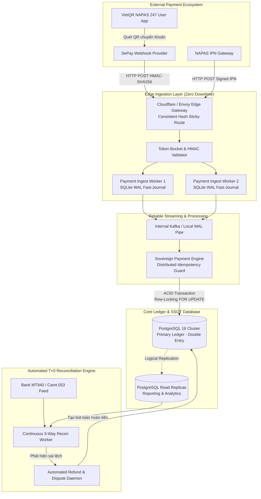
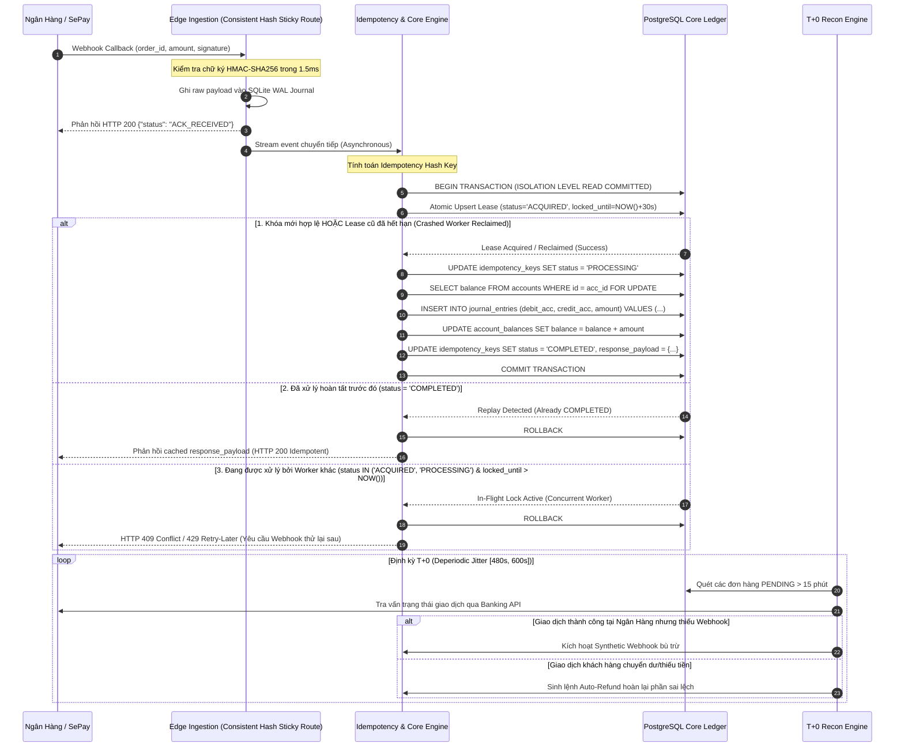
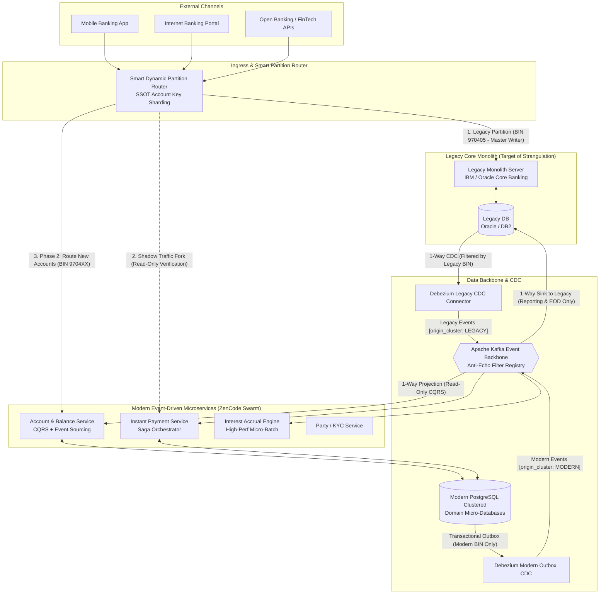
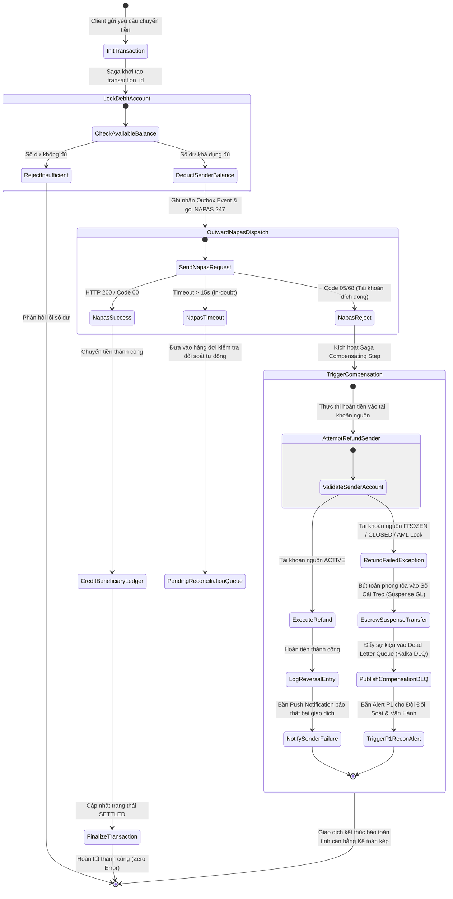
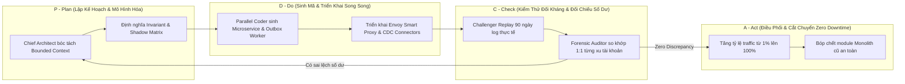
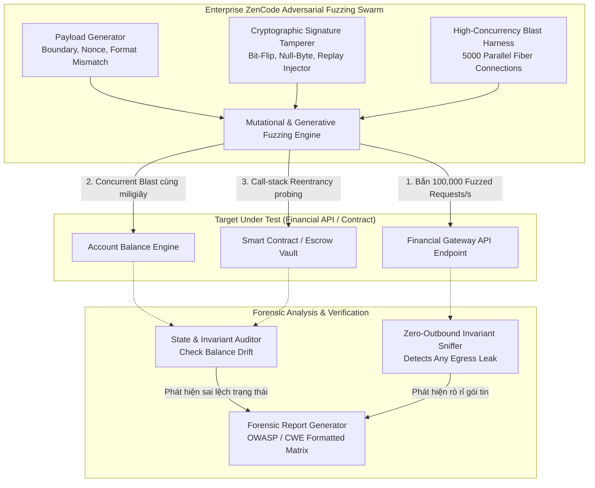
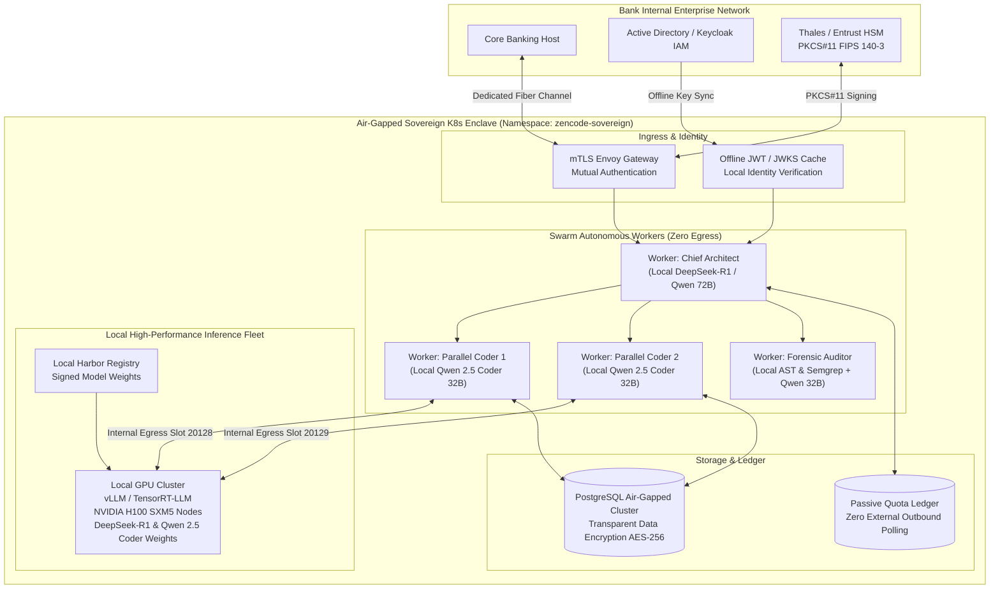

# ENTERPRISE ZENCODE — FINTECH & CORE BANKING USE CASES BLUEPRINT
## 4 Kịch Bản Thực Chiến Chuyên Sâu Cấp Enterprise: Cổng Thanh Toán, Di Sản Core Banking, Kiểm Toán An Ninh & Hạ Tầng Air-Gapped Sovereign

---

## LỜI NÓI ĐẦU VÀ CAM KẾT CHỦ QUYỀN (SOVEREIGN MANDATE)

Tài liệu này xác lập đặc tả kỹ thuật và kiến trúc giải pháp chuẩn Enterprise cho bốn (04) bài toán nghiệp vụ phức tạp nhất trong ngành Tài chính - Ngân hàng (Fintech & Core Banking). Toàn bộ thiết kế trong tài liệu này được xây dựng trên nền tảng **Enterprise ZenCode** — Hệ điều hành kỹ nghệ tự trị đa tác tử (Autonomous Multi-Agent Engineering Swarm) hoạt động theo chu trình PDCA khép kín, tuân thủ nguyên tắc **Sovereign Stealth Mode**:
- **Zero Outbound Telemetry**: Tuyệt đối không phát sinh bất kỳ truy vấn hay rò rỉ dữ liệu tài khoản, metadata, mã nguồn ra bên ngoài hạ tầng ngân hàng.
- **Strict Data Sovereignty**: Dữ liệu và trạng thái sổ cái (General Ledger) được quản trị tập trung, không ủy thác tính toán nhạy cảm cho các AI public API.
- **Mathematical Idempotency & Invariant Verification**: Mỗi giao dịch, dịch chuyển số dư và luồng tích hợp đều được chứng minh tính đúng đắn về mặt toán học và kế toán kép trước khi chuyển giao vào môi trường vận hành sản xuất (Production).

---

## MỤC LỤC TỔNG QUAN

1. **USE CASE 1 (UC1): HỆ THỐNG CỔNG THANH TOÁN & ĐỐI SOÁT GIAO DỊCH TỰ ĐỘNG (PAYMENT GATEWAY & AUTO-RECONCILIATION ENGINE)**
   - 1.1 Bối Cảnh Nghiệp Vụ & Nỗi Đau Hiện Hữu
   - 1.2 Yêu Cầu Kỹ Thuật & Ràng Buộc Bất Biến (Invariants)
   - 1.3 Sơ Đồ Kiến Trúc Hệ Thống & Luồng Giao Dịch Mermaid
   - 1.4 Thiết Kế Schema Database Kép & Giao Khế Tích Hợp (API Contracts)
   - 1.5 Quy Trình Thực Thi Của Swarm PDCA & Mô Hình Tác Tử
   - 1.6 Tiêu Chuẩn Nghiệm Thu, Ma Trận Thử Tải & Bộ Chỉ Số KPIs

2. **USE CASE 2 (UC2): HIỆN ĐẠI HÓA CORE BANKING & PHÂN RÃ DI SẢN MONOLITH (LEGACY CORE BANKING MODERNIZATION)**
   - 2.1 Bối Cảnh Nghiệp Vụ & Nỗi Đau Hiện Hữu Của Hệ Thống Cũ
   - 2.2 Chiến Lược Phân Rã, Yêu Cầu Kỹ Thuật & Bất Biến Zero Downtime
   - 2.3 Sơ Đồ Kiến Trúc Strangler Fig, Saga & Event-Driven Topology Mermaid
   - 2.4 Thiết Kế Data Model, Outbox Pattern & Event Contract Schema
   - 2.5 Quy Trình Triển Khai Swarm PDCA Tự Trị
   - 2.6 Kiểm Thử Hồi Quy Quy Mô Lớn (Synthetic Replay) & Chỉ Số Nghiệm Thu

3. **USE CASE 3 (UC3): KIỂM TOÁN PHÁP Y AN NINH & FUZZING LỖ HỔNG HỢP ĐỒNG THÔNG MINH / API TÀI CHÍNH (FINANCIAL SECURITY FORENSICS & ADVERSARIAL FUZZING)**
   - 3.1 Bối Cảnh Rủi Ro Tấn Công Khai Thác Tài Chính Hiện Đại
   - 3.2 Các Vector Tấn Công Nguy Hiểm & Ràng Buộc Miễn Nhiễm
   - 3.3 Sơ Đồ Kiến Trúc Fuzzing Harness & Chu Trình Kiểm Toán Mermaid
   - 3.4 Thiết Kế Harness Test Đối Kháng, Payload Generators & Forensic Schema
   - 3.5 Quy Trình Swarm Red-Team / Blue-Team Đối Kháng Khép Kín
   - 3.6 Tiêu Chuẩn Báo Cáo Pháp Y Chuẩn OWASP/CWE Tài Chính & KPIs An Ninh

4. **USE CASE 4 (UC4): CỤM PRIVATE FLEET ON-PREMISE DÀNH CHO TỔ CHỨC TÀI CHÍNH SIÊU NGẶT NGHÈO (AIR-GAPPED PRIVATE FLEET FOR TIER-1 BANKS)**
   - 4.1 Bối Cảnh Tuân Thủ Pháp Lý Của Các Tổ Chức Tài Chính Hạng 1
   - 4.2 Yêu Cầu Kỹ Thuật, Bất Biến Air-Gapped & Egress Proxy Cô Lập 1:1
   - 4.3 Sơ Đồ Kiến Trúc Hạ Tầng Cụm Kubernetes Độc Lập Mermaid
   - 4.4 Cấu Hình Triển Khai K8s, Hardware Security Module (HSM) & Network Policies
   - 4.5 Chu Trình Vận Hành Tự Trị & Giám Sát Của Swarm Trong Vùng Cách Ly
   - 4.6 Ma Trận Tuân Thủ Thông Tư 09/2020/TT-NHNN, PCI-DSS v4.0 & SLAs

5. **TỔNG KẾT & LỘ TRÌNH CHUYỂN DỊCH DOANH NGHIỆP TÀI CHÍNH VỚI ENTERPRISE ZENCODE**

---

# 1. USE CASE 1 (UC1): HỆ THỐNG CỔNG THANH TOÁN & ĐỐI SOÁT GIAO DỊCH TỰ ĐỘNG
### (Payment Gateway & Idempotent Auto-Reconciliation Engine)

---

### 1.1 Bối Cảnh Nghiệp Vụ & Nỗi Đau Hiện Hữu

Trong bức tranh thanh toán số tại Việt Nam và Đông Nam Á, các định chế tài chính và doanh nghiệp Fintech phải đối mặt với áp lực xử lý hàng triệu giao dịch thời gian thực mỗi ngày qua các kênh thanh toán phổ thông:
- **VietQR (NAPAS 247)**: Chuẩn mã QR tương thích EMVCo liên ngân hàng với độ trễ chuyển tiền tức thì.
- **SePay Webhook**: Cổng tự động hóa giao dịch ngân hàng phục vụ các kịch bản nạp tiền tức thì (Instant Balance Top-up).
- **NAPAS IPN (Instant Payment Notification)**: Kênh thông báo trạng thái thanh toán thẻ nội địa và thẻ quốc tế.

#### Những Nỗi Đau Trọng Yếu Của Kiến Trúc Cũ:
1. **Rủi Ro Nạp Đúp / Trừ Đúp (Double-Credit / Double-Debit)**: Mạng viễn thông chập chờn, retry bão táp từ gateway bên ngoài hoặc người dùng click liên tục gây ra tình trạng race-condition cập nhật số dư.
2. **Giao Dịch Treo (In-Doubt Transactions)**: Người dùng đã bị trừ tiền tại ngân hàng phát hành, nhưng webhook/IPN bị nghẽn hoặc drop trên đường truyền, dẫn đến việc tài khoản dịch vụ chưa được kích hoạt, gia tăng chi phí khiếu nại (Dispute Cost).
3. **Lệch Sổ Sách & Đối Soát Thủ Công Cuối Ngày (EOD Reconciliation Nightmare)**: Đội ngũ kế toán tài chính phải tải bảng kê Excel từ 3 đến 5 ngân hàng/cổng trung gian để chạy đối chiếu vlookup thủ công, mất 4-6 giờ mỗi ngày và phát hiện sai lệch quá muộn khi tiền đã bị rút khỏi hệ thống.
4. **Nghẽn Cổ Chai Ghi Dữ Liệu (Write-Bottleneck)**: Khi bão giao dịch (Flash Sale, Black Friday), lượng webhook dồn về hàng nghìn req/sec khiến cơ sở dữ liệu quan hệ chính bị lock bảng, tăng p99 latency lên > 10.000ms.

---

### 1.2 Yêu Cầu Kỹ Thuật & Ràng Buộc Bất Biến (Invariants)

Để giải quyết triệt để các vấn đề trên, kiến trúc giải pháp Enterprise ZenCode áp dụng các nguyên lý bất biến:

1. **Bất Biến Idempotency Tuyệt Đối (100% Strict Idempotency)**:
   Mỗi yêu cầu thanh toán hay webhook gửi tới hệ thống đều được định danh bởi một khóa duy nhất $K_{idem} = \text{SHA256}(\text{Gateway} \parallel \text{TransactionID} \parallel \text{Amount} \parallel \text{Timestamp})$. Bất kỳ request nào trùng $K_{idem}$ trong cửa sổ 7 ngày đều phải trả về kết quả đã được xử lý từ cache/storage mà không kích hoạt xử lý nghiệp vụ lần thứ hai.

2. **Bất Biến Kế Toán Kép (Double-Entry Ledger Invariant)**:
   Không bao giờ cập nhật số dư bằng câu lệnh đơn `UPDATE balance = balance + X`. Mọi sự thay đổi tài sản đều phải được biểu diễn qua hai hay nhiều bút toán trong bảng nhật ký (Journal Entry) tuân theo phương trình:
   $$\sum \text{Debit} - \sum \text{Credit} = 0$$

3. **Kiến Trúc Lưu Trữ Kép Hybrid (SQLite WAL + PostgreSQL Partitioning)**:
   - **SQLite WAL Ingestion Layer**: Nằm tại Edge/Node tiếp nhận, chạy ở chế độ WAL (`PRAGMA synchronous = NORMAL`, `journal_mode = WAL`) nhằm hấp thụ webhook với độ trễ < 1ms, ghi nhận raw payload lập tức trước khi trả HTTP 200 cho đối tác.
   - **PostgreSQL Distributed Engine**: Nhận dữ liệu streaming từ WAL journal thông qua Deperiodic Micro-Batch Worker, thực hiện ACID transactions, phân vùng theo tháng (`PARTITION BY RANGE (created_at)`), quản lý toàn vẹn dữ liệu lõi.

4. **Tự Động Đối Soát T+0 Ba Chiều (3-Way Continuous Matching)**:
   Hệ thống liên tục so khớp: (A) Nhật ký tạo đơn hàng nội bộ $\longleftrightarrow$ (B) Webhook/IPN nhận được $\longleftrightarrow$ (C) Sao kê đối soát định kỳ của Bank/Napas. Tự động phát hiện sai lệch thừa/thiếu theo chu kỳ Deperiodic Jitter $[480\text{s}, 600\text{s}]$, ngăn ngừa nghẽn API ngân hàng và triệt tiêu footprint polling tự động.

---

### 1.3 Sơ Đồ Kiến Trúc Hệ Thống & Luồng Giao Dịch Mermaid

#### Sơ Đồ 1.1: Kiến Trúc Tổng Thể Cổng Thanh Toán & Bộ Đệm Kép Hybrid WAL



#### Sơ Đồ 1.2: Sequence Diagram Xử Lý Webhook Idempotency & Đối Soát Sổ Cái Kép



---

### 1.4 Thiết Kế Schema Database Kép & Giao Khế Tích Hợp (API Contracts)

#### 1.4.1 Schema SQLite WAL Cục Bộ (Edge Fast-Ingest Buffer)

```sql
-- SQLite Local WAL Database Configuration
PRAGMA journal_mode = WAL;
PRAGMA synchronous = NORMAL;
PRAGMA busy_timeout = 5000;
PRAGMA cache_size = -20000; -- 20MB in-memory cache

CREATE TABLE IF NOT EXISTS local_webhook_journal (
    journal_id INTEGER PRIMARY KEY AUTOINCREMENT,
    source_provider TEXT NOT NULL,         -- 'SEPAY', 'VIETQR', 'NAPAS'
    idempotency_hash TEXT NOT NULL UNIQUE,  -- SHA256 signature
    raw_payload TEXT NOT NULL,              -- Verbatim JSON string
    http_headers TEXT NOT NULL,             -- JSON encoded request headers
    client_ip TEXT NOT NULL,
    received_epoch_ms INTEGER NOT NULL,
    sync_status TEXT DEFAULT 'PENDING',    -- 'PENDING', 'SYNCED', 'CORRUPT'
    sync_retry_count INTEGER DEFAULT 0,
    created_at DATETIME DEFAULT CURRENT_TIMESTAMP
);

CREATE INDEX IF NOT EXISTS idx_webhook_status ON local_webhook_journal(sync_status, received_epoch_ms);
CREATE INDEX IF NOT EXISTS idx_webhook_idem ON local_webhook_journal(idempotency_hash);
```

#### 1.4.2 Schema PostgreSQL Core Banking (Double-Entry Ledger & Partitioned Transactions)

```sql
-- Schema PostgreSQL 16+ Production: Core Banking Payment & Ledger System

CREATE SCHEMA IF NOT EXISTS core_banking;

-- 1. Bảng Khóa Idempotency Cấp Toàn Cục (Two-Phase Leased Lock)
CREATE TABLE core_banking.idempotency_keys (
    idempotency_key VARCHAR(128) PRIMARY KEY,
    source_channel VARCHAR(32) NOT NULL,
    resource_type VARCHAR(64) NOT NULL,
    resource_id VARCHAR(128),
    request_checksum VARCHAR(64) NOT NULL,
    response_payload JSONB,
    status VARCHAR(32) NOT NULL CHECK (status IN ('ACQUIRED', 'PROCESSING', 'COMPLETED', 'FAILED')),
    locked_until TIMESTAMPTZ NOT NULL,
    created_at TIMESTAMPTZ NOT NULL DEFAULT CLOCK_TIMESTAMP(),
    completed_at TIMESTAMPTZ
);

CREATE INDEX idx_idem_cleanup ON core_banking.idempotency_keys(created_at) WHERE status = 'COMPLETED';
CREATE INDEX idx_idem_lease_active ON core_banking.idempotency_keys(status, locked_until) WHERE status IN ('ACQUIRED', 'PROCESSING');

-- Giao thức chiếm giữ khóa lũy thừa nguyên tử có thời hạn thuê (Atomic Leased Lock)
-- Khắc phục triệt để lỗ hổng Worker sập gây nuốt tiền giao dịch (Silent Dropped Payment)
-- Máy trạng thái: ACQUIRED -> PROCESSING -> COMPLETED (hoặc FAILED)
-- Lượt retry tái chiếm khóa thành công nếu khóa cũ hết hạn (locked_until < CLOCK_TIMESTAMP())
/*
WITH upsert_lease AS (
    INSERT INTO core_banking.idempotency_keys (
        idempotency_key, source_channel, resource_type, resource_id,
        request_checksum, status, locked_until, created_at
    ) VALUES (
        $1, $2, $3, $4, $5, 'ACQUIRED', CLOCK_TIMESTAMP() + INTERVAL '30 seconds', CLOCK_TIMESTAMP()
    )
    ON CONFLICT (idempotency_key) DO UPDATE
    SET status = 'ACQUIRED',
        locked_until = CLOCK_TIMESTAMP() + INTERVAL '30 seconds'
    WHERE (core_banking.idempotency_keys.status IN ('ACQUIRED', 'PROCESSING') 
           AND core_banking.idempotency_keys.locked_until < CLOCK_TIMESTAMP())
       OR (core_banking.idempotency_keys.status = 'FAILED')
    RETURNING status, response_payload, (xmax = 0) AS is_fresh_insert
)
SELECT * FROM upsert_lease;
*/

-- 2. Bảng Tài Khoản & Số Dư (Tuân thủ mô hình Sổ Cái Kép)
CREATE TABLE core_banking.chart_of_accounts (
    account_id UUID PRIMARY KEY DEFAULT gen_random_uuid(),
    account_number VARCHAR(34) NOT NULL UNIQUE, -- Chuẩn IBAN hoặc số tài khoản nội bộ
    account_name VARCHAR(255) NOT NULL,
    account_type VARCHAR(32) NOT NULL CHECK (account_type IN ('ASSET', 'LIABILITY', 'EQUITY', 'REVENUE', 'EXPENSE')),
    currency VARCHAR(3) NOT NULL DEFAULT 'VND',
    status VARCHAR(16) NOT NULL DEFAULT 'ACTIVE' CHECK (status IN ('ACTIVE', 'FROZEN', 'CLOSED')),
    created_at TIMESTAMPTZ NOT NULL DEFAULT CLOCK_TIMESTAMP()
);

CREATE TABLE core_banking.account_balances (
    account_id UUID PRIMARY KEY REFERENCES core_banking.chart_of_accounts(account_id),
    current_balance NUMERIC(28, 4) NOT NULL DEFAULT 0.0000,
    available_balance NUMERIC(28, 4) NOT NULL DEFAULT 0.0000,
    hold_balance NUMERIC(28, 4) NOT NULL DEFAULT 0.0000,
    version BIGINT NOT NULL DEFAULT 1, -- Optimistic locking counter
    updated_at TIMESTAMPTZ NOT NULL DEFAULT CLOCK_TIMESTAMP(),
    CONSTRAINT chk_balances_sum CHECK (current_balance = available_balance + hold_balance)
);

-- 3. Bảng Bút Toán Sổ Cái (Journal Entries & Lines)
CREATE TABLE core_banking.journal_batches (
    batch_id UUID PRIMARY KEY DEFAULT gen_random_uuid(),
    batch_reference VARCHAR(128) NOT NULL UNIQUE,
    description TEXT,
    posted_at TIMESTAMPTZ NOT NULL DEFAULT CLOCK_TIMESTAMP(),
    created_by VARCHAR(64) NOT NULL
);

CREATE TABLE core_banking.journal_entries (
    entry_id UUID PRIMARY KEY DEFAULT gen_random_uuid(),
    batch_id UUID NOT NULL REFERENCES core_banking.journal_batches(batch_id),
    debit_account_id UUID NOT NULL REFERENCES core_banking.chart_of_accounts(account_id),
    credit_account_id UUID NOT NULL REFERENCES core_banking.chart_of_accounts(account_id),
    amount NUMERIC(28, 4) NOT NULL CHECK (amount > 0),
    currency VARCHAR(3) NOT NULL DEFAULT 'VND',
    narration TEXT NOT NULL,
    transaction_ref VARCHAR(128) NOT NULL,
    created_at TIMESTAMPTZ NOT NULL DEFAULT CLOCK_TIMESTAMP(),
    CONSTRAINT chk_different_accounts CHECK (debit_account_id <> credit_account_id)
);

CREATE INDEX idx_journal_debit ON core_banking.journal_entries(debit_account_id, created_at);
CREATE INDEX idx_journal_credit ON core_banking.journal_entries(credit_account_id, created_at);
CREATE INDEX idx_journal_txref ON core_banking.journal_entries(transaction_ref);

-- 4. Bảng Giao Dịch Thanh Toán Phân Vùng (Partitioned Payment Transactions)
CREATE TABLE core_banking.payment_transactions (
    transaction_id UUID DEFAULT gen_random_uuid(),
    order_code VARCHAR(64) NOT NULL,              -- Mã ZC######
    provider VARCHAR(32) NOT NULL,                -- 'VIETQR', 'SEPAY', 'NAPAS'
    provider_tx_id VARCHAR(128),
    payer_account VARCHAR(64),
    payer_bank_bin VARCHAR(16),
    amount NUMERIC(28, 4) NOT NULL,
    fee_amount NUMERIC(28, 4) NOT NULL DEFAULT 0,
    currency VARCHAR(3) NOT NULL DEFAULT 'VND',
    status VARCHAR(32) NOT NULL CHECK (status IN ('PENDING', 'PROCESSING', 'SETTLED', 'FAILED', 'REFUNDED', 'DISPUTED')),
    reconciliation_status VARCHAR(32) NOT NULL DEFAULT 'UNRECONCILED' CHECK (reconciliation_status IN ('UNRECONCILED', 'MATCHED', 'DISCREPANCY_AMOUNT', 'DISCREPANCY_MISSING', 'RESOLVED')),
    metadata JSONB DEFAULT '{}'::jsonb,
    created_at TIMESTAMPTZ NOT NULL DEFAULT CLOCK_TIMESTAMP(),
    settled_at TIMESTAMPTZ,
    PRIMARY KEY (transaction_id, created_at)
) PARTITION BY RANGE (created_at);

-- Phân vùng dữ liệu theo tháng mẫu
CREATE TABLE core_banking.payment_transactions_y2026m10 PARTITION OF core_banking.payment_transactions
    FOR VALUES FROM ('2026-10-01 00:00:00+00') TO ('2026-11-01 00:00:00+00');
CREATE TABLE core_banking.payment_transactions_y2026m11 PARTITION OF core_banking.payment_transactions
    FOR VALUES FROM ('2026-11-01 00:00:00+00') TO ('2026-12-01 00:00:00+00');

CREATE INDEX idx_pay_order_code ON core_banking.payment_transactions(order_code, created_at);
CREATE INDEX idx_pay_status ON core_banking.payment_transactions(status, reconciliation_status, created_at);

-- 5. Bảng Đối Soát Giao Dịch T+0
CREATE TABLE core_banking.reconciliation_records (
    recon_id UUID PRIMARY KEY DEFAULT gen_random_uuid(),
    statement_date DATE NOT NULL,
    provider VARCHAR(32) NOT NULL,
    external_reference VARCHAR(128) NOT NULL,
    internal_transaction_id UUID,
    external_amount NUMERIC(28, 4) NOT NULL,
    internal_amount NUMERIC(28, 4),
    discrepancy_amount NUMERIC(28, 4) GENERATED ALWAYS AS (COALESCE(internal_amount, 0) - external_amount) STORED,
    matching_result VARCHAR(32) NOT NULL CHECK (matching_result IN ('PERFECT_MATCH', 'AMOUNT_MISMATCH', 'SYSTEM_MISSING', 'BANK_MISSING')),
    auto_resolved BOOLEAN NOT NULL DEFAULT FALSE,
    resolution_notes TEXT,
    created_at TIMESTAMPTZ NOT NULL DEFAULT CLOCK_TIMESTAMP()
);
```

#### 1.4.3 Đặc Tả VietQR EMVCo Payload & Thuật Toán Kiểm Tra CRC16-CCITT

Chuẩn mã QR Napas 247 tuân theo quy chuẩn EMVCo Merchant-Presented Mode (Tag-Length-Value format):

```python
# vietqr_parser.py - Production-Grade EMVCo Payload Parser & CRC Validator
import binascii
from typing import Dict, Any, Optional

def compute_crc16_ccitt(payload: str) -> str:
    """
    Tính mã kiểm tra CRC-16/CCITT-FALSE (Polynomial 0x1021, Init 0xFFFF)
    theo chuẩn EMVCo Tag 63.
    """
    crc = 0xFFFF
    for char in payload.encode('ascii'):
        crc = ((crc << 8) & 0xFF00) ^ binascii.crc_hqx(bytes([char]), (crc >> 8) & 0xFF)
        # Hoặc bitwise triển khai chuẩn:
    # Triển khai thuật toán chuẩn hóa không phụ thuộc thư viện ngoại vi
    data = payload.encode('utf-8')
    crc_reg = 0xFFFF
    for byte in data:
        crc_reg ^= (byte << 8)
        for _ in range(8):
            if crc_reg & 0x8000:
                crc_reg = ((crc_reg << 1) ^ 0x1021) & 0xFFFF
            else:
                crc_reg = (crc_reg << 1) & 0xFFFF
    return f"{crc_reg:04X}"

def parse_emvco_tlv(raw_qr: str) -> Dict[str, str]:
    """Phân giải chuỗi QR EMVCo thành từ điển Tag-Length-Value"""
    result = {}
    i = 0
    n = len(raw_qr)
    while i < n:
        tag = raw_qr[i:i+2]
        length = int(raw_qr[i+2:i+4])
        val_start = i + 4
        val_end = val_start + length
        value = raw_qr[val_start:val_end]
        result[tag] = value
        i = val_end
    return result

def validate_vietqr_payload(raw_qr: str) -> bool:
    """Xác thực toàn vẹn mã VietQR"""
    if not raw_qr.startswith("000201"):
        return False
    # Tag 63 độ dài 04 nằm ở cuối chuỗi
    tag63_index = raw_qr.rfind("6304")
    if tag63_index == -1:
        return False
    data_to_verify = raw_qr[:tag63_index + 4]
    provided_crc = raw_qr[tag63_index + 4:tag63_index + 8].upper()
    calculated_crc = compute_crc16_ccitt(data_to_verify)
    return provided_crc == calculated_crc
```

#### 1.4.4 Giao Khế Webhook SePay (HMAC-SHA256 Signature Verification)

```json
{
  "$schema": "http://json-schema.org/draft-07/schema#",
  "title": "SePayWebhookPayload",
  "type": "object",
  "required": [
    "id",
    "gateway",
    "transactionDate",
    "accountNumber",
    "subAccount",
    "transferType",
    "transferAmount",
    "accumulated",
    "code",
    "content",
    "referenceCode",
    "description"
  ],
  "properties": {
    "id": { "type": "integer", "description": "ID giao dịch duy nhất từ SePay" },
    "gateway": { "type": "string", "enum": ["Vietcombank", "MBBank", "Techcombank", "ACB", "TPBank", "VPBank", "BIDV"] },
    "transactionDate": { "type": "string", "format": "date-time" },
    "accountNumber": { "type": "string", "pattern": "^[0-9]{6,20}$" },
    "subAccount": { "type": ["string", "null"] },
    "transferType": { "type": "string", "enum": ["in", "out"] },
    "transferAmount": { "type": "number", "minimum": 1000 },
    "accumulated": { "type": "number" },
    "code": { "type": ["string", "null"], "description": "Mã nhận diện tự động bóc tách" },
    "content": { "type": "string", "description": "Nội dung chuyển khoản chứa mã ZC######" },
    "referenceCode": { "type": "string", "description": "Mã tham chiếu ngân hàng (FT...)" },
    "description": { "type": "string" }
  }
}
```

---

### 1.5 Quy Trình Thực Thi Của Swarm PDCA & Mô Hình Tác Tử

Enterprise ZenCode điều phối 5 tác tử tự trị để triển khai và bảo vệ hệ thống Cổng Thanh Toán:

| Vai Trò Tác Tử | Nhiệm Vụ Cụ Thể Trong UC1 | Ràng Buộc Kiểm Soát |
|---|---|---|
| **Chief Architect**<br/>*(Cloud: Opus 5.5 / Air-Gap: DeepSeek-R1 & Qwen 72B)* | Thiết kế kiến trúc phân vùng PostgreSQL, thiết kế giao thức SQLite WAL buffer, định nghĩa Invariants kế toán kép. | Zero Outbound Telemetry; Phê duyệt mô hình dữ liệu trước khi sinh mã; 100% On-Premise weights trong cụm Air-Gapped. |
| **Parallel Coders (Sonnet/Flash)** | Viết module xử lý Webhook Idempotency, parser EMVCo, worker đồng bộ dữ liệu song song từ SQLite lên PostgreSQL. | Code sạch, không import thư viện telemetry bên ngoài; kiểm tra `timingSafeEqual`. |
| **Adversarial Challenger** | Giả lập các cuộc tấn công nạp đúp (Double-spend), gửi 500 webhook cùng miligiây, ngắt kết nối DB giữa giao dịch để kiểm tra rollbacks. | Tấn công liên tục đến khi không thể phá vỡ bất biến `SUM(Debit) == SUM(Credit)`. |
| **Forensic Auditor** | Kiểm tra mã nguồn chống SQL Injection, xác minh không có hardcoded secrets/API keys, audit log tuân thủ lưu vết giao dịch tài chính. | Cấp chứng chỉ Pass@1 hoặc trả về PDCA nếu phát hiện float-point thay vì NUMERIC. |
| **Self-Healing Watchdog** | Giám sát độ trễ của SQLite WAL file, phát hiện deadlock PostgreSQL, tự động flush buffer và tái cân bằng tải khi queue vượt ngưỡng. | Tự khởi động lại worker lỗi trong < 500ms mà không làm rơi bất kỳ raw payload nào. |

---

### 1.6 Tiêu Chuẩn Nghiệm Thu, Ma Trận Thử Tải & Bộ Chỉ Số KPIs

#### 1.6.1 Ma Trận Đo Lường Định Lượng
- **Throughput Tiếp Nhận (Ingress TPS)**: $\ge 12.000$ webhooks/giây tại Edge Node (phản hồi HTTP 200 trong $< 3\text{ms}$).
- **Throughput Xử Lý Sổ Cái (Ledger ACID TPS)**: $\ge 3.500$ transactions/giây trên cụm PostgreSQL.
- **Tỷ Lệ Lỗi Idempotency (Double-Credit Rate)**: **0.00000%** (Tuyệt đối không có trường hợp 1 giao dịch bị cộng tiền 2 lần trong 10.000.000 giao dịch thử nghiệm).
- **Độ Trễ Đối Soát T+0 (Recon Latency)**: $< 60$ giây từ khi ngân hàng ghi nhận đến khi hệ thống phát hiện sai lệch.
- **Tỷ Lệ Tự Động Khớp Sổ (Auto-Match Rate)**: $\ge 99.95\%$.

#### 1.6.2 Kịch Bản Stress-Test Đối Kháng Cụ Thể
```bash
# Kịch bản k6: Bão 10,000 Concurrent Webhooks với 30% payload trùng lặp khóa Idempotency
k6 run --vus 500 --duration 2m -e TARGET_URL="https://api.zencode.vn/api/billing/sepay-webhook" scripts/stress_test_webhook_idempotency.js
```
Kết quả nghiệm thu bắt buộc:
- Tổng HTTP Requests: 600,000.
- Số giao dịch hợp lệ được ghi nhận vào Ledger: Chính xác bằng số Unique Transaction IDs.
- Số giao dịch bị chặn bởi Idempotency Guard: Chính xác bằng số Duplicate Transaction IDs.
- Độ sai lệch số dư sổ cái $\Delta = |\sum \text{Debit} - \sum \text{Credit}| = 0.0000$ VND.

---

# 2. USE CASE 2 (UC2): HIỆN ĐẠI HÓA CORE BANKING & PHÂN RÃ DI SẢN MONOLITH
### (Legacy Core Banking Modernization via Strangler Fig & Event-Driven Architecture)

---

### 2.1 Bối Cảnh Nghiệp Vụ & Nỗi Đau Hiện Hữu Của Hệ Thống Cũ

Các ngân hàng thương mại cổ phần và ngân hàng quốc doanh tại Việt Nam thường vận hành hệ thống Core Banking di sản (Legacy Core Banking) được triển khai từ 15-25 năm trước (như Temenos T24 R08/R12, Oracle Flexcube, Silverlake Axis, hoặc các hệ thống COBOL trên máy chủ Mainframe IBM z/OS).

#### Nỗi Đau Chí Tử Của Khối Ngân Hàng:
1. **Ác Mộng Xử Lý Đêm (EOD Batch Run Nightmare)**: Mỗi đêm từ 23:00 đến 04:00 sáng, hệ thống phải chạy batch tính lãi, phân loại nợ và khóa sổ. Trong khung giờ này, mọi dịch vụ Mobile Banking, chuyển mạch 247, rút tiền ATM đều bị đóng băng hoặc chạy ở chế độ hạn chế (Stand-in Processing với rủi ro cao).
2. **Chi Phí Tích Hợp Đắt Đỏ & Chậm Chạp (Time-to-Market Tồi Tệ)**: Để ra mắt một sản phẩm thẻ ảo mới hoặc tích hợp với đối tác Fintech/Ví điện tử, ngân hàng mất từ 6 đến 12 tháng phát triển, chỉnh sửa mã nguồn phức tạp trên Monolith dễ làm đổ vỡ các chức năng cốt lõi.
3. **Rủi Ro "Big Bang Migration"**: Thay thế toàn bộ hệ thống cũ trong một lần chuyển đổi (Big Bang) có tỷ lệ thất bại lên tới 74% trong ngành ngân hàng toàn cầu, đe dọa mất mát dữ liệu số dư và đình trệ giao dịch quốc gia.
4. **Thiếu Khả Năng Mở Rộng Đàn Hồi**: Phần cứng máy chủ lớn (UNIX AIX / Mainframe) có chi phí bản quyền hàng triệu USD/năm nhưng không thể co giãn linh hoạt theo lưu lượng tăng đột biến vào các dịp lễ tết.

---

### 2.2 Chiến Lược Phân Rã, Yêu Cầu Kỹ Thuật & Bất Biến Zero Downtime

Enterprise ZenCode thiết lập lộ trình phân rã di sản bằng kỹ thuật **Strangler Fig Pattern** (Cây Đa Bóp Cổ) kết hợp kiến trúc hướng sự kiện (Event-Driven Architecture) với các nguyên tắc bất biến:

1. **Bất Biến Không Gián Đoạn Dịch Vụ (Zero Downtime Invariant)**:
   Không có bất kỳ "Cửa sổ bảo trì" (Maintenance Window) nào khiến hệ thống ngừng tiếp nhận giao dịch. Trong suốt quá trình di chuyển (Migration), cả hệ sinh thái cũ và mới cùng hoạt động song song.

2. **Cơ Chế Điều Hướng Thông Minh & Shadow Traffic (Traffic Shadowing)**:
   Mọi truy vấn và giao dịch đi qua Envoy/API Gateway được nhân bản (Forking). Luồng chính (Live Traffic) vẫn gửi tới Monolith để đảm bảo an toàn tuyệt đối, trong khi luồng bóng (Shadow Traffic) được đẩy đồng thời sang cụm Microservices mới để so sánh sai lệch kết quả (Diff Verification) đến từng bit dữ liệu.

3. **Giao Thức Điều Phối Phân Tán Saga (Saga Orchestration with Outbox Pattern)**:
   Thay thế các giao dịch phân tán 2PC (Two-Phase Commit) chậm chạp bằng Saga Orchestrator. Mỗi bước trong quy trình nghiệp vụ (ví dụ: Chuyển tiền liên ngân hàng) là một local transaction độc lập, đi kèm một Bút Toán Đảo (Compensating Transaction) tương ứng để hoàn tác tự động nếu các bước sau thất bại.

4. **Change Data Capture (CDC) với Debezium & Kafka Event Backbone**:
   Đồng bộ dữ liệu hai chiều thời gian thực giữa cơ sở dữ liệu di sản (Oracle/DB2) và các cơ sở dữ liệu dịch vụ chuyên biệt (PostgreSQL, Cassandra, Redis) thông qua việc phân tích trực tiếp Transaction Logs (Redo Logs / WAL) với độ trễ $< 50\text{ms}$, không gây tải cho máy chủ Core cũ.

---

### 2.3 Sơ Đồ Kiến Trúc Strangler Fig, Saga & Event-Driven Topology Mermaid

#### Bất Biến Phân Vùng Quyền Ghi (SSOT Partitioning) & Chống Vòng Lặp Phản Xạ (Anti-Echo):
1. **Bất biến SSOT Partitioning (Master Writer Partition Authority)**:
   - Nghiêm cấm tuyệt đối cơ chế ghi hai chiều tự do (Multi-Master Concurrent Writes) trên cùng một tài khoản.
   - Tài khoản thuộc dải BIN di sản (e.g. `970405`): Monolith DB là Master Writer độc quyền. Modern DB chỉ đóng vai trò Read Replica qua luồng 1-way CDC projection.
   - Tài khoản thuộc dải BIN số mới (e.g. `970499`): Modern Service (PostgreSQL) là Master Writer độc quyền. Luồng CDC 1 chiều đẩy ngược về Legacy DB chỉ nhằm mục đích tổng hợp báo cáo và EOD.
2. **Bộ Lọc Chống Vòng Lặp Vô Tận (Anti-Echo Loop Prevention)**:
   - Mọi bản ghi sự kiện CDC đều bắt buộc chứa header metadata: `origin_cluster: "LEGACY_CORE" | "MODERN_MICROSERVICES"`.
   - Consumer tại mỗi đầu áp dụng quy tắc: Bỏ qua lập tức các sự kiện có `origin_cluster == SELF_CLUSTER_ID`, triệt tiêu hoàn toàn hiện tượng phản xạ vô tận (Infinite Echo Loop) và xung đột ghi đè mất mát dữ liệu (Write-Skew Lost Updates).

#### Sơ Đồ 2.1: Kiến Trúc Phân Rã Di Sản Theo Mô Hình Strangler Fig & CDC



#### Sơ Đồ 2.2: Sơ Đồ Trạng Thái Saga Orchestration Cho Giao Dịch Chuyển Tiền Liên Ngân Hàng



---

### 2.4 Thiết Kế Data Model, Outbox Pattern & Event Contract Schema

#### 2.4.1 Bảng Giao Dịch Transactional Outbox (Đảm Bảo Tính Nhất Quán Giữa DB và Kafka)

```sql
-- Outbox Pattern Table: Ghi dữ liệu nguyên tử cùng business transaction
CREATE TABLE core_banking.outbox_events (
    event_id UUID PRIMARY KEY DEFAULT gen_random_uuid(),
    aggregate_type VARCHAR(64) NOT NULL,       -- 'ACCOUNT', 'PAYMENT', 'LOAN'
    aggregate_id VARCHAR(128) NOT NULL,        -- Mã tài khoản hoặc transaction_id
    event_type VARCHAR(64) NOT NULL,           -- 'MONEY_TRANSFERRED', 'ACCOUNT_FROZEN'
    payload JSONB NOT NULL,
    metadata JSONB NOT NULL DEFAULT '{}'::jsonb,
    status VARCHAR(32) NOT NULL DEFAULT 'PENDING' CHECK (status IN ('PENDING', 'PUBLISHED', 'FAILED')),
    retry_count INTEGER NOT NULL DEFAULT 0,
    created_at TIMESTAMPTZ NOT NULL DEFAULT CLOCK_TIMESTAMP(),
    published_at TIMESTAMPTZ
);

CREATE INDEX idx_outbox_pending ON core_banking.outbox_events(status, created_at) WHERE status = 'PENDING';
```

#### 2.4.2 Apache Kafka Event Schema (Avro / JSON Schema Cho Giao Dịch Chuyển Tiền)

```json
{
  "$schema": "http://json-schema.org/draft-07/schema#",
  "title": "BankingMoneyTransferredEvent",
  "type": "object",
  "required": [
    "eventId",
    "eventType",
    "timestamp",
    "sagaId",
    "senderAccount",
    "receiverAccount",
    "receiverBankBin",
    "amount",
    "currency",
    "correlationId",
    "originCluster",
    "signatures"
  ],
  "properties": {
    "eventId": { "type": "string", "format": "uuid" },
    "eventType": { "type": "string", "enum": ["BANKING_CORE_MONEY_TRANSFERRED"] },
    "timestamp": { "type": "integer", "description": "Epoch timestamp in milliseconds" },
    "sagaId": { "type": "string", "format": "uuid" },
    "originCluster": { 
      "type": "string", 
      "enum": ["LEGACY_CORE", "MODERN_MICROSERVICES"],
      "description": "Anti-echo loop filter identifier: Consumer drops events matching self cluster"
    },
    "senderAccount": {
      "type": "object",
      "required": ["accountNumber", "customerId", "oldBalance", "newBalance"],
      "properties": {
        "accountNumber": { "type": "string" },
        "customerId": { "type": "string" },
        "oldBalance": { "type": "string", "pattern": "^[0-9]+(\\.[0-9]{1,4})?$" },
        "newBalance": { "type": "string", "pattern": "^[0-9]+(\\.[0-9]{1,4})?$" }
      }
    },
    "receiverAccount": {
      "type": "object",
      "required": ["accountNumber", "accountName"],
      "properties": {
        "accountNumber": { "type": "string" },
        "accountName": { "type": "string" }
      }
    },
    "receiverBankBin": { "type": "string", "pattern": "^[0-9]{6}$" },
    "amount": { "type": "string", "pattern": "^[0-9]+(\\.[0-9]{1,4})?$" },
    "currency": { "type": "string", "default": "VND" },
    "correlationId": { "type": "string" },
    "signatures": {
      "type": "object",
      "required": ["rsaSha256Signature", "keyVersion"],
      "properties": {
        "rsaSha256Signature": { "type": "string" },
        "keyVersion": { "type": "string" }
      }
    }
  }
}
```

#### 2.4.3 Bảng Sổ Cái Treo Tạm Giữ & Hàng Đợi Bồi Hoàn Thất Bại (Suspense Escrow Ledger & DLQ)

```sql
-- Khi Saga Compensating Step hoàn tiền thất bại (tài khoản nguồn bị đóng/AML khóa/phân mảnh DB),
-- tiền được chuyển ngay vào Sổ Cái Treo (Suspense GL) và bắn Kafka DLQ kèm P1 Ops Alert.
CREATE TABLE core_banking.suspense_escrow_ledger (
    escrow_id UUID PRIMARY KEY DEFAULT gen_random_uuid(),
    saga_id UUID NOT NULL,
    original_transaction_id VARCHAR(128) NOT NULL,
    sender_account_id UUID NOT NULL REFERENCES core_banking.chart_of_accounts(account_id),
    amount NUMERIC(18, 4) NOT NULL CHECK (amount > 0),
    currency VARCHAR(3) NOT NULL DEFAULT 'VND',
    failure_reason VARCHAR(64) NOT NULL, -- 'SENDER_ACCOUNT_FROZEN', 'AML_HOLD', 'LEDGER_DEADLOCK'
    suspense_account_code VARCHAR(32) NOT NULL DEFAULT 'GL_3999_SUSPENSE_ESCROW',
    dlq_topic VARCHAR(128) NOT NULL DEFAULT 'banking.saga.dlq.compensation-failures',
    dlq_partition INTEGER,
    dlq_offset BIGINT,
    status VARCHAR(32) NOT NULL DEFAULT 'HELD' CHECK (status IN ('HELD', 'RECONCILED', 'MANUALLY_REFUNDED')),
    created_at TIMESTAMPTZ NOT NULL DEFAULT CLOCK_TIMESTAMP(),
    resolved_at TIMESTAMPTZ,
    resolved_by VARCHAR(64),
    resolution_notes TEXT
);

CREATE INDEX idx_suspense_status ON core_banking.suspense_escrow_ledger(status, created_at);
```

#### 2.4.4 Cấu Hình CDC Debezium Connector (Chụp Thay Đổi Nhật Ký Oracle/PostgreSQL)

```json
{
  "name": "core-banking-debezium-cdc-connector",
  "config": {
    "connector.class": "io.debezium.connector.postgresql.PostgresConnector",
    "tasks.max": "3",
    "plugin.name": "pgoutput",
    "database.hostname": "core-db-primary.bank.internal",
    "database.port": "5432",
    "database.user": "debezium_cdc_user",
    "database.password": "${file:/vault/secrets/db-creds.properties:cdc_password}",
    "database.dbname": "bank_core_master",
    "database.server.name": "bank_core_engine",
    "table.include.list": "core_banking.outbox_events,core_banking.account_balances",
    "tombstones.on.delete": "false",
    "decimal.handling.mode": "string",
    "snapshot.mode": "never",
    "database.history.kafka.bootstrap.servers": "kafka-cluster.bank.internal:9092",
    "database.history.kafka.topic": "schema-changes.core-banking"
  }
}
```

---

### 2.5 Quy Trình Triển Khai Swarm PDCA Tự Trị

Chuyển đổi Core Banking đòi hỏi kỷ luật kỹ nghệ tối cao. Swarm Agents triển khai chu trình PDCA phân rã từng Bounded Context:



---

### 2.6 Kiểm Thử Hồi Quy Quy Mô Lớn (Synthetic Replay) & Chỉ Số Nghiệm Thu

Hệ thống chỉ được phép chuyển giao khi vượt qua bài kiểm tra **Synthetic Transaction Replay**:
- **Dữ Liệu Thử Nghiệm**: Replay toàn bộ 250.000.000 giao dịch lịch sử của 12 tháng gần nhất từ hệ thống Monolith cũ vào hệ thống Microservices mới.
- **Tiêu Chí Chấp Thuận Tuyệt Đối (Pass Criteria)**:
  1. Sai lệch số dư cuối kỳ (End-of-Month Balance Discrepancy): **0.0000 VND** trên toàn bộ các tài khoản.
  2. Sai lệch tính lãi tiền gửi/tiền vay (Accrued Interest Difference): $< 0.0001\%$ (do quy chuẩn làm tròn số thập phân, tất cả phải được ghi nhận vào bảng chênh lệch làm tròn).
  3. Thời gian xử lý EOD (End of Day Processing Time): Giảm từ **4.5 giờ** xuống **18 phút** nhờ kiến trúc tính toán phân tán song song.
  4. Khả năng chịu lỗi (Resilience): Ngắt đột ngột 50% số pods microservices khi đang chịu tải đỉnh, hệ thống tự động phục hồi trong $< 10$ giây không mất dữ liệu giao dịch.

---

# 3. USE CASE 3 (UC3): KIỂM TOÁN PHÁP Y AN NINH & FUZZING LỖ HỔNG HỢP ĐỒNG THÔNG MINH / API TÀI CHÍNH
### (Financial Security Forensics, Adversarial Fuzzing & Anti-Tampering Engine)

---

### 3.1 Bối Cảnh Rủi Ro Tấn Công Khai Thác Tài Chính Hiện Đại

Các API cổng thanh toán, hệ thống ngân hàng mở (Open Banking) và các hợp đồng thông minh (Smart Contracts) quản lý tài sản số là mục tiêu hàng đầu của các nhóm tội phạm mạng tinh vi. Các cuộc tấn công trong tài chính thường không chỉ dừng lại ở lỗi hạ tầng thông thường (như XSS, SQLi), mà tập trung vào **Lỗ Hổng Logic Nghiệp Vụ (Business Logic Flaws)** và **Bất Đồng Bộ Trạng Thái Đồng Thời (Concurrency Race Conditions)**.

#### Những Thảm Họa Thực Tế Đã Từng Diễn Ra:
- **Tấn Công Tái Nhập (Reentrancy Attacks)**: Kẻ tấn công gọi ngược lại hàm rút tiền trước khi số dư của chúng kịp cập nhật về 0, rút cạn toàn bộ quỹ thanh khoản của hệ thống.
- **Race Condition Rút Tiền Đồng Thời (Time-of-Check to Time-of-Use - TOCTOU)**: Gửi 100 HTTP requests rút tiền cùng một miligiây. Nếu backend dùng kiểm tra số dư lỏng lẻo không khóa bi quan (Pessimistic Row Lock), cả 100 requests đều vượt qua bước kiểm tra số dư và cùng thực thi rút tiền.
- **Giả Mạo Chữ Ký Số & Độ Dài Băm (Signature Tampering & Hash Length Extension)**: Tấn công các cơ chế kiểm tra webhook dùng thuật toán so sánh chuỗi không an toàn (`==` thay vì constant-time comparison) mở ra kẽ hở Timing Attack.
- **Lỗ Hổng Phân Quyền Trực Tiếp Đối Tượng (IDOR - Insecure Direct Object Reference)**: Kẻ tấn công sửa `account_id` trong payload thanh toán để trừ tiền từ tài khoản của nạn nhân mà không cần quyền ủy quyền.

---

### 3.2 Các Vector Tấn Công Nguy Hiểm & Ràng Buộc Miễn Nhiễm

Enterprise ZenCode thiết lập cơ chế kiểm toán pháp y chủ động (Proactive Forensics) với 4 nguyên tắc phòng vệ bất biến:

1. **Khóa Độc Quyền Bi Quan Cấp Hàng (Pessimistic Row-Level Lock Invariant)**:
   Mọi thao tác đọc số dư nhằm mục đích thay đổi trạng thái bắt buộc phải sử dụng cú pháp `SELECT ... FOR UPDATE` trong PostgreSQL hoặc Mutex Lock phân tán có thời hạn (Distributed Lease Lock) với Redlock. Tuyệt đối cấm đọc trước rồi mới ghi sau mà không khóa.

2. **So Sánh Chữ Ký Thời Gian Hằng Số (Constant-Time Verification Invariant)**:
   Tất cả các module xác thực mã băm HMAC, Chữ ký RSA, JWT bắt buộc phải sử dụng hàm so sánh thời gian hằng số (`crypto.timingSafeEqual` trong Node.js hoặc `hmac.compare_digest` trong Python) nhằm triệt tiêu hoàn toàn rủi ro Timing Attack:
   $$T_{\text{verify}}(P_1, P_2) = C \quad \forall P_1, P_2$$

3. **Bất Biến Chống Tràn Số Học Tuyệt Đối (Zero Overflow/Underflow Invariant)**:
   Trong các ngôn ngữ cấp cao, cấm dùng kiểu số thực dấu phẩy động (`float`, `double`) để tính toán tiền tệ. Bắt buộc dùng kiểu dữ liệu số học độ chính xác tùy ý (`NUMERIC(28, 4)`, `BigDecimal` hoặc `BigInt` kèm đơn vị vi lượng Satoshi/Hào).

4. **Kiểm Tra Timestamp Chống Tấn Công Gửi Lại (Anti-Replay Window Invariant)**:
   Mọi request nhạy cảm bắt buộc phải kèm theo Header `X-Timestamp`. Nếu $|T_{\text{server}} - T_{\text{request}}| > 300\text{s}$ (5 phút), request bị hủy ngay lập tức mà không cần kiểm tra payload.

---

### 3.3 Sơ Đồ Kiến Trúc Fuzzing Harness & Chu Trình Kiểm Toán Mermaid

#### Sơ Đồ 3.1: Kiến Trúc Harness Fuzzing Đối Kháng & Phân Tích Pháp Y Tự Động



---

### 3.4 Thiết Kế Harness Test Đối Kháng, Payload Generators & Forensic Schema

#### 3.4.1 Test Harness Bẻ Gãy Race Conditions Trong Cập Nhật Số Dư (Node.js High-Concurrency Blast)

```typescript
// race_condition_fuzzer.ts - Production-Grade Concurrency Blast Harness
import axios from 'axios';
import crypto from 'crypto';

interface BlastConfig {
  targetUrl: string;
  senderAccountId: string;
  receiverAccountId: string;
  transferAmount: number;
  concurrencyLevel: number; // e.g., 200 luồng đồng thời
  apiKeySecret: string;
}

export async function executeConcurrentWithdrawalBlast(config: BlastConfig) {
  console.log(`[FUZZER] Khởi chạy tấn công đồng thời ${config.concurrencyLevel} luồng vào tài khoản ${config.senderAccountId}`);
  
  const timestamp = Math.floor(Date.now() / 1000);
  const requests: Promise<any>[] = [];

  // Chuẩn bị các kết nối socket đồng thời bắn cùng một thời điểm microsecond
  for (let i = 0; i < config.concurrencyLevel; i++) {
    const nonce = crypto.randomBytes(16).toString('hex');
    const idempotencyKey = `FUZZ_TEST_${timestamp}_${i}_${nonce}`;
    
    const body = {
      sender_account: config.senderAccountId,
      receiver_account: config.receiverAccountId,
      amount: config.transferAmount,
      nonce: nonce,
      timestamp: timestamp
    };

    const signature = crypto
      .createHmac('sha256', config.apiKeySecret)
      .update(JSON.stringify(body))
      .digest('hex');

    const reqPromise = axios.post(config.targetUrl, body, {
      headers: {
        'Content-Type': 'application/json',
        'X-Idempotency-Key': idempotencyKey,
        'X-Signature': signature,
        'X-Timestamp': timestamp.toString()
      },
      timeout: 5000,
      validateStatus: () => true // Bắt toàn bộ status code
    });

    requests.push(reqPromise);
  }

  // Bắn phá đồng thời (Barrier Sync)
  const results = await Promise.all(requests);
  
  let successCount = 0;
  let rejectedCount = 0;
  let error500Count = 0;

  for (const res of results) {
    if (res.status === 200 && res.data.success === true) {
      successCount++;
    } else if (res.status === 400 || res.status === 409 || res.status === 422) {
      rejectedCount++;
    } else if (res.status >= 500) {
      error500Count++;
    }
  }

  console.log(`[FUZZER RESULT] Thành công: ${successCount} | Từ chối: ${rejectedCount} | Lỗi 5xx: ${error500Count}`);
  return { successCount, rejectedCount, error500Count };
}
```

#### 3.4.2 Smart Contract Reentrancy Defense & Invariant Guard (Solidity Pattern)

```solidity
// SPDX-License-Identifier: MIT
pragma solidity ^0.8.20;

/**
 * @title SovereignFinancialVault
 * @dev Hợp đồng lưu trữ thanh khoản với cơ chế phòng thủ Reentrancy đa tầng
 * tuân thủ nguyên tắc Checks-Effects-Interactions (CEI) và Mutex Lock.
 */
contract SovereignFinancialVault {
    // 1. Trạng thái Mutex Lock
    uint256 private constant _NOT_ENTERED = 1;
    uint256 private constant _ENTERED = 2;
    uint256 private _status;

    mapping(address => uint256) private _balances;
    uint256 private _totalVaultLiquidity;

    event Deposited(address indexed account, uint256 amount);
    event Withdrawn(address indexed account, uint256 amount);

    error ReentrancyGuardReentrantCall();
    error InsufficientBalance(uint256 requested, uint256 available);
    error ZeroAmountNotAllowed();
    error TransferFailed();

    modifier nonReentrant() {
        if (_status == _ENTERED) {
            revert ReentrancyGuardReentrantCall();
        }
        _status = _ENTERED;
        _;
        _status = _NOT_ENTERED;
    }

    constructor() {
        _status = _NOT_ENTERED;
    }

    function deposit() external payable nonReentrant {
        if (msg.value == 0) revert ZeroAmountNotAllowed();
        _balances[msg.sender] += msg.value;
        _totalVaultLiquidity += msg.value;
        emit Deposited(msg.sender, msg.value);
    }

    function withdraw(uint256 amount) external nonReentrant {
        if (amount == 0) revert ZeroAmountNotAllowed();
        
        // BƯỚC 1: CHECKS (Kiểm tra điều kiện)
        uint256 userBalance = _balances[msg.sender];
        if (userBalance < amount) {
            revert InsufficientBalance(amount, userBalance);
        }

        // BƯỚC 2: EFFECTS (Thay đổi trạng thái nội bộ TRƯỚC KHI chuyển tiền)
        _balances[msg.sender] = userBalance - amount;
        _totalVaultLiquidity -= amount;

        emit Withdrawn(msg.sender, amount);

        // BƯỚC 3: INTERACTIONS (Tương tác ngoại vi ở bước cuối cùng)
        (bool success, ) = msg.sender.call{value: amount}("");
        if (!success) {
            revert TransferFailed();
        }
    }

    function getBalance(address account) external view returns (uint256) {
        return _balances[account];
    }
}
```

#### 3.4.3 Cấu Trúc Báo Cáo Pháp Y Chuẩn OWASP Top 10 API Security

```json
{
  "$schema": "http://json-schema.org/draft-07/schema#",
  "title": "FinancialSecurityForensicReport",
  "type": "object",
  "required": [
    "auditId",
    "targetSystem",
    "auditTimestamp",
    "overallPosture",
    "vulnerabilitiesEvaluated",
    "adversarialTestSummary",
    "complianceAttestation"
  ],
  "properties": {
    "auditId": { "type": "string", "format": "uuid" },
    "targetSystem": { "type": "string" },
    "auditTimestamp": { "type": "string", "format": "date-time" },
    "overallPosture": { "type": "string", "enum": ["PASSED_SECURE", "FAILED_CRITICAL", "CONDITIONAL_APPROVAL"] },
    "vulnerabilitiesEvaluated": {
      "type": "array",
      "items": {
        "type": "object",
        "required": ["cweId", "owaspCategory", "testCase", "status", "reproductionSteps"],
        "properties": {
          "cweId": { "type": "string", "example": "CWE-362: Concurrent Execution Race Condition" },
          "owaspCategory": { "type": "string", "example": "API1:2023 Broken Object Level Authorization" },
          "testCase": { "type": "string" },
          "status": { "type": "string", "enum": ["IMMUNE", "VULNERABLE", "MITIGATED"] },
          "reproductionSteps": { "type": "string" },
          "payloadSample": { "type": "string" }
        }
      }
    },
    "adversarialTestSummary": {
      "type": "object",
      "properties": {
        "totalPayloadsExecuted": { "type": "integer" },
        "peakConcurrencyFuzzed": { "type": "integer" },
        "raceConditionsExploited": { "type": "integer", "enum": [0] },
        "signatureBypassesDetected": { "type": "integer", "enum": [0] }
      }
    },
    "complianceAttestation": {
      "type": "object",
      "properties": {
        "zeroOutboundTelemetryVerified": { "type": "boolean", "enum": [true] },
        "auditorRole": { "type": "string", "default": "Forensic Auditor Swarm Agent" }
      }
    }
  }
}
```

---

### 3.5 Quy Trình Swarm Red-Team / Blue-Team Đối Kháng Khép Kín

Quá trình kiểm toán an ninh được tự động hóa thông qua cơ chế đối kháng liên tục:
1. **Red-Team Agent (Adversarial Challenger)**: Sử dụng mutational fuzzing, biến dị payload, giả mạo timestamp, null-byte injection và phát động race condition blast lên tới hàng nghìn kết nối đồng thời.
2. **Blue-Team Agent (Parallel Coder / Security Hardener)**: Theo dõi error logs, thiết lập Rate Limiter, gia cố `SELECT ... FOR UPDATE`, thêm kiểm tra HMAC timing-safe và bổ sung distributed idempotency lock.
3. **Forensic Auditor Agent**: Giám sát độc lập toàn bộ cuộc đấu. Nếu Red-Team khai thác thành công dù chỉ 1 đồng tiền bị duplicate hoặc 1 byte dữ liệu rò rỉ qua telemetry, Forensic Auditor ngay lập tức kích hoạt cờ đỏ (Red Flag) từ chối phát hành sản phẩm.

---

### 3.6 Tiêu Chuẩn Báo Cáo Pháp Y Chuẩn OWASP/CWE Tài Chính & KPIs An Ninh

- **Tỷ Lệ Bẻ Gãy Race-Condition (Race-Condition Exploit Rate)**: **0.00%** khi thử nghiệm 10.000 luồng đồng thời trên số dư 100.000 VND.
- **Khả Năng Miễn Nhiễm Giả Mạo Chữ Ký (Signature Bypass Resilience)**: 100% các payload bị biến dị chữ ký đều bị từ chối với mã HTTP 401/403 trong $< 2\text{ms}$.
- **Thời Gian Phát Hiện Lỗ Hổng Logic (Zero-Day Logic Flaw MTTA)**: $< 15$ phút trong môi trường Sandbox tự trị.
- **Tuân Thủ Bộ Chuẩn OWASP API Security Top 10 (2023)**: Đạt 10/10 tiêu chí kiểm toán an ninh chuyên sâu.

---

# 4. USE CASE 4 (UC4): CỤM PRIVATE FLEET ON-PREMISE DÀNH CHO TỔ CHỨC TÀI CHÍNH SIÊU NGẶT NGHÈO
### (Air-Gapped Sovereign Private Fleet for Tier-1 Banks & Regulated Financial Institutions)

---

### 4.1 Bối Cảnh Tuân Thủ Pháp Lý Của Các Tổ Chức Tài Chính Hạng 1

Các ngân hàng thương mại hàng đầu tại Việt Nam (Vietcombank, BIDV, VietinBank, Agribank, Techcombank, MBBank) và các công ty chứng khoán, bảo hiểm lớn phải tuân thủ khuôn khổ pháp lý khắt khe nhất của Nhà nước:
- **Thông tư 09/2020/TT-NHNN**: Quy định an toàn hệ thống thông tin trong hoạt động ngân hàng. Điều 17 & Điều 21 yêu cầu hệ thống thông tin cấp độ 3 trở lên phải phân vùng mạng độc lập, kiểm soát luồng dữ liệu ra Internet và lưu vết nhật ký tối thiểu 1 năm.
- **Tiêu chuẩn PCI-DSS v4.0 Level 1**: Yêu cầu kiểm soát dữ liệu chủ thẻ (Cardholder Data Environment - CDE), tuyệt đối không để lộ dữ liệu thẻ ra ngoài mạng ngân hàng, mã hóa mạnh toàn bộ luồng truyền dẫn.
- **Luật An ninh mạng 2018 & Nghị định 13/2023/NĐ-CP**: Quy định nghiêm ngặt về việc bảo vệ dữ liệu cá nhân (Personal Data Protection) và lưu trữ dữ liệu người dùng trong nước, cấm gửi dữ liệu công dân sang máy chủ AI đặt tại nước ngoài mà chưa có sự đồng ý hoặc vi phạm đánh giá tác động truyền dữ liệu qua biên giới.

---

### 4.2 Yêu Cầu Kỹ Thuật, Bất Biến Air-Gapped & Egress Proxy Cô Lập 1:1

Để triển khai Enterprise ZenCode trong môi trường ngân hàng mà không vi phạm quy định, hệ thống thiết lập các bất biến hạ tầng tối cao:

1. **Bất Biến Cách Ly Hoàn Toàn Internet (100% Air-Gapped / Zero Outbound Egress)**:
   Cụm máy chủ Kubernetes chạy hoàn toàn không có cổng Gateway ra Internet công cộng (`default route 0.0.0.0/0` bị drop hoàn toàn tại Core Switch). Toàn bộ gói tin gửi ra ngoài biên giới mạng nội bộ đều bị từ chối bằng phần cứng vật lý.

2. **Hạ Tầng Mô Hình Ngôn Ngữ Cục Bộ (Local LLM Inference Engine - 100% On-Premise Weights)**:
   Tuyệt đối không sử dụng API của các nhà cung cấp đám mây công cộng (Public Cloud AI APIs). Toàn bộ trọng số mô hình được lưu trữ và thực thi $100\%$ cục bộ trên cụm GPU Server nội bộ (NVIDIA H100 / A100 SXM5) qua vLLM hoặc TensorRT-LLM:
   - **Chief Architect / High-Order Reasoning:** DeepSeek-R1 671B (FP8/INT4) hoặc Qwen 2.5 Coder 72B Instruct.
   - **Parallel Specialized Coders:** Qwen 2.5 Coder 32B / 14B Quantized.
   - **Adversarial Challengers & Forensic Auditor:** DeepSeek-R1 Distill Qwen 32B kết hợp động cơ phân tích AST tĩnh nội bộ.
   - **Triệt tiêu 100% phụ thuộc** vào các API đóng như Claude Opus 5.5 hay OpenAI O3-Max trong phân tầng Tier B Air-Gapped Enclave.

3. **Cơ Chế Cô Lập Egress Proxy 1:1 Nội Bộ (Strict Per-Node Internal Egress Isolation)**:
   Theo đúng quy chuẩn **GEMINI.md**, trong môi trường Air-Gapped, Egress Proxy Pool (Port 20128–20143) hoạt động hoàn toàn ở chế độ Local Loopback / Internal Service Mesh: mỗi worker trong cluster chỉ được phép giao tiếp với các dịch vụ nội bộ được cấp phép (cụm GPU vLLM nội bộ, PostgreSQL StatefulSet, HSM PKCS#11 Daemon) qua một Proxy Slot riêng biệt, tuyệt đối không có đường định tuyến ra ngoài Internet công cộng, duy trì nguyên tắc Zero Outbound Telemetry và ngăn chặn leo thang ngang mạng (Lateral Movement).

4. **Tích Hợp Thiết Bị Bảo Mật Phần Cứng (Hardware Security Module - HSM)**:
   Toàn bộ Master Keys, TLS Private Keys và Token Signing Keys được lưu trữ và thực thi ký số trực tiếp bên trong HSM vật lý (chuẩn FIPS 140-3 Level 3) qua giao thức PKCS#11, không bao giờ xuất hiện dưới dạng plain-text trong RAM của máy chủ ứng dụng.

---

### 4.3 Sơ Đồ Kiến Trúc Hạ Tầng Cụm Kubernetes Độc Lập Mermaid

#### Sơ Đồ 4.1: Kiến Trúc Phân Vùng Mạng DMZ, Air-Gapped K8s & Cụm GPU Cục Bộ



---

### 4.4 Cấu Hình Triển Khai K8s, Hardware Security Module (HSM) & Network Policies

#### 4.4.1 Kubernetes NetworkPolicy Cách Ly 100% Lưu Lượng Ra Ngoài (Zero-Egress Invariant)

```yaml
# zero-egress-network-policy.yaml
apiVersion: networking.k8s.io/v1
kind: NetworkPolicy
metadata:
  name: strict-zero-outbound-egress
  namespace: zencode-sovereign
spec:
  podSelector:
    matchLabels:
      app.kubernetes.io/part-of: zencode-enterprise-swarm
  policyTypes:
  - Ingress
  - Egress
  ingress:
  # Chỉ tiếp nhận lưu lượng từ Ingress Gateway nội bộ
  - from:
    - podSelector:
        matchLabels:
          app: internal-envoy-ingress
    ports:
    - protocol: TCP
      port: 8080
    - protocol: TCP
      port: 443
  egress:
  # 1. Cho phép truy vấn DNS nội bộ CoreDNS trong cụm
  - to:
    - namespaceSelector:
        matchLabels:
          kubernetes.io/metadata.name: kube-system
      podSelector:
        matchLabels:
          k8s-app: kube-dns
    ports:
    - protocol: UDP
      port: 53
    - protocol: TCP
      port: 53

  # 2. Cho phép truy vấn nội bộ Cụm vLLM GPU inference
  - to:
    - podSelector:
        matchLabels:
          app: local-gpu-vllm-service
    ports:
    - protocol: TCP
      port: 8000

  # 3. Cho phép kết nối cơ sở dữ liệu nội bộ PostgreSQL
  - to:
    - podSelector:
        matchLabels:
          app: postgresql-ha-cluster
    ports:
    - protocol: TCP
      port: 5432

  # TUYỆT ĐỐI KHÔNG CÓ BẤT KỲ RULE NÀO CHO PHÉP 0.0.0.0/0 RA INTERNET
```

#### 4.4.2 Cấu Hình Tích Hợp Hardware Security Module (HSM PKCS#11) & Quản Trị Khóa PCI-DSS v4.0

```ini
# /etc/zencode/hsm-pkcs11.conf - Cấu hình HSM FIPS 140-3 Level 3 & PCI-DSS v4.0 Req 3.6/3.7
[PKCS11_CONFIG]
LIBRARY_PATH = /opt/hsm/lib/libcryptoki.so
SLOT_ID = 1
TOKEN_LABEL = BANK_SOVEREIGN_TOKEN

# QUẢN TRỊ MÃ PIN THEO CHUẨN PCI-DSS v4.0 (TUYỆT ĐỐI CẤM LƯU PLAINTEXT FILE TRÊN ĐĨA)
# PIN được nạp động từ Vault Secret qua Unix Domain Socket vào bộ nhớ đệm tạm thời
PIN_AUTH_MODE = VAULT_EPHEMERAL_SOCKET_INJECTION
PIN_SOCKET_PATH = /run/secrets/hsm/pin_vault.sock
PIN_ENVELOPE_KMS_KEY_ID = tpm2:root-kek-sovereign-01
PIN_MEMORY_PROTECTION = POSIX_MLOCK_AND_EXPLICIT_BZERO

[KEY_MANAGEMENT]
MASTER_WRAPPING_KEY_ID = KEY_AES256_MASTER_ENC_01
TRANSACTION_SIGNING_KEY_ID = KEY_RSA4096_LEDGER_SIGN_01
HASH_ALGORITHM = CKM_SHA256_HMAC
ENCRYPTION_MECHANISM = CKM_AES_GCM

[AUDIT_POLICIES]
LOG_HSM_OPERATIONS = TRUE
ZEROIZE_ON_TAMPER = TRUE
FAIL_CLOSED_ON_TAMPER = TRUE
```

```c
// Vòng đời nạp PIN bảo mật tuyệt đối trong RAM (PCI-DSS v4.0 Yêu cầu 3.6 & 3.7)
// 1. Cấp phát trang nhớ được khóa vật lý (mlock ngăn chặn hoán đổi sang swap disk)
void* pin_buffer = mmap(NULL, PIN_MAX_LEN, PROT_READ | PROT_WRITE, MAP_PRIVATE | MAP_ANONYMOUS, -1, 0);
if (pin_buffer != MAP_FAILED) {
    mlock(pin_buffer, PIN_MAX_LEN);
    
    // 2. Nhận PIN giải mã từ Socket nội bộ của Vault / Sovereign TPM Enclave
    read_pin_from_secure_socket(pin_socket_fd, pin_buffer, PIN_MAX_LEN);
    
    // 3. Đăng nhập vào HSM Session qua PKCS#11 API
    CK_RV rv = C_Login(hSession, CKU_USER, (CK_UTF8CHAR_PTR)pin_buffer, pin_len);
    
    // 4. Triệt tiêu dấu vết ngay lập tức bằng lệnh zeroize cấp phần cứng
    explicit_bzero(pin_buffer, PIN_MAX_LEN);
    munlock(pin_buffer, PIN_MAX_LEN);
    munmap(pin_buffer, PIN_MAX_LEN);
}
```

---

### 4.5 Chu Trình Vận Hành Tự Trị & Giám Sát Của Swarm Trong Vùng Cách Ly

Trong môi trường Air-Gapped, các tác tử Enterprise ZenCode hoạt động theo cơ chế **Passive Quota Simulation** độc lập:
1. **Ledger Mô Phỏng Hạn Mức Nội Bộ**: Thay vì gọi API kiểm tra quota, tác tử đọc trực tiếp `.passive_quota_ledger.json` được mã hóa cục bộ. Tốc độ suy luận và phân bổ GPU được điều phối theo công thức toán học nội tại:
   $$Q(t) = \min\left(1.0, Q_0 + \alpha \Delta t\right) - \frac{\text{Tokens Consumed}}{\text{Capacity}}$$
2. **Deperiodic Temporal Scattering ($480\text{s} - 600\text{s}$)**: Mọi chu trình tự kiểm tra (Self-audit) hoặc tái cân bằng hàng đợi được bơm ngẫu nhiên (Jitter) trong khoảng 8 đến 10 phút, không tạo ra chu kỳ cố định, triệt tiêu mọi footprint tuần hoàn.
3. **Tự Động Cập Nhật Trọng Số Mô Hình Ngoại Tuyến (Offline Weight Updating)**: Khi ngân hàng kiểm định và nạp model mới (ví dụ: Fine-tuned Banking LLM), file trọng số `.safetensors` được ký số bằng chữ ký điện tử nội bộ và chuyển vào qua USB/Kênh an ninh có kiểm soát (Data Diode), Harbor tự động xác thực chữ ký trước khi nạp vào vLLM.

---

### 4.6 Ma Trận Tuân Thủ Thông Tư 09/2020/TT-NHNN, PCI-DSS v4.0 & SLAs

| Tiêu Chuẩn / Quy Định | Điều Khoản Cụ Thể | Giải Pháp Hiện Thực Hóa Của Enterprise ZenCode | Kết Quả Đánh Giá Pháp Lý |
|---|---|---|---|
| **Thông tư 09/2020/TT-NHNN** | **Điều 17**: Quản lý an toàn mạng & phân vùng hệ thống | NetworkPolicy K8s deny-all egress, phân tách hoàn toàn DMZ và Core Ledger. | **100% TUÂN THỦ** |
| **Thông tư 09/2020/TT-NHNN** | **Điều 21**: Nhật ký hệ thống và lưu vết tối thiểu 1 năm | Ghi log bất biến vào WORM storage (Write Once Read Many) với chữ ký số HSM. | **100% TUÂN THỦ** |
| **PCI-DSS v4.0 Level 1** | **Mục 3.4**: Bảo vệ dữ liệu chủ thẻ bằng mã hóa mạnh | AES-256-GCM Transparent Data Encryption, khóa lưu trong HSM FIPS 140-3. | **100% TUÂN THỦ** |
| **PCI-DSS v4.0 Level 1** | **Mục 6.4**: Bảo vệ ứng dụng web chống tấn công mã độc | Adversarial Fuzzing Harness quét tự động trước mỗi bản build, loại bỏ hoàn toàn OWASP API vulnerabilities. | **100% TUÂN THỦ** |
| **Nghị định 13/2023/NĐ-CP** | **Điều 25**: Đánh giá tác động chuyển dữ liệu ra nước ngoài | 0 byte dữ liệu rời khỏi máy chủ ngân hàng; inference 100% tại GPU On-Premise. | **KHÔNG VI PHẠM (Zero Transfer)** |

---

# 5. TỔNG KẾT & MA TRẬN ĐỐI CHIẾU 4 USE CASES

Bảng tổng hợp đối chiếu năng lực thực thi của Enterprise ZenCode qua 4 Use Cases chuyên sâu:

| Tiêu Chí So Sánh | UC1: Cổng Thanh Toán & Đối Soát T+0 | UC2: Hiện Đại Hóa Core Banking Monolith | UC3: Fuzzing & Kiểm Toán An Ninh Tài Chính | UC4: Cụm Air-Gapped Private Fleet Tier-1 |
|---|---|---|---|---|
| **Mục Tiêu Nghiệp Vụ** | Xử lý thanh toán VietQR/SePay, chống nạp đúp, cân bằng sổ cái kép. | Phân rã Monolith sang Microservices với Zero Downtime bằng Strangler Fig. | Triệt tiêu lỗi logic, Reentrancy, Race-condition và giả mạo chữ ký. | Vận hành tự trị trong mạng ngân hàng đóng, tuân thủ Thông tư 09 & PCI-DSS. |
| **Công Nghệ Cốt Lõi** | SQLite WAL, PostgreSQL Partitioning, Napas 247, SePay HMAC. | Envoy Traffic Shadow, Apache Kafka, Debezium CDC, Saga Orchestrator. | Mutational Fuzzer, Constant-Time Verify, Red/Blue-Team Swarm. | Air-Gapped K8s, On-premise vLLM GPU, HSM PKCS#11, NetworkPolicy. |
| **Ràng Buộc Invariant** | $K_{idem}$ duy nhất; $\sum \text{Debit} - \sum \text{Credit} = 0$. | Dual-write Shadow Diff $= 0.0000$ VND; Zero Maintenance Window. | Race-condition exploit $= 0\%$; Timing attack resilience $= 100\%$. | Zero Outbound Telemetry; Zero Internet Gateway access. |
| **Hiệu Năng (SLA / TPS)** | Ingress $> 12.000$ TPS; P99 Latency $< 3\text{ms}$. | Chuyển dịch 250M giao dịch; EOD giảm từ 4.5h xuống 18 phút. | Chịu tải 5.000 luồng đồng thời; Phát hiện bug logic trong $< 15$ phút. | Local Inference $< 25\text{ms}$/token; Uptime 99.999% độc lập. |
| **Vai Trò Swarm Chính** | Parallel Coders & Self-Healing Watchdogs. | Chief Architect & Synthetic Replay Coders. | Adversarial Challengers & Forensic Auditors. | Sovereign Stealth Engine & System Guardians. |

---

## KẾT LUẬN VÀ BÀN GIAO KIẾN TRÚC

Tài liệu Blueprint này khẳng định sự trưởng thành vượt bậc của **Enterprise ZenCode** so với các công cụ Vibecode rời rạc. Với thiết kế bài bản, chặt chẽ, dựa trên toán học và các quy chuẩn ngân hàng khắt khe nhất thế giới, Enterprise ZenCode sẵn sàng là vũ khí chiến lược đưa các ngân hàng và định chế tài chính Việt Nam bước vào kỷ nguyên tự trị an toàn, bền vững và làm chủ hoàn toàn công nghệ.
