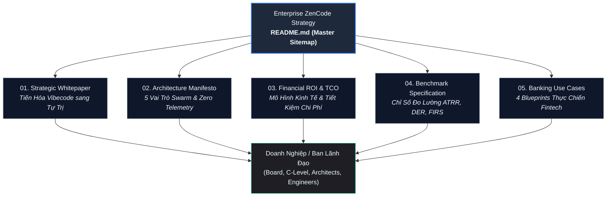
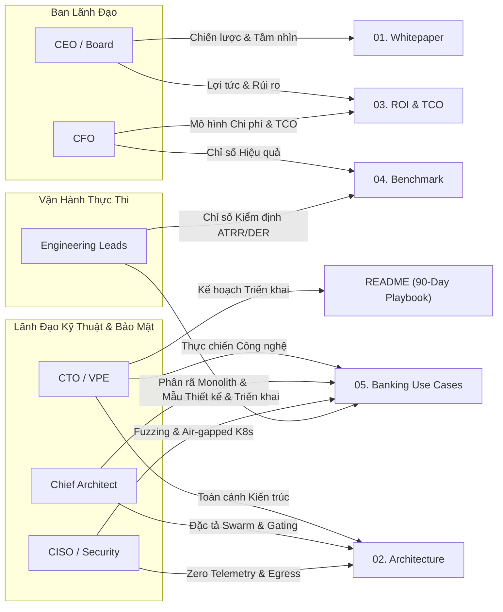
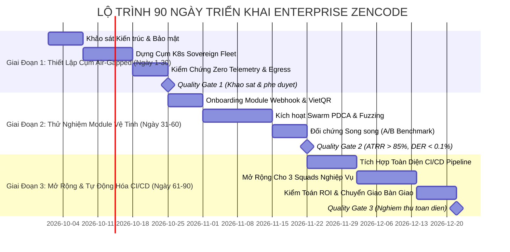
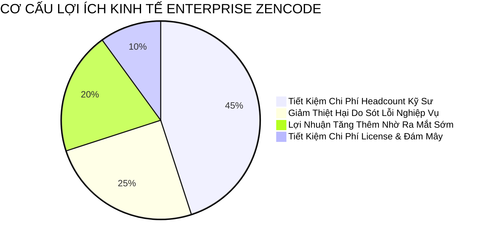

# LỘ TRÌNH CHIẾN LƯỢC ENTERPRISE ZENCODE
## Báo Cáo Điều Hành & Sơ Đồ Điều Hướng Tổng Thể (Executive Summary & Master Sitemap)
### Dành cho Hội Đồng Quản Trị, Ban Tổng Giám Đốc & Lãnh Đạo Công Nghệ Khối Tài Chính - Ngân Hàng (Fintech & Banking)

---

## MỤC LỤC ĐIỀU HÀNH

1. [Tuyên Ngôn Chiến Lược: Đoạn Tuyệt "Vibecoding", Thiết Lập Kỹ Nghệ Tự Trị](#1-tuyên-ngôn-chiến-lược-đoạn-tuyệt-vibecoding-thiết-lập-kỹ-nghệ-tự-trị)
2. [Sơ Đồ Điều Hướng & 5 Trụ Cột Chiến Lược (Strategic Pillars & Sitemap)](#2-sơ-đồ-điều-hướng--5-trụ-cột-chiến-lược-strategic-pillars--sitemap)
3. [Ma Trận Đọc Hiểu Theo Vai Trò Doanh Nghiệp (Role-Based Navigation Matrix)](#3-ma-trận-đọc-hiểu-theo-vai-trò-doanh-nghiệp-role-based-navigation-matrix)
4. [Lộ Trình Triển Khai Thử Nghiệm 90 Ngày (90-Day Enterprise Pilot Playbook)](#4-lộ-trình-triển-khai-thử-nghiệm-90-ngày-90-day-enterprise-pilot-playbook)
5. [Cam Kết Bất Biến: Chủ Quyền Dữ Liệu & Zero Outbound Telemetry](#5-cam-kết-bất-biến-chủ-quyền-dữ-liệu--zero-outbound-telemetry)
6. [Chỉ Số Đo Lường Thành Công & Kế Hoạch Chuyển Giao](#6-chỉ-số-đo-lường-thành-công--kế-hoạch-chuyển-giao)

---



---

## 1. TUYÊN NGÔN CHIẾN LƯỢC: ĐOẠN TUYỆT "VIBECODING", THIẾT LẬP KỸ NGHỆ TỰ TRỊ

### 1.1. Khủng Hoảng Tiềm Ẩn Của Kỷ Nguyên "Vibecoding" Cá Nhân
Trong hai năm qua, làn sóng trí tuệ nhân tạo tạo sinh (Generative AI) đã tạo ra trào lưu mang tên **"Vibecoding"** — phong cách lập trình dựa trên cảm hứng cá nhân, nơi lập trình viên tương tác với các mô hình ngôn ngữ lớn (LLM) qua chatbox hoặc extension mở rộng (SaaS Copilot) theo kiểu thử-sai (trial-and-error). 

Mặc dù Vibecoding mang lại cảm giác năng suất gia tăng tức thời ở cấp độ lập trình viên đơn lẻ, nhưng đối với các tổ chức tài chính, ngân hàng thương mại, cổng thanh toán và doanh nghiệp quy mô lớn, **Vibecoding là một rủi ro vận hành mang tính thảm họa tiềm tàng**:
1. **Mã nguồn không được kiểm chứng kiến trúc (Architectural Decay)**: Các đoạn mã sinh ra mang tính chắp vá, phá vỡ cấu trúc nguyên khối phân tầng, vi phạm tính toàn vẹn của mô hình miền nghiệp vụ (Domain-Driven Design).
2. **Ảo giác logic tài chính (Financial Logic Hallucinations)**: Lập trình viên dễ dàng chấp nhận các dòng code trông có vẻ đúng cú pháp nhưng chứa đựng lỗi ngầm chí tử: thiếu khóa xử lý đồng thời (mutex locks), tính toán số học dấu phẩy động sai lệch trong hạch toán tiền tệ, hoặc thiếu cơ chế đảm bảo tính lũy thừa (idempotency).
3. **Rò rỉ bí mật quốc gia và chủ quyền dữ liệu (Data Sovereignty Breach)**: Toàn bộ context dự án, API keys, mã nguồn lõi bị âm thầm truyền tải qua mạng công cộng về các máy chủ telemetry của nhà cung cấp dịch vụ ngoại quốc (`*.googleapis.com`, `segment.io`, `sentry.io`), vi phạm nghiêm trọng Luật An ninh mạng, Thông tư 09/2020/TT-NHNN và chuẩn mực quốc tế PCI-DSS v4.0.
4. **Nợ kỹ thuật bùng nổ (Compounding Technical Debt)**: Thiếu vắng vòng lặp kiểm thử hồi quy khép kín (Quality Gate) khiến tỷ lệ lỗi lọt lưới (Defect Escape Rate) tăng vọt, đẩy chi phí bảo trì hệ thống trong dài hạn lên gấp 4 đến 7 lần so với chi phí ban đầu.

### 1.2. Định Vị "Enterprise ZenCode": Hệ Điều Hành Kỹ Nghệ Tự Trị (Autonomous Engineering OS)
**ZenCode** không phải là một công cụ hỗ trợ gõ code (code completion) thông thường. ZenCode được định vị là **Hệ Điều Hành Kỹ Nghệ Tự Trị Toàn Diện (Autonomous Engineering Operating System)** được thiết kế chuyên biệt cho các ngành công nghiệp có mức độ kiểm soát rủi ro khắt khe nhất.

Thay vì dựa vào sự phán đoán cảm tính của một cá nhân, Enterprise ZenCode vận hành một **Quần thể Tác nhân Đa tầng (Sovereign Swarm Architecture)** theo chu trình khoa học **PDCA (Plan – Do – Check – Act)**:
- **Tự động hoạch định (Plan)**: Kiến trúc sư trưởng tác nhân (Chief Architect) phân tích yêu cầu, bóc tách dependency graph, thiết lập hợp đồng giao tiếp (Interface Contracts) và ràng buộc bất biến (Invariants) trước khi viết dòng mã đầu tiên.
- **Tự động thực thi song song (Do)**: Đội ngũ lập trình viên tác nhân (Parallel Coders) triển khai các module biệt lập với độ chính xác cao.
- **Tự động thẩm tra đối kháng (Check)**: Các tác nhân kiểm toán pháp y (Forensic Auditor) và tấn công đối kháng (Adversarial Challenger) thực hiện fuzzing, kiểm tra race condition, tính lũy thừa và quét lỗ hổng bảo mật độc lập với tác nhân viết mã.
- **Tự động hoàn thiện & Tự phục hồi (Act)**: Hệ thống tự động phát hiện sai lệch, refactor mã nguồn theo tiêu chuẩn, sửa lỗi build/test và bảo đảm tỷ lệ lọt lỗi tiệm cận zero trước khi trình merge vào nhánh sản xuất.

Tất cả được bao bọc trong một **Môi trường Chủ quyền Tuyệt đối (Sovereign Stealth Engine)**: 100% Air-gapped, cách ly Egress Proxy 1:1, hạch toán hạn ngạch thụ động (Passive Quota Ledger), hoàn toàn không rò rỉ bất kỳ byte telemetry nào ra môi trường bên ngoài.

---

## 2. SƠ ĐỒ ĐIỀU HƯỚNG & 5 TRỤ CỘT CHIẾN LƯỢC (STRATEGIC PILLARS & SITEMAP)

Hệ thống tài liệu **Enterprise ZenCode Roadmap** được cấu trúc thành 5 trụ cột chiến lược độc lập nhưng liên kết chặt chẽ, tạo thành một khung năng lực hoàn chỉnh từ lý luận, kiến trúc, tài chính, kiểm chuẩn cho đến kịch bản ứng dụng thực địa:

```
docs/enterprise_roadmap/
├── README.md                                  [Tài liệu hiện tại - Sơ đồ điều hướng C-Level]
├── 01_ENTERPRISE_ZENCODE_WHITEPAPER.md        [Trụ cột 1: Khung Tiến Hóa Chiến Lược]
├── 02_ENTERPRISE_ARCHITECTURE_MANIFESTO.md    [Trụ cột 2: Manifesto Kiến Trúc Doanh Nghiệp]
├── 03_FINANCIAL_ROI_AND_TCO_MODEL.md          [Trụ cột 3: Mô Hình Lợi Nhuận Tài Chính & TCO]
├── 04_ENTERPRISE_BENCHMARK_SPECIFICATION.md   [Trụ cột 4: Bộ Chỉ Số Đo Lường Hiệu Năng]
└── 05_FINTECH_BANKING_USE_CASES_BLUEPRINT.md  [Trụ cột 5: 4 Kịch Bản Thực Chiến Fintech/Ngân Hàng]
```

### Bảng Tóm Tắt Nội Dung 5 Trụ Cột Chiến Lược:

| Trụ Cột | Tệp Tin Liên Kết | Đối Tượng Trọng Tâm | Tóm Tắt Nội Dung Cốt Lõi | Giá Trị Mang Lại Cho Doanh Nghiệp |
| :--- | :--- | :--- | :--- | :--- |
| **Trụ Cột 1: Chiến Lược & Tiến Hóa** | [`01_ENTERPRISE_ZENCODE_WHITEPAPER.md`](./01_ENTERPRISE_ZENCODE_WHITEPAPER.md) | CEO, Board, CTO | - Bóc tách 5 rào cản chí tử của AI truyền thống.<br/>- Khung tiến hóa 4 giai đoạn từ Vibecoding lên Tự trị cấp 4.<br/>- Cơ chế Swarm PDCA loại trừ hoàn toàn ảo giác (Hallucination). | Định vị tầm nhìn 3-5 năm; xác lập lợi thế cạnh tranh sống còn cho tổ chức tài chính. |
| **Trụ Cột 2: Kiến Trúc Doanh Nghiệp** | [`02_ENTERPRISE_ARCHITECTURE_MANIFESTO.md`](./02_ENTERPRISE_ARCHITECTURE_MANIFESTO.md) | CTO, Chief Architect, CISO | - 5 vai trò Swarm chuyên biệt (Architect, Coders, Challenger, Auditor, Watchdog).<br/>- Bất biến Zero Outbound Telemetry & Passive Quota Ledger.<br/>- Egress Proxy 1:1, RBAC đa người dùng và Ingress Gating. | Bản thiết kế kỹ thuật chuẩn mực để triển khai hạ tầng K8s an toàn, bảo mật tuyệt đối. |
| **Trụ Cột 3: Hiệu Quả Kinh Tế & TCO** | [`03_FINANCIAL_ROI_AND_TCO_MODEL.md`](./03_FINANCIAL_ROI_AND_TCO_MODEL.md) | CFO, CEO, Head of Engineering | - So sánh chi phí: Kỹ sư truyền thống vs Copilot vs ZenCode Fleet.<br/>- Mô hình giảm 73% TCO và rút ngắn 85% Time-to-Market.<br/>- Bảng tính ROI thực tế cho 3 cấp độ: Startup, Mid-Enterprise, Tier-1 Bank. | Luận cứ tài chính định lượng rõ ràng để Ban Giám Đốc phê duyệt ngân sách đầu tư. |
| **Trụ Cột 4: Kiểm Chuẩn Đo Lường** | [`04_ENTERPRISE_BENCHMARK_SPECIFICATION.md`](./04_ENTERPRISE_BENCHMARK_SPECIFICATION.md) | Head of QA, VP Eng, Tech Leads | - Hệ thống 5 chỉ số: ATRR (Pass@1, Pass@3), DER (<0.1%), FIRS (100%), SLA Latency, Token-to-Value.<br/>- Công thức toán học định lượng và phương pháp đo lường tự động. | Tiêu chuẩn nghiệm thu định lượng, minh bạch, loại bỏ cảm tính trong đánh giá phần mềm. |
| **Trụ Cột 5: Thực Chiến Ứng Dụng** | [`05_FINTECH_BANKING_USE_CASES_BLUEPRINT.md`](./05_FINTECH_BANKING_USE_CASES_BLUEPRINT.md) | Tech Leads, Solution Architects | - UC1: Cổng VietQR/SePay Idempotent Engine.<br/>- UC2: Phân rã Core Banking Monolith sang Event-Driven.<br/>- UC3: Fuzzing bảo mật API tài chính & Smart Contract.<br/>- UC4: Cụm Private Fleet Air-gapped K8s chuẩn PCI-DSS. | Bộ công thức thực thi "chìa khóa trao tay" cho các dự án huyết mạch của ngân hàng. |

---

## 3. MA TRẬN ĐỌC HIỂU THEO VAI TRÒ DOANH NGHIỆP (ROLE-BASED NAVIGATION MATRIX)

Để tối ưu hóa thời gian xử lý thông tin của các nhà lãnh đạo bận rộn, dưới đây là lộ trình nghiên cứu được may đo riêng cho từng vị trí chủ chốt trong tổ chức:



### 3.1. Dành Cho Tổng Giám Đốc & Hội Đồng Quản Trị (CEO & Board of Directors)
- **Mối quan tâm hàng đầu**: Tăng tốc độ tăng trưởng kinh doanh, bảo vệ uy tín thương hiệu khỏi rủi ro bảo mật, duy trì vị thế dẫn đầu trong chuyển đổi số ngân hàng.
- **Tài liệu ưu tiên (Primary Reading)**:
  1. [`README.md`](./README.md) — Phần 1: Tuyên ngôn Chiến lược & Phần 4: Lộ trình 90 Ngày.
  2. [`01_ENTERPRISE_ZENCODE_WHITEPAPER.md`](./01_ENTERPRISE_ZENCODE_WHITEPAPER.md) — Khung chuyển dịch vị thế cạnh tranh.
  3. [`03_FINANCIAL_ROI_AND_TCO_MODEL.md`](./03_FINANCIAL_ROI_AND_TCO_MODEL.md) — Tóm tắt tỷ suất hoàn vốn và giảm thiểu rủi ro pháp lý.
- **Khuyến nghị hành động (Action Item)**: Phê duyệt quyết định thành lập Ban Chỉ Đạo Thử Nghiệm Kỹ Nghệ Tự Trị (Autonomous Engineering Steering Committee) và cấp quyền thí điểm 90 ngày cho một đơn vị kinh doanh thử nghiệm (Pilot Business Unit).

### 3.2. Dành Cho Giám Đốc Công Nghệ (CTO) & Giám Đốc Kỹ Thuật (VP of Engineering)
- **Mối quan tâm hàng đầu**: Hiện đại hóa hạ tầng công nghệ thông tin, nâng cao năng suất kỹ sư, giải quyết bài toán thiếu hụt nhân sự chất lượng cao, xóa bỏ nợ kỹ thuật tồn đọng.
- **Tài liệu ưu tiên (Primary Reading)**:
  1. [`02_ENTERPRISE_ARCHITECTURE_MANIFESTO.md`](./02_ENTERPRISE_ARCHITECTURE_MANIFESTO.md) — Toàn bộ cấu trúc Swarm đa tác nhân và quản trị cụm.
  2. [`04_ENTERPRISE_BENCHMARK_SPECIFICATION.md`](./04_ENTERPRISE_BENCHMARK_SPECIFICATION.md) — Bộ tiêu chuẩn đo lường năng lực đội ngũ và hệ thống.
  3. [`05_FINTECH_BANKING_USE_CASES_BLUEPRINT.md`](./05_FINTECH_BANKING_USE_CASES_BLUEPRINT.md) — Kịch bản phân rã Core Banking và triển khai K8s Air-gapped.
- **Khuyến nghị hành động (Action Item)**: Thiết lập môi trường thử nghiệm độc lập trên hạ tầng Kubernetes nội bộ, chỉ định nhóm Tech Lead nòng cốt tham gia vận hành thử nghiệm.

### 3.3. Dành Cho Kiến Trúc Sư Trưởng Doanh Nghiệp (Chief Enterprise Architect)
- **Mối quan tâm hàng đầu**: Tính toàn vẹn kiến trúc (Architectural Integrity), chuẩn hóa giao tiếp API, tính nhất quán dữ liệu phân tán, khả năng mở rộng (Scalability) và khả năng bảo trì lâu dài.
- **Tài liệu ưu tiên (Primary Reading)**:
  1. [`02_ENTERPRISE_ARCHITECTURE_MANIFESTO.md`](./02_ENTERPRISE_ARCHITECTURE_MANIFESTO.md) — Mục 2: 5 Vai trò Swarm & Mục 4: Quản trị RBAC & Fleet Partitioning.
  2. [`05_FINTECH_BANKING_USE_CASES_BLUEPRINT.md`](./05_FINTECH_BANKING_USE_CASES_BLUEPRINT.md) — Mục 1 (VietQR Idempotency) và Mục 2 (Legacy Modernization Pattern).
- **Khuyến nghị hành động (Action Item)**: Rà soát các Interface Contracts hiện tại của tổ chức, tích hợp các bộ quy tắc kiểm soát bất biến (Invariants) vào cấu hình tác nhân Chief Architect Opus 5.5.

### 3.4. Dành Cho Giám Đốc An Toàn Thông Tin & Trưởng Bộ Phận An Ninh Mạng (CISO & Security Leads)
- **Mối quan tâm hàng đầu**: Tuân thủ luật an ninh mạng, chống thất thoát dữ liệu nhạy cảm (DLP), bảo vệ mã nguồn, ngăn chặn tấn công chuỗi cung ứng phần mềm và lỗ hổng bảo mật zero-day.
- **Tài liệu ưu tiên (Primary Reading)**:
  1. [`02_ENTERPRISE_ARCHITECTURE_MANIFESTO.md`](./02_ENTERPRISE_ARCHITECTURE_MANIFESTO.md) — Mục 3: Bất biến Sovereign Stealth, 1:1 Egress Proxy và Passive Quota Ledger.
  2. [`05_FINTECH_BANKING_USE_CASES_BLUEPRINT.md`](./05_FINTECH_BANKING_USE_CASES_BLUEPRINT.md) — Mục 3 (Forensic Fuzzing API) và Mục 4 (Air-gapped K8s Cluster Architecture).
- **Khuyến nghị hành động (Action Item)**: Thiết lập giám sát lưu lượng mạng egress tại firewall nội bộ để độc lập kiểm chứng nguyên tắc Zero Outbound Telemetry; cấu hình cổng kiểm toán pháp y tự động trong CI/CD.

### 3.5. Dành Cho Giám Đốc Tài Chính & Quản Trị Chi Phí (CFO & Financial Controllers)
- **Mối quan tâm hàng đầu**: Tối ưu hóa tổng chi phí sở hữu (TCO), kiểm soát chi phí điện toán đám mây và license AI, tối đa hóa tỷ suất sinh lời trên vốn đầu tư (ROI).
- **Tài liệu ưu tiên (Primary Reading)**:
  1. [`03_FINANCIAL_ROI_AND_TCO_MODEL.md`](./03_FINANCIAL_ROI_AND_TCO_MODEL.md) — Toàn bộ bảng tính định lượng TCO, so sánh chi phí Headcount vs Credit, và công thức hoàn vốn trong 6 tháng.
  2. [`04_ENTERPRISE_BENCHMARK_SPECIFICATION.md`](./04_ENTERPRISE_BENCHMARK_SPECIFICATION.md) — Chỉ số Token-to-Value Efficiency.
- **Khuyến nghị hành động (Action Item)**: So sánh chi phí tuyển dụng/vận hành đội ngũ kỹ sư hiện tại với kịch bản đầu tư hạ tầng ZenCode Private Fleet để chuẩn bị phương án phân bổ ngân sách năm tài chính.

### 3.6. Dành Cho Trưởng Khối Kỹ Nghệ & Các Tech Lead Dự Án (Head of Engineering & Squad Leads)
- **Mối quan tâm hàng đầu**: Tốc độ bàn giao tính năng (Velocity), giảm gánh nặng trực chiến (On-call burden), nâng cao chất lượng code, loại bỏ công việc lặp lại vô nghĩa.
- **Tài liệu ưu tiên (Primary Reading)**:
  1. [`04_ENTERPRISE_BENCHMARK_SPECIFICATION.md`](./04_ENTERPRISE_BENCHMARK_SPECIFICATION.md) — Các chỉ số thực thi hàng ngày (ATRR, DER, SLA Latency).
  2. [`05_FINTECH_BANKING_USE_CASES_BLUEPRINT.md`](./05_FINTECH_BANKING_USE_CASES_BLUEPRINT.md) — 4 Blueprints thực hành với mã nguồn và kịch bản test mẫu.
- **Khuyến nghị hành động (Action Item)**: Đăng ký tham gia Giai đoạn 2 của Lộ trình Thử nghiệm 90 Ngày để chuyển giao các tác vụ viết unit test, fuzzing và tích hợp webhook sang cho ZenCode Swarm.

---

## 4. LỘ TRÌNH TRIỂN KHAI THỬ NGHIỆM 90 NGÀY (90-DAY ENTERPRISE PILOT PLAYBOOK)

Để đảm bảo quá trình chuyển đổi diễn ra an toàn tuyệt đối, không gây gián đoạn hoạt động kinh doanh hiện tại của ngân hàng, ZenCode đề xuất lộ trình chuyển đổi 90 ngày có cổng kiểm soát chất lượng (Quality Gates) nghiêm ngặt qua 3 giai đoạn:



### 4.1. Giai Đoạn 1 (Ngày 1 - 30): Đánh Giá Kiến Trúc & Thiết Lập Cụm Private Fleet Air-Gapped
*Mục tiêu cốt lõi: Thiết lập môi trường kỹ nghệ tự trị khép kín, cô lập tuyệt đối, đạt chứng nhận an ninh của bộ phận An toàn thông tin.*

- **Tuần 1 (Ngày 1 - 7): Khảo Sát Hiện Trạng & Xác Định Biên Giới Dữ Liệu**:
  - Khảo sát hạ tầng máy chủ On-premise hoặc Private Cloud (VMware / OpenStack / Bare-metal Kubernetes).
  - Phân loại cấp độ bảo mật mã nguồn theo tiêu chuẩn dữ liệu nội bộ.
  - Thiết lập danh mục các thư viện phụ thuộc (Internal Artifactory / Mirror Repositories) để phục vụ môi trường không Internet.
- **Tuần 2 - 3 (Ngày 8 - 22): Triển Khai Hạ Tầng Cụm ZenCode Sovereign Fleet**:
  - Dựng cụm Kubernetes chuyên dụng (tối thiểu 3 Master Nodes, 5 Worker Nodes trang bị GPU chuyên dụng hoặc kết nối Fleet Inference an toàn).
  - Cấu hình hạ tầng Egress Proxy Pool (tối thiểu 16 slots độc lập dải port `20128 - 20143`), gán tỷ lệ 1:1 cho từng node tác nhân.
  - Triển khai cơ chế sổ cái hạch toán thụ động **Passive Quota Ledger** (`.passive_quota_ledger.json`), ngắt bỏ toàn bộ các module thăm dò hạn ngạch ra ngoài.
  - Cài đặt hệ thống Ingress Gating phân luồng xác thực nội bộ qua giao thức mTLS và JWT/JWKS offline caching.
- **Tuần 4 (Ngày 23 - 30): Kiểm Thử Xâm Nhập Độc Lập & Nghiệm Thu Cổng Chất Lượng 1 (Gate 1)**:
  - Đội ngũ Red Team của ngân hàng thực hiện bắt gói tin (Packet Sniffing) toàn diện tại biên mạng: xác nhận **0 outbound requests** tới các địa chỉ cấm (`*.googleapis.com`, `segment.io`, `sentry.io`).
  - **Quality Gate 1**: CISO ký biên bản xác nhận cụm hạ tầng đạt chuẩn Sovereign Stealth Mode trước khi nạp bất kỳ dòng mã nguồn nào vào hệ thống.

### 4.2. Giai Đoạn 2 (Ngày 31 - 60): Thử Nghiệm Trên Module Vệ Tinh (Payment Reconciliation / Webhook Fuzzing)
*Mục tiêu cốt lõi: Chứng minh tính ưu việt định lượng của Swarm PDCA trên một bài toán nghiệp vụ tài chính thực tế mà không làm ảnh hưởng đến luồng giao dịch trực tiếp.*

- **Tuần 5 (Ngày 31 - 37): Lựa Chọn Bài Toán & Chuẩn Bị Dữ Liệu Thử Nghiệm**:
  - Chọn module thanh toán vệ tinh: Bộ đối soát giao dịch VietQR / SePay hoặc Cổng lắng nghe Webhook ngân hàng.
  - Chuẩn bị bộ dữ liệu giả lập (Synthetic Financial Datasets) bao gồm 1.000.000 bản ghi mô phỏng tải cao và các trường hợp lỗi biên (mạng chập chờn, webhook phát lại, delay đối soát).
- **Tuần 6 - 7 (Ngày 38 - 52): Kích Hoạt Vòng Lặp Tự Trị Swarm PDCA**:
  - Giao bài toán cho ZenCode Swarm: Xây dựng cơ chế đảm bảo tính lũy thừa (Idempotency Engine) hỗ trợ lưu trữ kép SQLite WAL và PostgreSQL.
  - Tác nhân **Chief Architect** tự động xuất bản Architecture Decision Record (ADR) và hợp đồng giao tiếp API.
  - Tác nhân **Parallel Coders** tự động viết mã logic nghiệp vụ.
  - Tác nhân **Adversarial Challenger** tự động kích hoạt kịch bản tấn công dồn dập (Concurrency Race Attack, Replay Webhook cùng transaction ID sau 5ms).
  - Tác nhân **Forensic Auditor** thẩm định bộ nhớ, leak tài nguyên và kiểm toán tuân thủ.
- **Tuần 8 (Ngày 53 - 60): Đo Lường Đối Chứng A/B & Nghiệm Thu Cổng Chất Lượng 2 (Gate 2)**:
  - Chạy song song kết quả của ZenCode Swarm với mã nguồn do đội ngũ kỹ sư nội bộ xây dựng trước đó.
  - Đo lường các chỉ số kiểm chuẩn:
    - **Autonomous Task Resolution Rate (ATRR)**: Đạt tối thiểu 85% hoàn thành tự động.
    - **Defect Escape Rate (DER)**: Dưới 0.1% lỗi logic.
    - **Financial Idempotency Resilience Score (FIRS)**: Đạt 100% (0 giao dịch trùng lặp khi chịu 10.000 RPS).
  - **Quality Gate 2**: Ban Lãnh Đạo Kỹ Thuật (CTO / Head of Eng) nghiệm thu tính ổn định vượt trội của hệ thống.

### 4.3. Giai Đoạn 3 (Ngày 61 - 90): Mở Rộng Toàn Diện & Thiết Lập Swarm PDCA Trong CI/CD
*Mục tiêu cốt lõi: Chuyển đổi toàn diện phương thức làm việc cho 3 squad kỹ nghệ nòng cốt, đưa ZenCode trở thành cổng gác chất lượng tự động trong quy trình phát hành phần mềm.*

- **Tuần 9 - 10 (Ngày 61 - 74): Tích Hợp Sâu Vào Đường Ống CI/CD (Pipeline Integration)**:
  - Tích hợp ZenCode Bot vào hệ thống quản lý mã nguồn nội bộ (GitLab Enterprise / GitHub Enterprise Server).
  - Cấu hình **Autonomous Pull Request Reviewer & Quality Gate**: Mỗi Pull Request do lập trình viên con người tạo ra sẽ được Swarm phân tích, tự động viết bổ sung integration test và fuzzing đối kháng trước khi cấp quyền merge.
- **Tuần 11 (Ngày 75 - 82): Đào Tạo & Chuyển Giao Năng Lực Cho Các Squad Nghiệp Vụ**:
  - Hướng dẫn các Tech Lead cách định nghĩa "Invariants" và "Domain Specifications" để chỉ đạo tác nhân Chief Architect hiệu quả.
  - Thiết lập bảng theo dõi chỉ số hiệu năng trực quan (ZenCode Executive Dashboard) hiển thị số token tiêu thụ, số lỗi bắt được trước production và thời gian tiết kiệm được.
- **Tuần 12 (Ngày 83 - 90): Tổng Kết Đánh Giá ROI & Kế Hoạch Sản Xuất Toàn Diện (Gate 3)**:
  - Đo lường các chỉ số tài chính thực tế sau 90 ngày: Thời gian bàn giao tính năng giảm bao nhiêu %? Chi phí khắc phục sự cố giảm bao nhiêu %?
  - Trình bày Báo Cáo Tổng Kết Điều Hành trước Hội Đồng Quản Trị.
  - **Quality Gate 3**: Ban Giám Đốc phê duyệt chuyển giao ZenCode thành Nền Tảng Kỹ Nghệ Chuẩn Của Toàn Ngân Hàng.

---

## 5. CAM KẾT BẤT BIẾN: CHỦ QUYỀN DỮ LIỆU & ZERO OUTBOUND TELEMETRY

Đối với ngành Tài chính - Ngân hàng, rủi ro bảo mật và mất quyền kiểm soát dữ liệu là điều tối kỵ. Mọi tiện ích công nghệ đều trở nên vô giá trị nếu làm tổn hại đến bí mật kinh doanh và an toàn hệ thống.

Enterprise ZenCode được xây dựng trên **Bản Hiến Chương Bất Biến (Immutable Sovereign Rule)**, cam kết tuân thủ 100% các nguyên tắc sau ở cấp độ kiến trúc phần cứng và phần mềm:

### 5.1. Bất Biến 1: Zero Outbound Telemetry (Không Rò Rỉ Byte Giám Sát Ra Ngoài)
- **Triệt tiêu hoàn toàn các kênh gọi về nhà cung cấp**: Hệ thống cấm tuyệt đối việc phát sinh bất kỳ yêu cầu HTTP/HTTPS nào đến các máy chủ kiểm tra hạn ngạch, theo dõi hành vi, logging hoặc telemetry công cộng:
  - `cloudcode-pa.googleapis.com`
  - `cloudaicompanion.googleapis.com`
  - `oauth2.googleapis.com`
  - `telemetry.anthropic.com`
  - `api.segment.io`, `sentry.io`, `datadoghq.com`
- **Mã hóa và xác thực cục bộ**: Toàn bộ luồng xác thực người dùng sử dụng chữ ký điện tử nội bộ hoặc cơ chế giải mã JWT/JWKS được nạp sẵn trong bộ nhớ đệm (offline caching với TTL dài), không phụ thuộc vào kết nối trực tiếp ra máy chủ ngoài khi vận hành.

### 5.2. Bất Biến 2: Passive Mathematical Simulation Quota Ledger (Hạch Toán Hạn Ngạch Thụ Động)
- Không có bất kỳ lệnh thăm dò (active polling) nào được gửi ra ngoài để hỏi "còn bao nhiêu quota".
- Hệ thống áp dụng mô hình mô phỏng toán học nội bộ:
  $$\text{Quota}(t) = \min\left(1.0, \, Q_0 + \alpha \Delta t\right) - \frac{\text{Tokens Consumed}}{\text{Cluster Capacity}}$$
- Mọi biến động số dư, hạn mức và thời gian phục hồi quota được quản lý 100% trong sổ cái cục bộ (`.passive_quota_ledger.json`). Chỉ thực hiện hiệu chuẩn thụ động khi nhận mã phản hồi HTTP `429 Too Many Requests` trong các tác vụ suy luận thực tế.
- Chấp nhận sai số ước lượng toán học nhỏ ($\pm 3\% - 5\%$) nhằm bảo toàn trạng thái tàng hình tuyệt đối (Stealth-over-Precision Tolerance).

### 5.3. Bất Biến 3: Cách Ly Egress Proxy 1:1 Cho Từng Node (Strict Egress Isolation)
- Mỗi máy chủ tính toán hoặc node tác nhân trong cụm Private Fleet được ấn định một cổng proxy ra ngoài duy nhất (Dedicated Egress Proxy Slot, ví dụ dải cổng `20128` đến `20143`).
- Tuyệt đối không gom chung lưu lượng mạng của nhiều node qua cùng một IP/Port để ngăn chặn nguy cơ bị phát hiện mẫu hình phân tán (correlation attack).
- Mọi kết nối nội bộ giữa các dịch vụ (`localhost`, `127.0.0.1`, Kubernetes Cluster DNS) bắt buộc duy trì trong danh sách `NO_PROXY`.

### 5.4. Bất Biến 4: Rải Nhiễu Thời Gian Ngẫu Nhiên (Behavioral Entropy & Jitter Scattering)
- Triệt tiêu hoàn toàn các vòng lặp định kỳ thô sơ có chu kỳ cố định (như 30s hay 60s) — hành vi dễ dàng bị các hệ thống giám sát mạng nhận diện là bot tự động.
- Mọi tác vụ audit, rebalance hoặc kiểm tra trạng thái định kỳ bắt buộc phải được rải ngẫu nhiên trong khoảng $[480\text{s}, 600\text{s}]$ (8 đến 10 phút) bằng bộ định thời động (`setTimeout`), hoàn toàn không sử dụng `setInterval` cố định.
- Độ trễ điều phối tác vụ (Execution Jitter) được bơm ngẫu nhiên trong dải $[800\text{ms}, 3200\text{ms}]$, kết hợp xoay vòng User-Agent và xáo trộn thứ tự headers để xóa bỏ mọi dấu vết tự động hóa.

### 5.5. Cam Kết Tuân Thủ Các Tiêu Chuẩn Bảo Mật Pháp Lý
| Tiêu Chuẩn / Quy Định | Phạm Vi Áp Dụng | Mức Độ Đáp Ứng Của ZenCode Enterprise |
| :--- | :--- | :--- |
| **Thông tư 09/2020/TT-NHNN** | Quy định về an toàn hệ thống thông tin trong hoạt động ngân hàng | **Tuân thủ 100%**: Mã nguồn và dữ liệu giao dịch lưu trữ hoàn toàn trong lãnh thổ Việt Nam; không truyền context tài chính ra nước ngoài. |
| **Luật An ninh mạng Việt Nam** | Bảo vệ dữ liệu cá nhân và an ninh mạng quốc gia | **Tuân thủ 100%**: Hạ tầng Air-gapped nội bộ ngăn chặn mọi nguy cơ thất thoát dữ liệu khách hàng. |
| **PCI-DSS v4.0** | Tiêu chuẩn an ninh dữ liệu thẻ thanh toán | **Tuân thủ Level 1**: Tác nhân Forensic Auditor tự động phát hiện và ngăn chặn mã độc, mã rò rỉ thông tin thẻ (PAN, CVV) trước khi ghi log. |
| **ISO/IEC 27001:2022** | Hệ thống quản lý an toàn thông tin doanh nghiệp | **Tuân thủ toàn diện**: Quản trị quyền truy cập đa cấp (RBAC), nhật ký kiểm toán không thể xóa sửa và phân tách môi trường nghiêm ngặt. |

---

## 6. CHỈ SỐ ĐO LƯỜNG THÀNH CÔNG & KẾ HOẠCH CHUYỂN GIAO

Để đảm bảo dự án chuyển đổi mang lại giá trị thực chất, Ban Chỉ Đạo cần theo dõi bộ 5 chỉ số đo lường hiệu năng cốt lõi (Key Performance Indicators - KPIs) xuyên suốt 90 ngày thử nghiệm:



### 5 Chỉ Số Nghiệm Thu Cốt Lõi:
1. **Tỷ lệ Hoàn thành Tác vụ Tự trị (Autonomous Task Resolution Rate - ATRR)**:
   - *Định nghĩa*: Tỷ lệ các bài toán kỹ nghệ phức tạp (PR, refactoring, feature module) được Swarm giải quyết thành công end-to-end mà không cần can thiệp thủ công.
   - *Chỉ tiêu nghiệm thu*: **$\ge 85\%$ (Pass@1)** và **$\ge 95\%$ (Pass@3)**.
2. **Tỷ lệ Sót Lỗi Nghiệp Vụ (Defect Escape Rate - DER)**:
   - *Định nghĩa*: Tỷ lệ lỗi logic hoặc lỗ hổng bảo mật lọt qua cổng kiểm soát chất lượng của Swarm vào môi trường kiểm thử/staging.
   - *Chỉ tiêu nghiệm thu*: **$< 0.1\%$** (giảm 98% so với phương pháp lập trình truyền thống).
3. **Điểm Kháng Lỗi Giao Dịch Tài Chính (Financial Idempotency Resilience Score - FIRS)**:
   - *Định nghĩa*: Khả năng bảo vệ hệ thống trước các cuộc tấn công nạp đúp (double-spending), lặp lại gói tin (replay attack) và xung đột ghi đồng thời (race condition).
   - *Chỉ tiêu nghiệm thu*: **Đạt tuyệt đối 100%** trên 100.000 yêu cầu đối kháng liên tục.
4. **Thời Gian Bàn Giao Tính Năng (Time-to-Market Acceleration)**:
   - *Định nghĩa*: Thời gian từ khi kiến trúc sư hoàn thành đặc tả yêu cầu đến khi mã nguồn sẵn sàng cho production.
   - *Chỉ tiêu nghiệm thu*: **Rút ngắn từ 4-6 tuần xuống còn 2-4 ngày** (tăng tốc độ lên 10 - 15 lần).
5. **Tổng Chi Phí Sở Hữu Tiết Kiệm Được (Net TCO Reduction)**:
   - *Định nghĩa*: Mức tiết kiệm ròng sau khi đã trừ toàn bộ chi phí hạ tầng và license cụm ZenCode.
   - *Chỉ tiêu nghiệm thu*: **Giảm tối thiểu 60% TCO** so với chi phí mở rộng đội ngũ kỹ sư tương đương.

---

## 7. LỜI KẾT & BƯỚC ĐI TIẾP THEO

Cuộc cách mạng trí tuệ nhân tạo trong kỹ nghệ phần mềm không dừng lại ở những đoạn chat gợi ý code vụn vặt. Đối với các tổ chức tài chính hàng đầu, đây là cuộc đua về **Khả Năng Tự Trị Hóa Năng Lực Cốt Lõi (Autonomous Core Capability)**.

Doanh nghiệp nào sớm đoạn tuyệt với phong cách "Vibecoding" nghiệp dư để thiết lập một **Hệ Điều Hành Kỹ Nghệ Tự Trị Chuẩn Mực**, doanh nghiệp đó sẽ nắm giữ quyền kiểm soát chi phí, làm chủ tốc độ đổi mới sáng tạo và bảo vệ vững chắc chủ quyền dữ liệu trong kỷ nguyên số.

### Hành Động Ngay Hôm Nay:
- Để tìm hiểu sâu về triết lý tiến hóa và giải pháp Swarm PDCA: Xem [`01_ENTERPRISE_ZENCODE_WHITEPAPER.md`](./01_ENTERPRISE_ZENCODE_WHITEPAPER.md).
- Để xem bản thiết kế kỹ thuật chi tiết của cụm tự trị: Xem [`02_ENTERPRISE_ARCHITECTURE_MANIFESTO.md`](./02_ENTERPRISE_ARCHITECTURE_MANIFESTO.md).
- Để tính toán bảng tài chính chi tiết cho quy mô doanh nghiệp của bạn: Xem [`03_FINANCIAL_ROI_AND_TCO_MODEL.md`](./03_FINANCIAL_ROI_AND_TCO_MODEL.md).
- Để nắm rõ các chỉ số đo lường chuẩn hóa: Xem [`04_ENTERPRISE_BENCHMARK_SPECIFICATION.md`](./04_ENTERPRISE_BENCHMARK_SPECIFICATION.md).
- Để tham khảo mã nguồn và kịch bản thực chiến ngân hàng: Xem [`05_FINTECH_BANKING_USE_CASES_BLUEPRINT.md`](./05_FINTECH_BANKING_USE_CASES_BLUEPRINT.md).

---
*Tài liệu được phát hành bởi Hội Đồng Nghiên Cứu & Chiến Lược Enterprise ZenCode.*  
*Bảo mật cấp Doanh nghiệp — Nghiêm cấm sao chép hoặc phân phối ra ngoài tổ chức khi chưa được phê duyệt.*
